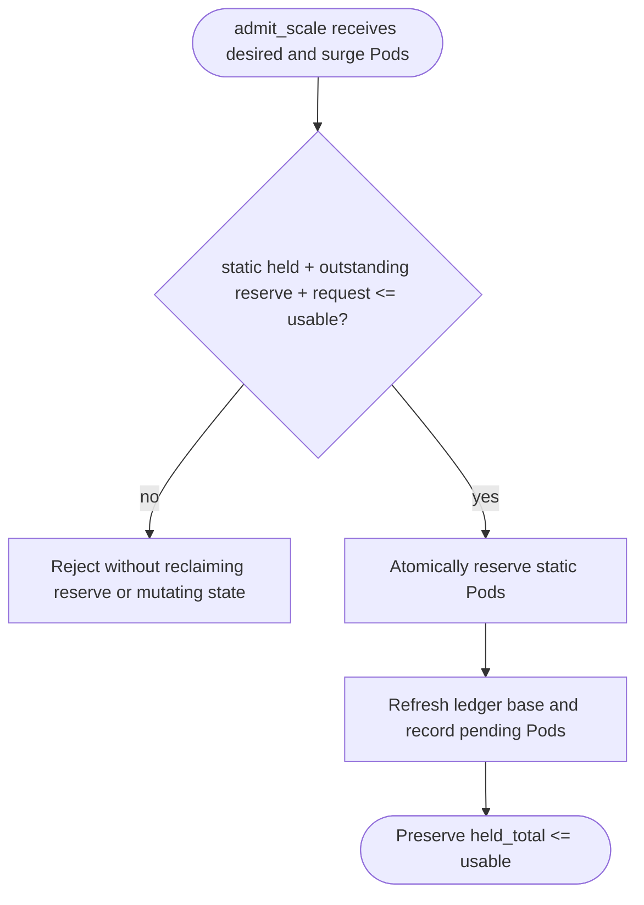

## Logic
<!-- type: logic lang: mermaid -->

Static Pod admission has precedence only over new Pods: outstanding reserve grants remain held until their normal close/release transition. The control plane rejects a scale-up that would exceed `usable`; it does not implicitly reclaim idle, draining, or expired reserves, because each may still represent a physical backend connection. The preflight is mutation-free, then `reserve_many` remains the atomic static-allocation operation.
