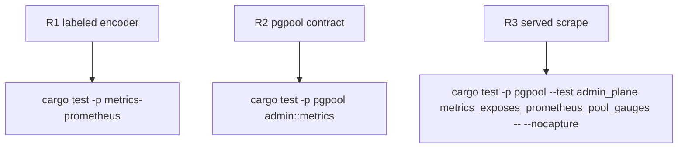

## Logic

```mermaid
---
id: pgpool-shared-labeled-prometheus-flow
entry: collect
nodes:
  collect:
    kind: start
    label: Pgpool collects live per-pool gauge values as shared labeled samples
  normalize:
    kind: process
    label: metrics-prometheus sorts every sample label set by label name
  escape:
    kind: process
    label: Escape backslash, double quote, and newline in every label value
  render:
    kind: process
    label: Emit HELP and TYPE once per supplied sample group, followed by deterministic labeled rows
  response:
    kind: terminal
    label: Pgpool serves the byte-compatible Prometheus 0.0.4 response
edges:
  - { from: collect, to: normalize }
  - { from: normalize, to: escape }
  - { from: escape, to: render }
  - { from: render, to: response }
---
flowchart LR
  collect[Collect live Pgpool gauges] --> normalize[Sort labels]
  normalize --> escape[Escape label values]
  escape --> render[Shared HELP TYPE and row rendering]
  render --> response([Serve unchanged metrics contract])
```

<!-- type: logic lang: mermaid -->



## Changes
<!-- type: changes lang: yaml -->

```yaml
changes:
  - { path: libs/metrics-prometheus/tech-design/semantic/source/libs-metrics-prometheus-src-lib-rs.md, action: modify, section: logic, impl_mode: hand-written, description: Add labeled sample groups, deterministic label ordering, and safe escaping to the canonical source unit. }
  - { path: libs/metrics-prometheus/README.md, action: modify, section: logic, impl_mode: hand-written, description: Document labeled exposition as part of the shared capability. }
  - { path: apps/pgpool/src/admin/metrics.rs, action: modify, section: logic, impl_mode: hand-written, description: Replace local exposition formatting with shared labeled sample groups. }
  - { path: apps/pgpool/Cargo.toml, action: modify, section: logic, impl_mode: hand-written, description: Depend on metrics-prometheus. }
  - { path: apps/pgpool/tech-design/logic/served-admin-plane-with-drain-aware-readiness.md, action: modify, section: logic, impl_mode: hand-written, description: Record shared encoder ownership while preserving the Pgpool contract. }
```

## Unit Test
<!-- type: unit-test lang: mermaid -->


