# pgpool backend pool — connection reuse and transaction/session pool modes

## Logic
<!-- type: logic lang: mermaid -->

```mermaid
(fill)
```
## Pool Lease State Machine
<!-- type: state-machine lang: mermaid -->

```mermaid
---
id: pgpool-backend-pool-lease-fsm
initial: admitting
nodes:
  admitting:
    kind: initial
    label: "Admitting: ConnectionBudget::try_acquire() just succeeded; BackendPool::acquire_fresh() is dialing this client's own one-time real startup+auth handshake backend (R1)"
  rejected_saturated:
    kind: terminal
    label: "RejectedSaturated: frontend ConnectionBudget exhausted before any backend was touched"
  rejected_backend_unreachable:
    kind: terminal
    label: "RejectedBackendUnreachable: acquire_fresh()'s connect failed or exceeded backend_connect_timeout"
  rejected_auth_failed:
    kind: terminal
    label: "RejectedAuthFailed: backend emitted ErrorResponse during the admission handshake, forwarded to the client verbatim"
  idle_no_lease:
    kind: normal
    label: "IdleNoLease: client is admitted and holds no backend lease \u2014 either just after the admission handshake's backend was reset+returned to idle, or after a prior transaction's backend was reset+returned to idle (R1, R2)"
  acquiring_transaction:
    kind: normal
    label: "AcquiringTransaction: the client sent a frontend frame other than Terminate; BackendPool::acquire() is running (idle-reuse-preferring, may wait up to acquire_timeout) (R2, R3)"
  rejected_pool_saturated:
    kind: terminal
    label: "RejectedPoolSaturated: acquire_timeout elapsed with no lease available; a synthesized ErrorResponse (53300) is written to this client only and its socket closed \u2014 every other admitted client and in-flight lease is unaffected (R3, AC3)"
  transaction_active:
    kind: normal
    label: "TransactionActive: a backend lease is held; frames relay bidirectionally between this client and its leased backend until the backend's ReadyForQuery reports Idle again, or Terminate/EOF/FrameError ends the leg (R2)"
  draining:
    kind: normal
    label: "Draining: SIGTERM/SIGINT observed (DrainSignal flipped); the accept loop stops admitting new connections, but this client's IdleNoLease/TransactionActive progress continues unaffected, bounded by drain_timeout"
  closed:
    kind: terminal
    label: "Closed: client Terminate while IdleNoLease (nothing to release), or a TransactionActive session ending cleanly (its backend already reset+returned to idle) or in error (its backend released as Close, not returned to idle), or drain_timeout elapsing while Draining (task abandoned)"
edges:
  - from: admitting
    to: rejected_saturated
    event: "ConnectionBudget::try_acquire() returns Err"
  - from: admitting
    to: rejected_backend_unreachable
    event: "acquire_fresh() connect fails or times out"
  - from: admitting
    to: rejected_auth_failed
    event: "backend ErrorResponse observed before ReadyForQuery"
  - from: admitting
    to: idle_no_lease
    event: "AuthenticationOk + ReadyForQuery forwarded; handshake backend reset (DISCARD ALL) and returned to idle"
  - from: idle_no_lease
    to: acquiring_transaction
    event: "a frontend frame other than Terminate arrives (transaction/query start)"
  - from: idle_no_lease
    to: closed
    event: "client sends Terminate or closes cleanly while holding no lease"
  - from: acquiring_transaction
    to: transaction_active
    event: "BackendPool::acquire() returns a lease within acquire_timeout"
  - from: acquiring_transaction
    to: rejected_pool_saturated
    event: "acquire_timeout elapses with no lease available"
  - from: transaction_active
    to: idle_no_lease
    event: "backend ReadyForQuery reports Idle again; reset (DISCARD ALL) and returned to idle"
  - from: transaction_active
    to: closed
    event: "FrameError or EOF on either leg mid-transaction; lease released as Close, not returned to idle"
  - from: idle_no_lease
    to: draining
    event: "DrainSignal flips to Draining (SIGTERM/SIGINT)"
  - from: transaction_active
    to: draining
    event: "DrainSignal flips to Draining (SIGTERM/SIGINT)"
  - from: draining
    to: closed
    event: "session ends normally (same transitions as above), or drain_timeout elapses and the task is abandoned"
---
stateDiagram-v2
    [*] --> admitting
    admitting --> rejected_saturated: ConnectionBudget::try_acquire() returns Err
    admitting --> rejected_backend_unreachable: acquire_fresh() connect fails/times out
    admitting --> rejected_auth_failed: backend ErrorResponse before ReadyForQuery
    admitting --> idle_no_lease: AuthenticationOk + ReadyForQuery forwarded, backend reset+returned to idle
    idle_no_lease --> acquiring_transaction: frontend frame other than Terminate arrives
    idle_no_lease --> closed: client sends Terminate or closes cleanly
    acquiring_transaction --> transaction_active: acquire() returns a lease within acquire_timeout
    acquiring_transaction --> rejected_pool_saturated: acquire_timeout elapses, no lease available
    transaction_active --> idle_no_lease: backend ReadyForQuery reports Idle again, reset+returned to idle
    transaction_active --> closed: FrameError/EOF mid-transaction, lease released as Close
    idle_no_lease --> draining: DrainSignal flips to Draining
    transaction_active --> draining: DrainSignal flips to Draining
    draining --> closed: session ends normally, or drain_timeout elapses (task abandoned)
    rejected_saturated --> [*]
    rejected_backend_unreachable --> [*]
    rejected_auth_failed --> [*]
    rejected_pool_saturated --> [*]
    closed --> [*]
```
## Schema
<!-- type: schema lang: yaml -->

```yaml
$schema: "https://json-schema.org/draft/2020-12/schema"
title: pgpool backend pool types
definitions:
  PoolConfig:
    type: object
    x-rust-derive: [Debug, Clone]
    required: [endpoint, max_backend_connections, acquire_timeout, backend_connect_timeout, wire]
    description: >-
      Configuration for one BackendPool: the single configured backend
      endpoint (reused from proxy::BackendEndpointConfig), the capacity
      bound sourced from RuntimePlan::max_backend_connections (R1), and the
      timeouts/wire bounds the pool's own connect+relay/reset helpers need.
    properties:
      endpoint:
        x-rust-type: crate::proxy::BackendEndpointConfig
        description: "The single configured backend this pool dials; multiple backend databases/pools keyed by database+user are out of scope for this slice (adapter-boundary epic #1283's seam)."
      max_backend_connections:
        type: integer
        x-rust-type: usize
        description: "Capacity bound shared by both pool modes (idle + active <= this value); sourced from RuntimePlan::max_backend_connections (default 512, R1)."
      acquire_timeout:
        type: string
        x-rust-type: std::time::Duration
        description: "Bounds how long BackendPool::acquire() waits for an idle/freed slot before returning PoolError::Saturated (R3, AC3)."
      backend_connect_timeout:
        type: string
        x-rust-type: std::time::Duration
        description: "Bounds a fresh backend TCP connect from acquire()/acquire_fresh(); mirrors SessionProxyConfig::backend_connect_timeout."
      wire:
        x-rust-type: crate::wire::WireCodecConfig
        description: "Frame bounds for the backend-role FrameReader the pool's own admission-handshake and reset helpers use."

  BackendConnectionId:
    type: integer
    x-rust-type: u64
    x-rust-derive: [Debug, Clone, Copy, PartialEq, Eq, Hash]
    description: >-
      Opaque identity for one physical backend TCP connection, stable
      across idle<->leased transitions; used for tracing and test
      assertions of reuse (e.g. AC1's "far fewer backend connections than
      client count").

  LeaseDisposition:
    type: string
    x-rust-enum: true
    x-rust-derive: [Debug, Clone, Copy, PartialEq, Eq]
    enum: [return_to_idle, close]
    description: >-
      How BackendPool::release() disposes of a returned lease:
      return_to_idle resets the connection (DISCARD ALL) and adds it to the
      shared idle set (R1, R2); close tears the physical connection down
      immediately and frees its capacity slot (session-mode teardown, or
      any lease whose session state is unknown/unsafe to reuse after a
      relay error, or a reset that itself failed).

  BackendLease:
    type: object
    x-rust-derive: [Debug]
    required: [id, fresh, stream]
    description: >-
      One leased physical backend connection returned by
      acquire()/acquire_fresh(): the live socket plus its
      BackendConnectionId and whether this lease required a fresh TCP
      connect.
    properties:
      id:
        $ref: "#/definitions/BackendConnectionId"
      fresh:
        type: boolean
        description: >-
          True when this lease required a brand-new TCP connect
          (acquire_fresh() always; acquire() only when the idle set was
          empty and capacity allowed a new connect) \u2014 signals the caller
          that a real startup+auth relay is required before the connection
          can carry client traffic; false means an already-authenticated
          idle connection was reused and only post-auth traffic should be
          relayed.
      stream:
        x-rust-type: tokio::net::TcpStream
        description: "The live backend socket for this lease; the caller splits it (into_split) to run the same frame relay helpers session mode already uses."

  PoolError:
    type: object
    x-rust-enum: true
    x-rust-derive: [Debug, thiserror::Error]
    description: >-
      Error taxonomy from BackendPool::acquire()/acquire_fresh(); every
      variant is handled by the caller writing a typed wire ErrorResponse
      (or forwarding the backend's own) and releasing any frontend permit \u2014
      never a panic, never a silent hang or drop.
    oneOf:
      - title: Saturated
        properties:
          max: { type: integer, x-rust-type: usize }
          waited: { type: string, x-rust-type: std::time::Duration }
        description: "acquire_timeout elapsed with the pool at max_backend_connections and no lease freed (R3, AC3); caller maps this to PoolRejectionReason::BackendPoolSaturated."
      - title: BackendUnreachable
        type: string
        description: "A fresh TCP connect (acquire_fresh(), or acquire() falling back to a fresh connect) failed or exceeded backend_connect_timeout; caller maps this to the existing proxy::RejectionReason::BackendUnreachable (SQLSTATE 08006)."

  PoolRejectionReason:
    type: string
    x-rust-enum: true
    x-rust-derive: [Debug, Clone, Copy, PartialEq, Eq]
    enum: [backend_pool_saturated]
    description: >-
      Drives the synthesized wire ErrorResponse for a mid-session
      backend-pool-exhaustion rejection (R3, AC3), distinct from the
      existing proxy::RejectionReason (which covers frontend-admission and
      admission-handshake rejections): backend_pool_saturated maps to
      synthesized_error_response() returning an ErrorResponse with SQLSTATE
      53300 too_many_connections, message text distinguishing "backend pool
      exhausted" from the frontend-budget wording so operators can tell the
      two saturation causes apart.

  BackendPoolStats:
    type: object
    x-rust-derive: [Debug, Clone, Copy, PartialEq, Eq]
    required: [backend_active, backend_idle]
    description: "Raw counts BackendPool exposes for composition into PoolStats."
    properties:
      backend_active:
        type: integer
        x-rust-type: usize
        description: "Count of physical backend connections currently leased out (active) \u2014 includes both fresh and reused leases, both pool modes."
      backend_idle:
        type: integer
        x-rust-type: usize
        description: "Count of physical backend connections currently sitting in the shared idle set, already authenticated and liveness-eligible for reuse."

  PoolStats:
    type: object
    x-rust-derive: [Debug, Clone, Copy, PartialEq, Eq]
    required: [frontend_active, backend_active, backend_idle]
    description: >-
      The plain Rust stats API (R4) a later admin-plane WI surfaces over
      HTTP (out of scope here \u2014 this slice ships only the Rust API);
      composes the existing server_core::ConnectionBudget::active()
      (frontend admission, unchanged from WI #1288) with BackendPoolStats
      (this TD) into one snapshot.
    properties:
      frontend_active:
        type: integer
        x-rust-type: usize
        description: "ConnectionBudget::active() for the frontend listener \u2014 count of currently-admitted client connections, both pool modes."
      backend_active:
        type: integer
        x-rust-type: usize
        description: "Equal to BackendPoolStats.backend_active at snapshot time."
      backend_idle:
        type: integer
        x-rust-type: usize
        description: "Equal to BackendPoolStats.backend_idle at snapshot time."

  TransactionProxyConfig:
    type: object
    x-rust-derive: [Debug, Clone]
    required: [frontend_budget, backend_pool, wire, drain_timeout]
    description: >-
      Everything a TransactionHandler needs: reuses the same
      frontend_budget ConnectionBudget concept as SessionProxyConfig
      (frontend admission is a pool-mode-independent concern), the
      BackendPool this handler leases from, and the wire/drain bounds
      transaction-mode's own admission-handshake and per-transaction relay
      helpers need.
    properties:
      frontend_budget:
        x-rust-type: server_core::ConnectionBudget
        description: "Same admission primitive as SessionProxyConfig::frontend_budget \u2014 one shared frontend-connection cap regardless of pool mode."
      backend_pool:
        x-rust-type: crate::pool::BackendPool
        description: "The shared, capacity-bounded backend pool this handler's admission handshakes and per-transaction leases draw from."
      wire:
        x-rust-type: crate::wire::WireCodecConfig
        description: "Frame bounds used by the admission-handshake relay and the per-transaction bidirectional relay."
      drain_timeout:
        type: string
        x-rust-type: std::time::Duration
        description: "Bounds how long an in-flight admission handshake or transaction lease is allowed to keep running after DrainSignal flips to Draining before the task is abandoned; mirrors SessionProxyConfig::drain_timeout."

  TransactionHandler:
    type: object
    x-rust-derive: [Debug, Clone]
    required: [config]
    description: >-
      The tcp_server::TcpHandler impl pgpool serve binds to its listener in
      transaction mode: dispatches each accepted client through the
      admission-handshake-then-per-transaction-lease pipeline described in
      the Logic section, using its TransactionProxyConfig.
    properties:
      config:
        $ref: "#/definitions/TransactionProxyConfig"
        description: "Private field, constructed via TransactionHandler::new(config); mirrors SessionHandler's shape."

  PoolHandler:
    type: object
    x-rust-enum: true
    x-rust-derive: [Debug, Clone]
    description: >-
      TcpHandler dispatch wrapper selected once at process start from
      RuntimePlan::PoolMode: wraps the unchanged crate::proxy::SessionHandler
      for PoolMode::Session, or the new TransactionHandler for
      PoolMode::Transaction. pgpool serve constructs exactly one variant and
      binds it to the single tcp-server listener \u2014 the mode is fixed for the
      process, not renegotiated per connection.
    oneOf:
      - title: Session
        x-rust-type: crate::proxy::SessionHandler
      - title: Transaction
        $ref: "#/definitions/TransactionHandler"
```
## Config
<!-- type: config lang: yaml -->

```yaml
# BackendPool config \u2014 capacity, timeouts, and reset/liveness defaults for
# both pool modes. Reuses RuntimePlan::max_backend_connections and the
# session-mode proxy's existing backend_host/backend_port/backend_connect_timeout_ms
# (see session-mode-proxy-with-auth-passthrough-and-serve-entrypoint.md#config)
# rather than re-declaring them; this section adds only the pool-specific seam.

max_backend_connections:
  source: "RuntimePlan::max_backend_connections"
  default: 512   # capacity bound shared by idle+active backend connections, both pool modes (R1)

pool_acquire_timeout_ms:
  env: PGPOOL_POOL_ACQUIRE_TIMEOUT_MS
  flag: --pool-acquire-timeout-ms
  default: 5000   # 5s; BackendPool::acquire() waits this long for an idle/freed slot before PoolError::Saturated (R3, AC3)

pool_liveness_check:
  source: "always-on, no config seam in this slice"
  default: enabled   # non-blocking peek read on every idle-pop before handing a connection out (R1); a dead peer is dropped and the acquire loop retries

pool_reset_statement:
  source: "hard-coded, no config seam in this slice"
  default: "DISCARD ALL"   # sent by pgpool itself (acting as its own client toward the backend) before LeaseDisposition::ReturnToIdle (R1, AC2); never sent on the Close disposition

pool_mode:
  source: "RuntimePlan::pool_mode"
  default: transaction   # PoolMode::Transaction is RuntimePlan::default(); PoolMode::Session reuses WI #1288's SessionHandler unchanged, now capacity-bounded through this same BackendPool

# Session mode continues to source its backend endpoint / backend_connect_timeout_ms
# from SessionProxyConfig (see the session-mode proxy TD's Config section);
# transaction mode's admission-handshake backend endpoint is the SAME
# BackendEndpointConfig \u2014 no separate per-mode backend target in this slice,
# and no multiple-backend-database/user keying (adapter-boundary epic #1283).
```
## Unit Test

```mermaid
---
id: apps-pgpool-backend-pool-verification
requirements:
  ac1a_transaction_mode_reuses_backend_connections:
    id: AC1
    text: "Across N sequential client transactions in transaction mode, the number of distinct physical backend connections opened is far fewer than the client/transaction count (idle reuse via BackendPool::acquire() is exercised, not a fresh connect per transaction)."
    kind: integration
    risk: high
    verify: pool_modes::transaction_mode_reuses_backend_connections_across_sequential_transactions
  ac1b_concurrent_transactions_isolated_on_distinct_backends:
    id: AC1
    text: "Concurrent transactions from different clients are correctly isolated: each holds its own distinct leased backend connection at the same time, with no frame cross-talk between them."
    kind: integration
    risk: high
    verify: pool_modes::concurrent_transactions_isolated_on_distinct_backends
  ac2_no_session_state_leak_across_leases:
    id: AC2
    text: "A SET/temp-table fixture proves no session-state leak across transaction-mode leases: a value set (or temp table created) by one transaction on a backend is not observable by the next transaction that reuses the same backend connection, because DISCARD ALL ran between owners."
    kind: regression
    risk: high
    verify: pool_modes::reset_between_owners_prevents_session_state_leak_across_transaction_leases
  ac3a_saturation_wait_then_acquire_succeeds:
    id: AC3
    text: "When the backend pool is saturated, a waiting client that is unblocked by another lease's release within acquire_timeout successfully acquires a backend and proceeds — it is never silently dropped."
    kind: integration
    risk: medium
    verify: pool_modes::saturation_wait_then_acquire_succeeds_when_lease_frees
  ac3b_saturation_timeout_produces_typed_error:
    id: AC3
    text: "When the backend pool stays saturated past acquire_timeout, the waiting client receives a typed wire ErrorResponse (SQLSTATE 53300, PoolRejectionReason::BackendPoolSaturated) and its socket is closed cleanly — it never hangs indefinitely."
    kind: integration
    risk: high
    verify: pool_modes::saturation_timeout_produces_typed_error_response
  ac4_churn_100_cycles_holds_backend_count_stable:
    id: AC4
    text: "A churn test running 100+ acquire/release cycles (mixed ReturnToIdle and Close dispositions, mixed session/transaction activity) holds the backend connection count stable throughout, with no leaked connection or file descriptor at the end."
    kind: regression
    risk: high
    verify: pool_modes::churn_100_cycles_holds_backend_count_stable_no_leak
  ac5_stats_api_matches_fixture_expectations:
    id: AC5
    text: "PoolStats (frontend_active, backend_active, backend_idle) reports counts matching fixture expectations at each phase of a scripted sequence: before any client connects, after admission, after a transaction lease is acquired, and after it is released back to idle."
    kind: functional
    risk: medium
    verify: pool_modes::stats_api_reports_expected_counts_at_each_phase
  r1a_acquire_reuses_idle_after_liveness_pass:
    id: R1
    text: "BackendPool::acquire() returns an existing idle connection (not a fresh connect) when the idle set is non-empty and the popped connection's non-blocking liveness peek succeeds."
    kind: functional
    risk: medium
    verify: pool::acquire_reuses_idle_connection_after_liveness_check_passes
  r1b_acquire_drops_dead_idle_and_retries:
    id: R1
    text: "BackendPool::acquire() drops an idle connection whose liveness peek indicates the peer is gone, frees its capacity slot, and continues the acquire attempt (fresh-connect or wait) rather than handing back a dead connection."
    kind: functional
    risk: medium
    verify: pool::acquire_drops_dead_idle_connection_and_retries
  r1c_reset_sent_before_return_to_idle:
    id: R1
    text: "BackendPool::release(id, stream, LeaseDisposition::ReturnToIdle) sends DISCARD ALL and awaits its ReadyForQuery before the connection is added to the idle set."
    kind: functional
    risk: high
    verify: pool::release_return_to_idle_sends_discard_all_before_reuse
  r1d_reset_failure_closes_instead_of_reuse:
    id: R1
    text: "When the DISCARD ALL reset itself fails (backend EOF/error/timeout during reset), release() closes the connection and frees its capacity slot instead of adding it to the idle set — a failed reset never yields a reused connection."
    kind: regression
    risk: high
    verify: pool::release_return_to_idle_closes_connection_when_reset_fails
  r2a_transaction_lease_boundaries_track_ready_for_query:
    id: R2
    text: "In transaction mode, a backend lease is acquired on the first frontend frame after the client is idle-with-no-lease, and released back through LeaseDisposition::ReturnToIdle exactly when the leased backend's ReadyForQuery reports TransactionStatus::Idle."
    kind: functional
    risk: high
    verify: pool::transaction_lease_acquired_on_first_frame_and_released_on_ready_for_query_idle
  r2b_session_mode_holds_one_lease_for_whole_session:
    id: R2
    text: "In session mode, exactly one backend lease is held for the entire session lifetime (acquire_fresh() at connect, release(..., Close) at teardown) — session mode's per-message relay/auth behavior is otherwise unchanged from WI #1288."
    kind: regression
    risk: medium
    verify: pool::session_mode_lease_held_for_whole_session_unchanged_from_1288
  r3a_acquire_waits_then_succeeds:
    id: R3
    text: "BackendPool::acquire() blocks a caller when the pool is at max_backend_connections with an empty idle set, and returns a lease as soon as another holder's release() frees a slot, provided this happens within acquire_timeout."
    kind: functional
    risk: medium
    verify: pool::acquire_waits_for_release_when_saturated_then_succeeds
  r3b_acquire_times_out_with_saturated_error:
    id: R3
    text: "BackendPool::acquire() returns PoolError::Saturated after waiting acquire_timeout with no slot freed, rather than blocking indefinitely."
    kind: functional
    risk: high
    verify: pool::acquire_times_out_with_saturated_error_after_acquire_timeout
  r3c_saturated_error_maps_to_typed_response:
    id: R3
    text: "PoolError::Saturated maps to PoolRejectionReason::BackendPoolSaturated, whose synthesized_error_response() produces a wire ErrorResponse with SQLSTATE 53300."
    kind: functional
    risk: medium
    verify: pool::saturated_pool_error_maps_to_synthesized_error_response_53300
  r4_stats_snapshot_composes_frontend_and_backend_counts:
    id: R4
    text: "PoolStats::snapshot composes ConnectionBudget::active() (frontend_active) with BackendPool's own backend_active/backend_idle counters into one consistent snapshot."
    kind: functional
    risk: low
    verify: pool::stats_snapshot_reports_frontend_backend_active_and_idle_counts
  r5_dropped_lease_without_release_does_not_leak_capacity:
    id: R5
    text: "If a BackendLease is dropped without an explicit release() call (e.g. task panic/cancellation), the pool's capacity accounting still frees the slot (RAII-style guard on the lease) rather than leaking it permanently."
    kind: regression
    risk: medium
    verify: pool::dropped_lease_without_explicit_release_does_not_leak_capacity_slot
---
flowchart TD
    ac1[AC1 ac1a transaction mode reuses backend connections] --> pool_modes_transaction_mode_reuses_backend_connections_across_sequential_transactions[pool_modes::transaction_mode_reuses_backend_connections_across_sequential_transactions]
    ac1[AC1 ac1b concurrent transactions isolated on distinct backends] --> pool_modes_concurrent_transactions_isolated_on_distinct_backends[pool_modes::concurrent_transactions_isolated_on_distinct_backends]
    r1[R1 r1a acquire reuses idle after liveness pass] --> pool_acquire_reuses_idle_connection_after_liveness_check_passes[pool::acquire_reuses_idle_connection_after_liveness_check_passes]
    r1[R1 r1b acquire drops dead idle and retries] --> pool_acquire_drops_dead_idle_connection_and_retries[pool::acquire_drops_dead_idle_connection_and_retries]
    r1[R1 r1c reset sent before return to idle] --> pool_release_return_to_idle_sends_discard_all_before_reuse[pool::release_return_to_idle_sends_discard_all_before_reuse]
    r1[R1 r1d reset failure closes instead of reuse] --> pool_release_return_to_idle_closes_connection_when_reset_fails[pool::release_return_to_idle_closes_connection_when_reset_fails]
    ac2[AC2 ac2 no session state leak across leases] --> pool_modes_reset_between_owners_prevents_session_state_leak_across_transaction_leases[pool_modes::reset_between_owners_prevents_session_state_leak_across_transaction_leases]
    r2[R2 r2a transaction lease boundaries track ready for query] --> pool_transaction_lease_acquired_on_first_frame_and_released_on_ready_for_query_idle[pool::transaction_lease_acquired_on_first_frame_and_released_on_ready_for_query_idle]
    r2[R2 r2b session mode holds one lease for whole session] --> pool_session_mode_lease_held_for_whole_session_unchanged_from_1288[pool::session_mode_lease_held_for_whole_session_unchanged_from_1288]
    ac3[AC3 ac3a saturation wait then acquire succeeds] --> pool_modes_saturation_wait_then_acquire_succeeds_when_lease_frees[pool_modes::saturation_wait_then_acquire_succeeds_when_lease_frees]
    ac3[AC3 ac3b saturation timeout produces typed error] --> pool_modes_saturation_timeout_produces_typed_error_response[pool_modes::saturation_timeout_produces_typed_error_response]
    r3[R3 r3a acquire waits then succeeds] --> pool_acquire_waits_for_release_when_saturated_then_succeeds[pool::acquire_waits_for_release_when_saturated_then_succeeds]
    r3[R3 r3b acquire times out with saturated error] --> pool_acquire_times_out_with_saturated_error_after_acquire_timeout[pool::acquire_times_out_with_saturated_error_after_acquire_timeout]
    r3[R3 r3c saturated error maps to typed response] --> pool_saturated_pool_error_maps_to_synthesized_error_response_53300[pool::saturated_pool_error_maps_to_synthesized_error_response_53300]
    ac4[AC4 ac4 churn 100 cycles holds backend count stable] --> pool_modes_churn_100_cycles_holds_backend_count_stable_no_leak[pool_modes::churn_100_cycles_holds_backend_count_stable_no_leak]
    r4[R4 r4 stats snapshot composes frontend and backend counts] --> pool_stats_snapshot_reports_frontend_backend_active_and_idle_counts[pool::stats_snapshot_reports_frontend_backend_active_and_idle_counts]
    ac5[AC5 ac5 stats api matches fixture expectations] --> pool_modes_stats_api_reports_expected_counts_at_each_phase[pool_modes::stats_api_reports_expected_counts_at_each_phase]
    r5[R5 r5 dropped lease without release does not leak capacity] --> pool_dropped_lease_without_explicit_release_does_not_leak_capacity_slot[pool::dropped_lease_without_explicit_release_does_not_leak_capacity_slot]
```

<!-- type: unit-test lang: mermaid -->


