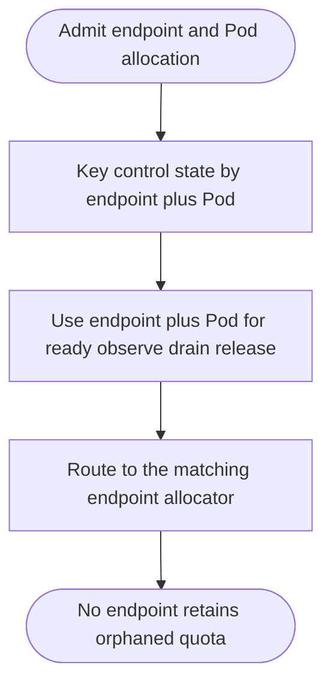
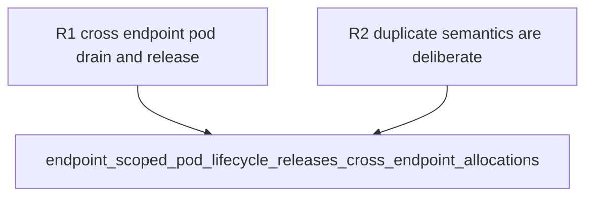

## Logic
<!-- type: logic lang: mermaid -->



A Pod name is reusable across endpoints because a single Deployment Pod may serve several remote endpoints. `PgpoolControlPlane` therefore keys its internal control record by `(endpoint, pod)`, and every Pod lifecycle API accepts that composite identity. Same-endpoint re-admission remains an `AllocationError::DuplicatePod`; cross-endpoint admission is intentional. The control plane never searches by Pod name alone, so drain and release target exactly the allocator that admitted the allocation.
## Changes
<!-- type: changes lang: yaml -->

```yaml
coverage_kind: semantic
changes:
  - path: apps/pgpool/src/k8s/control.rs
    action: modify
    section: logic
    impl_mode: hand-written
    anchor: admit_scale
    reason: Key pod control state by endpoint plus Pod, require endpoint-scoped lifecycle routing, and test cross-endpoint release.
  - path: apps/pgpool/tests/operator.rs
    action: modify
    section: unit-test
    impl_mode: hand-written
    anchor: status_projects_global_budget_and_managed_readiness
    reason: Migrate operator control-plane status coverage to the explicit endpoint-scoped Pod lifecycle API.
```
## Unit Test
<!-- type: unit-test lang: mermaid -->


