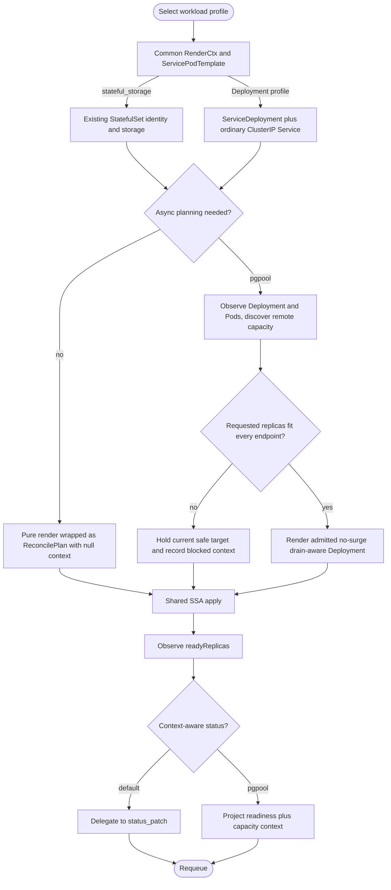

## Logic
<!-- type: logic lang: mermaid -->



The provider boundary is mechanical. `service-k8s::render::common` owns workload-neutral Pod composition and ordinary child helpers. `service-k8s::render::deployment` owns only the apps/v1 Deployment envelope and rollout fields. Existing StatefulSet rendering keeps headless Service, PVC, ordinal, Raft topology, resize, and reshard behavior; no stateful input or compatibility toggle is added to `ServiceDeployment`.

`ReconcilePlan` carries the exact rendered children and an opaque JSON context. The default `ManagedService::reconcile_plan(Client)` evaluates the existing pure `render()` path and returns null context, while `status_patch_with_context` defaults to `status_patch`. Therefore Lumen and other existing stateful consumers preserve their public implementation contract and controller order without app changes.

Pgpool overrides only the planning and context-aware status hooks. Recoverable endpoint discovery failures are converted inside pgpool into a safe plan that retains the current Deployment target and records blocked or degraded capacity facts; they are not generic controller errors. Insufficient capacity follows the same hold-current path. Only an admitted target is rendered. Unrecoverable planning errors become the shared controller's plan error, apply no children, and requeue through the existing error policy.

The controller order is invariant: obtain one plan, apply all plan children, observe every readiness target, then build status from the same plan context. Pgpool's remote PostgreSQL discovery, reserve and headroom calculation, per-Pod quota, drain-before-release state, CR status schema, and metric names remain app-owned. Kubernetes Lease and CR status are control-plane state; neither local disk nor Raft is introduced.
## Changes
<!-- type: changes lang: yaml -->

```yaml
coverage_kind: semantic
changes:
  - path: libs/service-k8s/src/render.rs
    action: modify
    section: logic
    impl_mode: hand-written
    reason: Convert the monolithic compatibility surface into the semantic render module root and preserve deliberate root-level re-exports for existing StatefulSet consumers.
  - path: libs/service-k8s/src/render/common.rs
    action: create
    section: logic
    impl_mode: hand-written
    reason: Own RenderCtx, ServicePodTemplate, labels, owner references, resources, ServiceAccount, ordinary ClusterIP Service, PDB, HPA, and CronJob composition independent of workload kind.
  - path: libs/service-k8s/src/render/deployment.rs
    action: create
    section: logic
    impl_mode: hand-written
    reason: Own ServiceDeployment and service_deployment with replicas and caller-supplied rollout fields while emitting no stateful or sticky-session contract.
  - path: libs/service-k8s/src/render/statefulset.rs
    action: create
    section: logic
    impl_mode: hand-written
    reason: Retain headless Service, WorkloadVolumeClaim, stable identity, downward-API topology, ServiceStatefulSet, and ShardedStatefulSet behavior outside Deployment composition.
  - path: libs/service-k8s/src/service.rs
    action: modify
    section: logic
    impl_mode: hand-written
    reason: Add ReconcilePlan plus backwards-compatible default reconcile_plan and status_patch_with_context hooks to ManagedService.
  - path: libs/service-k8s/src/controller.rs
    action: modify
    section: logic
    impl_mode: hand-written
    reason: Execute plan, apply children, observe readiness, and project status from the same context; surface unrecoverable planning errors through the existing requeue policy.
  - path: libs/service-k8s/src/lib.rs
    action: modify
    section: logic
    impl_mode: hand-written
    reason: Export ReconcilePlan and retain the existing controller, stateful planning, and render compatibility API.
  - path: libs/service-k8s/README.md
    action: modify
    section: logic
    impl_mode: hand-written
    reason: Document common, StatefulSet, and Deployment workload profiles plus the optional asynchronous planning seam.
  - path: apps/pgpool/Cargo.toml
    action: modify
    section: logic
    impl_mode: hand-written
    reason: Consume semantic service-k8s, server-lifecycle, server-tcp, server-http, metrics-prometheus, and transport-h2c identities with no legacy operator/server aliases.
  - path: apps/pgpool/src/k8s/instance.rs
    action: modify
    section: logic
    impl_mode: hand-written
    reason: Compose the shared common and Deployment modules while retaining Pgpool-owned maxSurge zero, probes, preStop drain, security, resources, and remote endpoint settings.
  - path: apps/pgpool/src/operator/reconcile.rs
    action: modify
    section: logic
    impl_mode: hand-written
    reason: Implement the service-k8s planning/context hooks while keeping live PostgreSQL discovery, safe replica admission, quotas, and blocked status app-owned.
  - path: apps/pgpool/tests/operator.rs
    action: modify
    section: unit-test
    impl_mode: hand-written
    reason: Verify default and context-aware provider contracts plus Pgpool safe-hold behavior and Deployment-only output.
```
## Unit Test

```mermaid
---
id: service-k8s-deployment-planning-convergence-verification
requirements:
  context_aware_status:
    id: R4
    text: "A context-aware service can carry opaque plan facts through apply and readiness into status projection, while unrecoverable plan errors do not apply children."
    kind: functional
    risk: high
    verify: cargo test -p pgpool --test operator context_aware_status_projects_capacity_plan
  default_managed_service_compatibility:
    id: R3
    text: "A ManagedService implementing the existing pure render, readiness, and status methods receives identical children and readiness-only status through the default planning hooks."
    kind: regression
    risk: high
    verify: cargo test -p service-k8s service::tests::default_plan_and_status_preserve_existing_contract
  deployment_composition:
    id: R1
    text: "service-k8s exposes workload-neutral ServicePodTemplate and a Deployment renderer that preserves caller probes, lifecycle, security, resources, topology spread, and rollout fields."
    kind: functional
    risk: high
    verify: cargo test -p service-k8s render::deployment
  lumen_stateful_compatibility:
    id: R7
    text: "Lumen continues compiling and rendering its StatefulSet topology through service-k8s compatibility re-exports without implementing the optional planning hooks."
    kind: regression
    risk: high
    verify: cargo test -p lumen --test operator_render
  negative_stateful_boundary:
    id: R2
    text: "Deployment-profile output contains no StatefulSet, PVC, headless Service, stable identity, Raft topology, or ClientIP affinity contract."
    kind: negative
    risk: high
    verify: cargo test -p service-k8s render::deployment::tests::deployment_has_no_stateful_or_sticky_session_contract
  pgpool_deployment_contract:
    id: R5
    text: "Pgpool production output remains Deployment plus ClusterIP Service and PDB with maxSurge zero, preStop drain, readiness probes, and no stateful or sticky fields."
    kind: regression
    risk: high
    verify: cargo test -p pgpool --test operator instance_render_uses_shared_stateless_children
  safe_capacity_hold:
    id: R6
    text: "Unavailable discovery or insufficient endpoint capacity retains the current safe Deployment target and publishes blocked or degraded status instead of scaling out."
    kind: negative
    risk: high
    verify: cargo test -p pgpool operator::reconcile::tests::discovery_failure_never_scales_a_new_deployment
---
flowchart TD
    r1[R1 deployment composition] --> cargo_test_p_service_k8s_render_deployment[cargo test -p service-k8s render::deployment]
    r2[R2 negative stateful boundary] --> cargo_test_p_service_k8s_render_deployment_tests_deployment_has_no_stateful_or_sticky_session_contract[cargo test -p service-k8s render::deployment::tests::deployment_has_no_stateful_or_sticky_session_contract]
    r3[R3 default managed service compatibility] --> cargo_test_p_service_k8s_service_tests_default_plan_and_status_preserve_existing_contract[cargo test -p service-k8s service::tests::default_plan_and_status_preserve_existing_contract]
    r4[R4 context aware status] --> cargo_test_p_pgpool_test_operator_context_aware_status_projects_capacity_plan[cargo test -p pgpool --test operator context_aware_status_projects_capacity_plan]
    r5[R5 pgpool deployment contract] --> cargo_test_p_pgpool_test_operator_instance_render_uses_shared_stateless_children[cargo test -p pgpool --test operator instance_render_uses_shared_stateless_children]
    r6[R6 safe capacity hold] --> cargo_test_p_pgpool_operator_reconcile_tests_discovery_failure_never_scales_a_new_deployment[cargo test -p pgpool operator::reconcile::tests::discovery_failure_never_scales_a_new_deployment]
    r7[R7 lumen stateful compatibility] --> cargo_test_p_lumen_test_operator_render[cargo test -p lumen --test operator_render]
```

<!-- type: unit-test lang: mermaid -->


