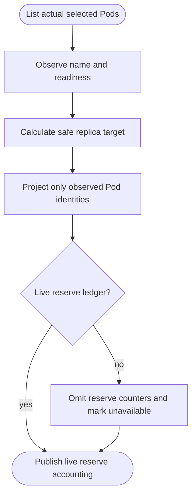

## Logic
<!-- type: logic lang: mermaid -->



Reconcile status is observational: only Pods returned by the Deployment selector are named in status, and a Pod is `Ready` only when its Kubernetes Ready condition is true; all other observed Pods are `Pending`. The capacity plan continues to hold quota for the current target and observed Pods during a scale-in, but it no longer fabricates per-index Pod records or claims a `Draining` phase without runtime confirmation. The live operator has no reserve-ledger reconciliation yet, so CR reserve counters are omitted and `reserveAccountingAvailable` is false. The pure control-plane model remains able to project real reserve values when it owns a ledger.

## Changes
<!-- type: changes lang: yaml -->

```yaml
coverage_kind: semantic
changes:
  - path: apps/pgpool/src/operator/reconcile.rs
    action: modify
    section: logic
    impl_mode: hand-written
    anchor: plan_capacity
    reason: Project only selected Pod names and observed readiness into plan context; remove fabricated drain records and explicitly mark reserve accounting unavailable.
  - path: apps/pgpool/src/k8s/control.rs
    action: modify
    section: logic
    impl_mode: hand-written
    anchor: status
    reason: Distinguish control-plane reserve ledger availability from endpoint discovery availability in the shared status context.
  - path: apps/pgpool/src/operator/crd.rs
    action: modify
    section: logic
    impl_mode: hand-written
    anchor: from_control_plane
    reason: Omit reserve counters when no live reserve ledger exists and expose whether reserve accounting is available.
  - path: apps/pgpool/tests/reconcile_planning.rs
    action: modify
    section: unit-test
    impl_mode: hand-written
    anchor: context_aware_status_projects_capacity_plan
    reason: Verify CR status omits unsupported reserve counters and exposes unavailable reserve accounting.
  - path: apps/pgpool/tests/operator.rs
    action: modify
    section: unit-test
    impl_mode: hand-written
    anchor: concurrent_pods_cannot_overgrant_reserve_capacity
    reason: Preserve coverage for reserve counters when the pure control plane does own a reserve ledger.
```
