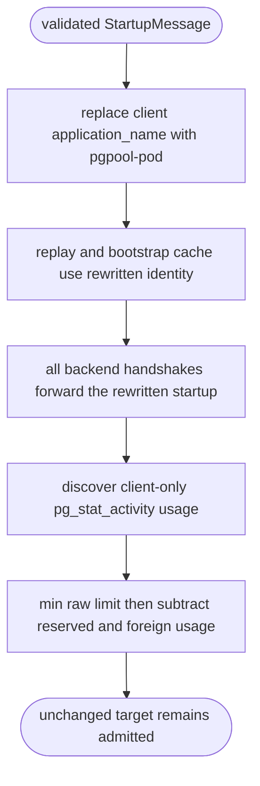

## Logic
<!-- type: logic lang: mermaid -->



### Backend identity contract

`pgpool serve` derives the deterministic backend identity `pgpool-<pod>` from
`PGPOOL_POD_NAME`; Kubernetes supplies the pod component through the Downward
API and local execution uses a stable non-empty default. The shared startup
normalizer removes every client-supplied `application_name` parameter, preserves
the relative order of every other parameter, and appends exactly one controlled
identity. Session mode, legacy transaction mode, and the dense-buffer reactor
call that normalizer before retaining or forwarding the startup. Every replay
lookup, replay publication, and bootstrap connection therefore keys on the
rewritten startup and every physical backend observes that same identity.

### Discovery contract

One PostgreSQL query returns raw `max_connections`, raw
`superuser_reserved_connections`, the count of `client backend` sessions, and
the pgpool subset whose application name begins `pgpool-`. Background workers
are excluded before total and foreign usage are formed. The effective connection
limit is `min(runtime_max, configured_ceiling?, advisory_ceiling?) -
superuser_reserved_connections`, using saturating arithmetic; foreign usage is
`client_total - pgpool_connections`, also saturating. Endpoint reserve and
safety headroom remain independent deductions in `EndpointCapacity::usable`.

### Reconcile contract

The reconciler evaluates new desired replicas against this corrected usable
capacity. It keeps the existing fail-closed rule for an unavailable discovery
or a genuine scale-out overage. Correctly classified active pgpool backends
must not turn an unchanged desired/current target into `Blocked`; status then
continues to describe normal readiness rather than a fabricated capacity fault.
## Changes
<!-- type: changes lang: yaml -->

```yaml
changes:
  - path: apps/pgpool/src/wire/frontend.rs
    action: modify
    section: logic
    impl_mode: hand-written
  - path: apps/pgpool/src/pool/backend_pool.rs
    action: modify
    section: logic
    impl_mode: hand-written
  - path: apps/pgpool/src/proxy/session.rs
    action: modify
    section: logic
    impl_mode: hand-written
  - path: apps/pgpool/src/pool/transaction.rs
    action: modify
    section: logic
    impl_mode: hand-written
  - path: apps/pgpool/src/pool/reactor/runtime.rs
    action: modify
    section: logic
    impl_mode: hand-written
  - path: apps/pgpool/src/bin/pgpool.rs
    action: modify
    section: logic
    impl_mode: hand-written
  - path: apps/pgpool/src/k8s/instance.rs
    action: modify
    section: logic
    impl_mode: hand-written
  - path: apps/pgpool/src/platform/discovery.rs
    action: modify
    section: logic
    impl_mode: hand-written
  - path: apps/pgpool/src/operator/reconcile.rs
    action: modify
    section: unit-test
    impl_mode: hand-written
  - path: apps/pgpool/tests/connection_discovery.rs
    action: modify
    section: unit-test
    impl_mode: hand-written
  - path: apps/pgpool/tech-design/semantic/pgpool-runtime-connection-limit-discovery.md
    action: modify
    section: logic
    impl_mode: hand-written
```
## Unit Test

```mermaid
---
id: pgpool-discovery-self-connection-accounting-verification
requirements:
  backend_identity:
    id: R1
    text: "Every data-plane backend startup removes client application_name values, emits one controlled pgpool-pod identity, and uses that rewritten startup for replay matching."
    kind: regression
    risk: high
    verify: cargo test -p pgpool backend_startup_identity
  client_only_usage:
    id: R2
    text: "Discovery counts a held pgpool backend as pgpool usage and excludes PostgreSQL background workers from the client total."
    kind: integration
    risk: high
    verify: cargo test -p pgpool --test connection_discovery pgpool_backend_connections_are_not_foreign_usage
  reserved_capacity:
    id: R3
    text: "The allocatable connection limit is capped by configured and advisory ceilings and reduced by superuser_reserved_connections before endpoint capacity is computed."
    kind: functional
    risk: high
    verify: cargo test -p pgpool platform::discovery
  unchanged_target:
    id: R4
    text: "A busy pool with correctly classified pgpool backends leaves an unchanged replica target admitted and reports no blocked scale reason."
    kind: regression
    risk: high
    verify: cargo test -p pgpool operator::reconcile::tests::busy_pool_usage_does_not_block_unchanged_target
---
flowchart TD
    r1[R1 backend identity] --> cargo_test_p_pgpool_backend_startup_identity[cargo test -p pgpool backend_startup_identity]
    r2[R2 client only usage] --> cargo_test_p_pgpool_test_connection_discovery_pgpool_backend_connections_are_not_foreign_usage[cargo test -p pgpool --test connection_discovery pgpool_backend_connections_are_not_foreign_usage]
    r3[R3 reserved capacity] --> cargo_test_p_pgpool_platform_discovery[cargo test -p pgpool platform::discovery]
    r4[R4 unchanged target] --> cargo_test_p_pgpool_operator_reconcile_tests_busy_pool_usage_does_not_block_unchanged_target[cargo test -p pgpool operator::reconcile::tests::busy_pool_usage_does_not_block_unchanged_target]
```

<!-- type: unit-test lang: mermaid -->


