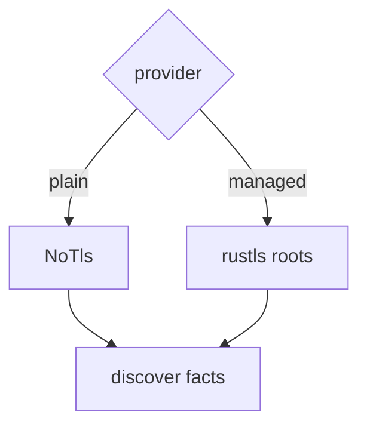
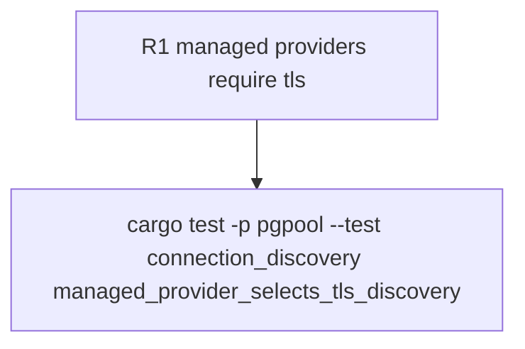

## Logic
<!-- type: logic lang: mermaid -->


## Changes
<!-- type: changes lang: yaml -->

```yaml
changes:
  - path: apps/pgpool/Cargo.toml
    action: modify
    section: logic
    impl_mode: hand-written
  - path: apps/pgpool/src/platform/discovery.rs
    action: modify
    section: logic
    impl_mode: hand-written
    anchor: discover_connection_facts
  - path: apps/pgpool/tests/connection_discovery.rs
    action: modify
    section: unit-test
    impl_mode: hand-written
    anchor: discovers_runtime_limit_from_real_postgres_when_available
```
## Unit Test
<!-- type: unit-test lang: mermaid -->



## Changes
<!-- type: changes lang: yaml -->

```yaml
changes:
  - path: apps/pgpool/Cargo.toml
    action: modify
    section: logic
    impl_mode: hand-written
  - path: apps/pgpool/src/platform/discovery.rs
    action: modify
    section: logic
    impl_mode: hand-written
    anchor: discover_connection_facts
  - path: apps/pgpool/tests/connection_discovery.rs
    action: modify
    section: unit-test
    impl_mode: hand-written
    anchor: provider_advisory_is_projected_into_discovery_context
```

## Unit Test
<!-- type: unit-test lang: mermaid -->


