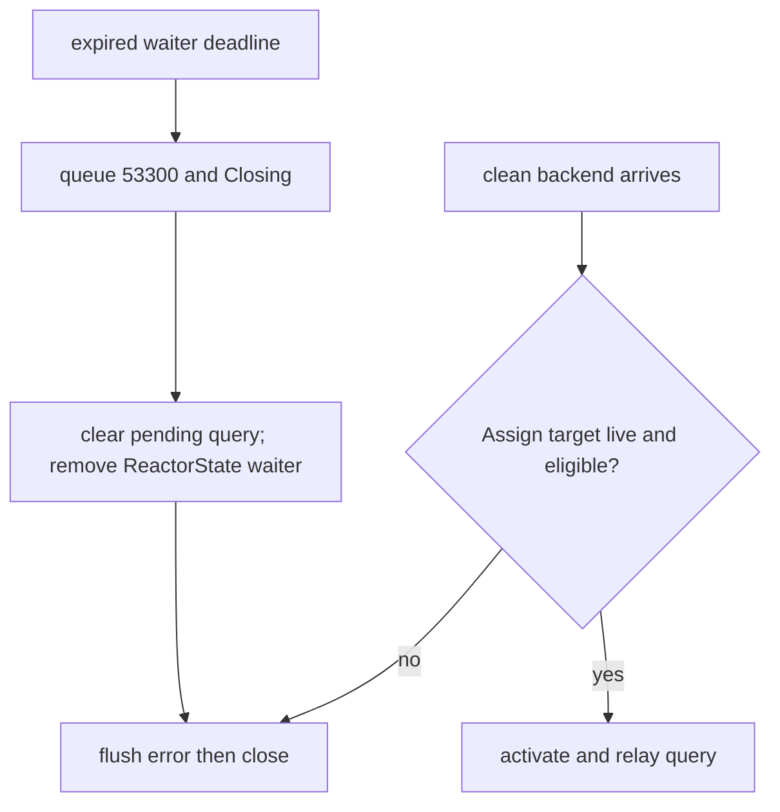
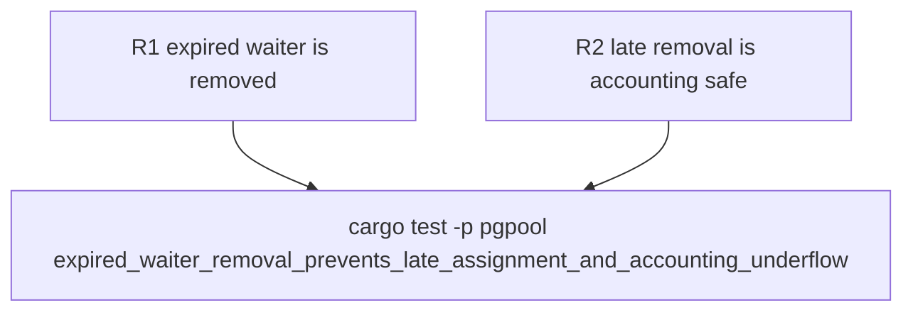

## Logic
<!-- type: logic lang: mermaid -->


## Changes
<!-- type: changes lang: yaml -->

```yaml
changes:
  - path: apps/pgpool/src/pool/reactor/runtime.rs
    action: modify
    section: logic
    impl_mode: hand-written
    anchor: expire_waiters
  - path: apps/pgpool/src/pool/reactor/state.rs
    action: modify
    section: unit-test
    impl_mode: hand-written
    anchor: disconnected_waiters_do_not_consume_a_clean_backend
```
## Unit Test
<!-- type: unit-test lang: mermaid -->



## Changes
<!-- type: changes lang: yaml -->

```yaml
changes:
  - path: apps/pgpool/src/pool/reactor/runtime.rs
    action: modify
    section: logic
    impl_mode: hand-written
    anchor: expire_waiters
  - path: apps/pgpool/src/pool/reactor/state.rs
    action: modify
    section: unit-test
    impl_mode: hand-written
    anchor: disconnected_waiters_do_not_consume_a_clean_backend
```
