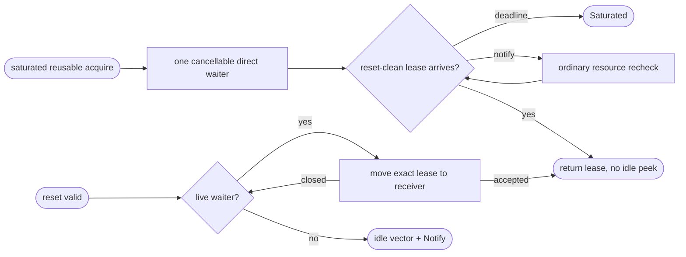

## Logic
<!-- type: logic lang: mermaid -->



### Ownership rules

- The permit is never duplicated: before a successful direct send it is restored to `outstanding` for the same `BackendConnectionId`; an accepted lease owns the normal guard, while a failed send returns that same lease for another send or idle parking.
- A waiter is a delivery opportunity, not a reservation. Existing semaphore and generic Notify determine all fresh capacity and deadline behavior.
- A waiter queue is consulted only by `ReturnToIdle` after a successful reset; it cannot expose a stream after close/reset failure or before `DISCARD ALL` completes.
- `acquire_fresh` remains excluded. Reusable standard/replay transaction acquisitions may participate because the backend has already authenticated and reset.
## Changes
<!-- type: changes lang: yaml -->

```yaml
coverage_kind: semantic
changes:
  - path: apps/pgpool/src/pool/backend_pool.rs
    action: modify
    section: pgpool-reset-clean-direct-handoff
    impl_mode: hand-written
    reason: Directly deliver a reset-clean BackendLease to a live reusable waiter with cancellation-safe fallback to the existing idle/Notify path.
  - path: apps/pgpool/tests/pool.rs
    action: modify
    section: pgpool-reset-clean-direct-handoff
    impl_mode: hand-written
    reason: Exercise direct handoff ownership and closed-waiter recovery with real local fake backend sockets.
  - path: apps/pgpool/tests/pool_modes.rs
    action: modify
    section: pgpool-reset-clean-direct-handoff
    impl_mode: hand-written
    reason: Verify reset isolation and stable capacity across direct transaction handoff.
```
## Unit Test

```mermaid
---
id: pgpool-reset-clean-direct-handoff-verification
requirements:
  closed_receiver:
    id: R2
    text: "A cancelled receiver returns its unsent lease to the next live waiter or idle state without a permit leak."
    kind: regression
    risk: high
    verify: pool::cancelled_direct_handoff_waiter_passes_backend_to_next_waiter
  exact_direct_lease:
    id: R1
    text: "A waiting reusable acquire receives the just-reset stream and permit as a BackendLease without the idle liveness round trip."
    kind: regression
    risk: high
    verify: pool::reset_clean_backend_hands_directly_to_waiting_reusable_acquire
  legacy_paths:
    id: R4
    text: "Fresh startup/session and replay publication retain existing timeout and capacity contracts."
    kind: integration
    risk: high
    verify: cargo test -p pgpool --test pool --test pool_modes --test trust_startup_replay
  transaction_semantics:
    id: R3
    text: "Direct handoff occurs only after DISCARD ALL and keeps transaction state isolated with stable backend count."
    kind: integration
    risk: high
    verify: pool_modes::transaction_mode_direct_handoff_preserves_reset_isolation_and_capacity
  unchanged_benchmark:
    id: R5
    text: "The fixed peer benchmark remains the sole success measure; meter is diagnostic only and a first valid loss reverts production code."
    kind: integration
    risk: high
    verify: apps/pgpool/benchmarks/pgbouncer-transaction-pooling/run.sh --pgpool-bin target/release/pgpool
---
flowchart TD
    r1[R1 exact direct lease] --> pool_reset_clean_backend_hands_directly_to_waiting_reusable_acquire[pool::reset_clean_backend_hands_directly_to_waiting_reusable_acquire]
    r2[R2 closed receiver] --> pool_cancelled_direct_handoff_waiter_passes_backend_to_next_waiter[pool::cancelled_direct_handoff_waiter_passes_backend_to_next_waiter]
    r3[R3 transaction semantics] --> pool_modes_transaction_mode_direct_handoff_preserves_reset_isolation_and_capacity[pool_modes::transaction_mode_direct_handoff_preserves_reset_isolation_and_capacity]
    r4[R4 legacy paths] --> cargo_test_p_pgpool_test_pool_test_pool_modes_test_trust_startup_replay[cargo test -p pgpool --test pool --test pool_modes --test trust_startup_replay]
    r5[R5 unchanged benchmark] --> apps_pgpool_benchmarks_pgbouncer_transaction_pooling_run_sh_pgpool_bin_target_release_pgpool[apps/pgpool/benchmarks/pgbouncer-transaction-pooling/run.sh --pgpool-bin target/release/pgpool]
```

<!-- type: unit-test lang: mermaid -->


