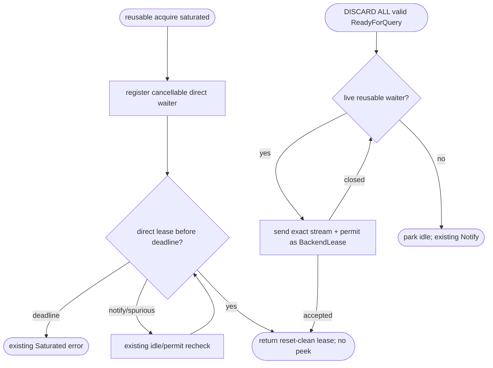

## Logic
<!-- type: logic lang: mermaid -->



### Contract invariants

- Only successful reset completion creates a direct handoff. EOF, reset error, or timeout still closes the socket and releases physical capacity through the existing path.
- The handed-off `BackendLease` owns the original stream and the same permit; its `CapacityGuard` observes it as outstanding before the receiver can use or drop it.
- A direct waiter is reusable-only. `acquire_fresh` and startup replay publication never receive an authenticated idle stream through this queue.
- Receiver cancellation cannot leak capacity: a failed oneshot send returns the lease to release, which tries the next live waiter before parking it idle. Timeout does not change the caller's deadline or reset the generic Notify path.
- Direct handoff has no timer driver, global scheduler, or new connection decision. It removes only the reset-clean idle-vector and liveness-probe round trip.

## Changes
<!-- type: changes lang: yaml -->

```yaml
coverage_kind: semantic
changes:
  - path: apps/pgpool/src/pool/backend_pool.rs
    action: modify
    section: pgpool-reset-clean-direct-handoff
    impl_mode: hand-written
    reason: Register reusable-only waiters and transfer a reset-clean stream/permit directly without changing fresh admission or generic Notify fallback.
  - path: apps/pgpool/tests/pool.rs
    action: modify
    section: pgpool-reset-clean-direct-handoff
    impl_mode: hand-written
    reason: Prove direct stream handoff skips idle re-acquisition and remains capacity/cancellation safe.
  - path: apps/pgpool/tests/pool_modes.rs
    action: modify
    section: pgpool-reset-clean-direct-handoff
    impl_mode: hand-written
    reason: Pin transaction reset isolation and backend-count stability while a reusable waiter receives a reset-clean connection.
```

## Unit Test

```mermaid
---
id: pgpool-reset-clean-direct-handoff-verification
requirements:
  closed_waiter_recovery:
    id: R2
    text: "A cancelled or closed direct waiter cannot leak the stream or permit; a next live waiter receives it and pool accounting remains bounded."
    kind: regression
    risk: high
    verify: pool::cancelled_direct_handoff_waiter_passes_backend_to_next_waiter
  direct_stream_transfer:
    id: R1
    text: "A reusable acquisition already waiting at saturation receives the exact reset-clean backend directly rather than re-acquiring it from idle."
    kind: regression
    risk: high
    verify: pool::reset_clean_backend_hands_directly_to_waiting_reusable_acquire
  existing_paths:
    id: R4
    text: "Fresh-only startup, replay publication, saturation deadline, and session mode retain their existing contracts."
    kind: integration
    risk: high
    verify: cargo test -p pgpool --test pool --test pool_modes --test trust_startup_replay
  peer_comparison:
    id: R5
    text: "The unchanged 64-client/16-backend/simple/30-second peer comparison has no errors; a first valid loss is immediately reverted as a no-go."
    kind: integration
    risk: high
    verify: apps/pgpool/benchmarks/pgbouncer-transaction-pooling/run.sh --pgpool-bin target/release/pgpool
  reset_isolation:
    id: R3
    text: "Transaction state is reset before the next owner observes a direct handoff and repeated transaction reuse holds backend count stable."
    kind: integration
    risk: high
    verify: pool_modes::transaction_mode_direct_handoff_preserves_reset_isolation_and_capacity
---
flowchart TD
    r1[R1 direct stream transfer] --> pool_reset_clean_backend_hands_directly_to_waiting_reusable_acquire[pool::reset_clean_backend_hands_directly_to_waiting_reusable_acquire]
    r2[R2 closed waiter recovery] --> pool_cancelled_direct_handoff_waiter_passes_backend_to_next_waiter[pool::cancelled_direct_handoff_waiter_passes_backend_to_next_waiter]
    r3[R3 reset isolation] --> pool_modes_transaction_mode_direct_handoff_preserves_reset_isolation_and_capacity[pool_modes::transaction_mode_direct_handoff_preserves_reset_isolation_and_capacity]
    r4[R4 existing paths] --> cargo_test_p_pgpool_test_pool_test_pool_modes_test_trust_startup_replay[cargo test -p pgpool --test pool --test pool_modes --test trust_startup_replay]
    r5[R5 peer comparison] --> apps_pgpool_benchmarks_pgbouncer_transaction_pooling_run_sh_pgpool_bin_target_release_pgpool[apps/pgpool/benchmarks/pgbouncer-transaction-pooling/run.sh --pgpool-bin target/release/pgpool]
```

<!-- type: unit-test lang: mermaid -->


