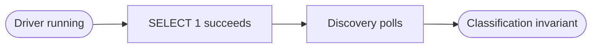
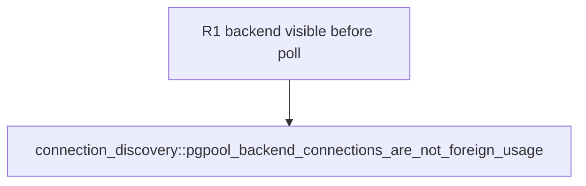
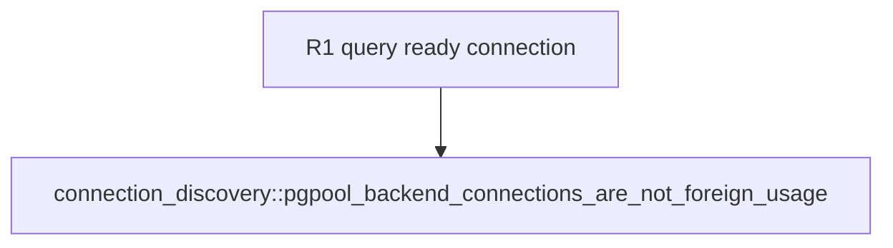

## Logic
<!-- type: logic lang: mermaid -->



The query-ready step is deliberately before the polling loop. If startup/auth cannot complete, the existing integration convention skips rather than treating a missing local database as a classification failure. Once the query succeeds, the held client remains alive through the observation loop.
## Changes
<!-- type: changes lang: yaml -->

```yaml
coverage_kind: semantic
changes:
  - path: apps/pgpool/tests/connection_discovery.rs
    action: modify
    section: unit-test
    impl_mode: hand-written
    anchor: pgpool_backend_connections_are_not_foreign_usage
    reason: Drive the held pgpool backend to query-ready state before observing it through runtime discovery.
```
## Unit Test
<!-- type: unit-test lang: mermaid -->



## Unit Test
<!-- type: unit-test lang: mermaid -->


