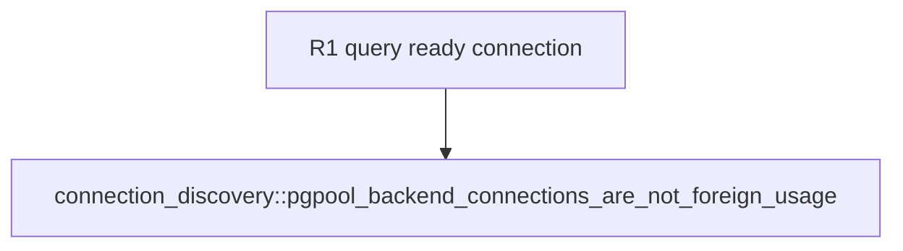

## Logic
<!-- type: logic lang: mermaid -->


The test driver must run before the readiness query. A successful query creates an observable client-backend session while retaining the `Client` for the polling interval; discovery then measures a real held connection rather than an asynchronous connection attempt.

## Changes
<!-- type: changes lang: yaml -->

```yaml
coverage_kind: semantic
changes:
  - path: apps/pgpool/tests/connection_discovery.rs
    action: modify
    section: unit-test
    impl_mode: hand-written
    anchor: pgpool_backend_connections_are_not_foreign_usage
    reason: Make the held backend query-ready before verifying pgpool-owned connection accounting.
```

## Unit Test
<!-- type: unit-test lang: mermaid -->


