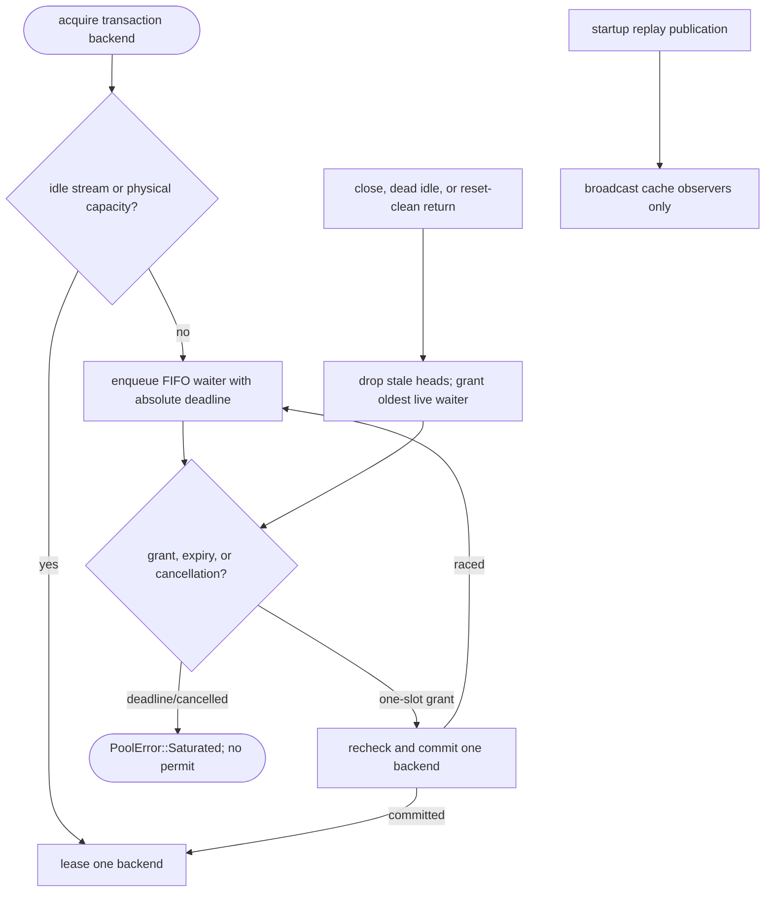

## Logic
<!-- type: logic lang: mermaid -->



### Invariants

- Physical capacity remains owned exactly once by an active lease or a reset-clean idle stream. Scheduler state contains only waiter identity, deadline, and notification sender; it never owns a backend stream or semaphore permit.
- Every saturated acquisition is ordered by FIFO insertion. A release removes cancelled or expired heads before granting one notification to the oldest live waiter, so one physical slot cannot admit more than one client.
- The scheduler holds at most one Tokio timer for its earliest live deadline. Adding, cancelling, granting, or expiring a waiter recomputes that earliest deadline only while holding scheduler state; no frontend owns an individual `Sleep`.
- A waiter that wakes does not assume ownership until it atomically commits an idle stream or physical permit. A stale wake, cancellation, liveness failure, or connect failure leaves no phantom permit and either advances the next waiter or returns the existing typed error.
- Startup replay is deliberately separate: exact safe reply publication wakes cache observers, while capacity release only drives FIFO backend admission.

### Error handling

When the earliest deadline fires, the scheduler removes every expired head in order, sends each a saturation result, and arms the next earliest live deadline. Dropping an acquire future marks or removes its waiter; a later release skips it without consuming a capacity handoff. Reset, liveness, connect, and dropped-lease failures preserve their existing stream disposal and physical-permit behavior, then invoke the same one-slot handoff only after capacity is actually visible.

## Changes
<!-- type: changes lang: yaml -->

```yaml
coverage_kind: semantic
changes:
  - path: apps/pgpool/src/pool/backend_pool.rs
    action: modify
    section: pgpool-capacity-deadline-scheduler
    impl_mode: hand-written
    reason: Replace per-waiter timeout and Notify capacity waits with pool-owned FIFO deadline scheduling and exact one-slot handoff.
  - path: apps/pgpool/tests/pool.rs
    action: modify
    section: pgpool-capacity-deadline-scheduler
    impl_mode: hand-written
    reason: Prove FIFO capacity handoff, deadline expiry, cancellation cleanup, and permit conservation.
  - path: apps/pgpool/tests/pool_modes.rs
    action: modify
    section: pgpool-capacity-deadline-scheduler
    impl_mode: hand-written
    reason: Preserve transaction reuse, capped replay admission, reset isolation, and no session-state leak under queued acquisition.
```
