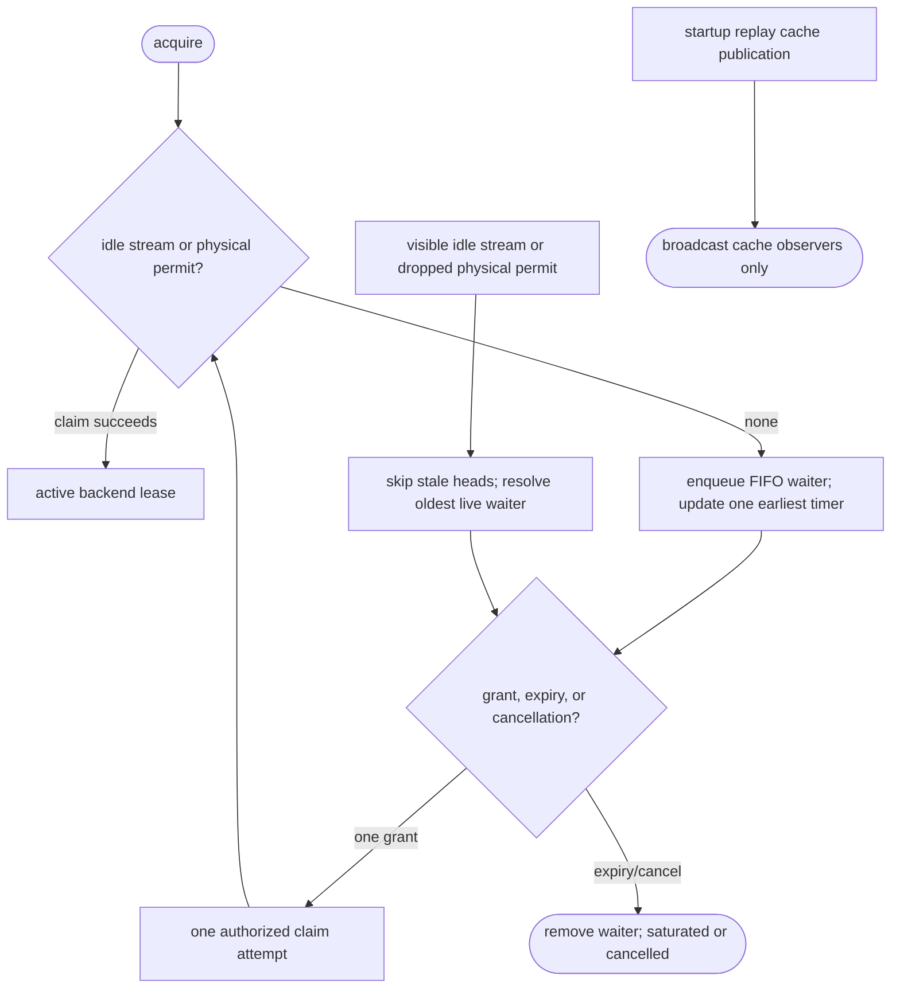

## Logic
<!-- type: logic lang: mermaid -->



### Contract invariants

- The scheduler never owns a backend stream or physical permit. An active lease or reset-clean idle tuple remains the sole owner of each physical permit.
- FIFO order applies to live saturated waiters. A release resolves exactly one oldest live waiter after capacity is visible; a grant only permits that waiter to attempt an atomic claim.
- Scheduler timer ownership is cardinality one: it is armed only for the earliest live deadline and is replaced only when that deadline changes, fires, or the queue empties.
- Every waiter preserves its original absolute deadline. Cancellation removes its scheduler record without converting to a backend grant; expiry returns the existing typed saturation error.
- Startup replay cache broadcast is not capacity handoff and cannot consume or create a physical backend permit.

### Error handling

Expired and cancelled waiters are removed before a handoff can target them. If a granted caller loses a race to a failed liveness probe, connect error, or another cancellation, it re-enters FIFO scheduling with its original deadline unless that deadline has elapsed. Any reset, close, dropped-lease, or failed-connect path invokes handoff only after its existing permit disposition completes, preventing phantom capacity or a lost wake.
## Changes
<!-- type: changes lang: yaml -->

```yaml
coverage_kind: semantic
changes:
  - path: apps/pgpool/src/pool/backend_pool.rs
    action: modify
    section: pgpool-capacity-deadline-scheduler
    impl_mode: hand-written
    reason: Own FIFO waiters, one earliest-deadline timer, exact cancellation, and one-slot capacity grants beside physical pool state.
  - path: apps/pgpool/tests/pool.rs
    action: modify
    section: pgpool-capacity-deadline-scheduler
    impl_mode: hand-written
    reason: Verify FIFO grants, expiry, cancellation, and physical permit conservation.
  - path: apps/pgpool/tests/pool_modes.rs
    action: modify
    section: pgpool-capacity-deadline-scheduler
    impl_mode: hand-written
    reason: Verify capped transaction reuse, replay, reset isolation, and concurrent client behavior remain unchanged.
```
## Unit Test

```mermaid
---
id: pgpool-capacity-deadline-scheduler-verification
requirements:
  deadline_and_cancellation:
    id: R3
    text: "Waiter expiry and cancellation preserve the original saturated error surface and cannot leak, duplicate, or steal a physical permit."
    kind: regression
    risk: high
    verify: pool::capacity_waiter_expiry_and_cancellation_preserve_permits
  fifo_handoff:
    id: R1
    text: "One available backend slot grants exactly one oldest live FIFO waiter, and successive releases preserve queue order without exceeding physical capacity."
    kind: regression
    risk: high
    verify: pool::fifo_capacity_handoff_admits_one_waiter_per_release
  performance_evidence:
    id: AC5
    text: "Meter is diagnostic only and the unchanged competitor benchmark is retained only after error-free unsampled release wins."
    kind: e2e
    risk: high
    verify: apps/pgpool/benchmarks/pgbouncer-transaction-pooling/run.sh
  pool_contract:
    id: R4
    text: "Replay cache broadcast stays independent while transaction reuse, reset isolation, liveness, and session state remain correct under queued acquisition."
    kind: integration
    risk: high
    verify: cargo test -p pgpool --test pool --test pool_modes --test trust_startup_replay
---
flowchart TD
    r1[R1 fifo handoff] --> pool_fifo_capacity_handoff_admits_one_waiter_per_release[pool::fifo_capacity_handoff_admits_one_waiter_per_release]
    r3[R3 deadline and cancellation] --> pool_capacity_waiter_expiry_and_cancellation_preserve_permits[pool::capacity_waiter_expiry_and_cancellation_preserve_permits]
    r4[R4 pool contract] --> cargo_test_p_pgpool_test_pool_test_pool_modes_test_trust_startup_replay[cargo test -p pgpool --test pool --test pool_modes --test trust_startup_replay]
    ac5[AC5 performance evidence] --> apps_pgpool_benchmarks_pgbouncer_transaction_pooling_run_sh[apps/pgpool/benchmarks/pgbouncer-transaction-pooling/run.sh]
```

<!-- type: unit-test lang: mermaid -->


