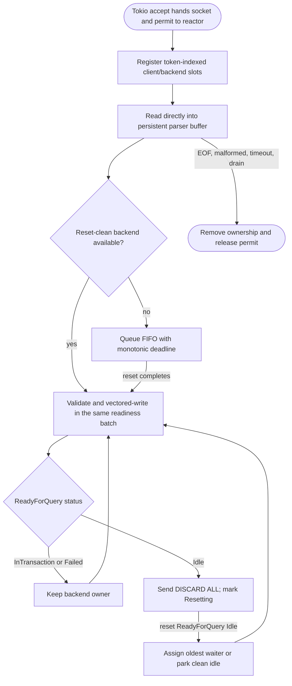
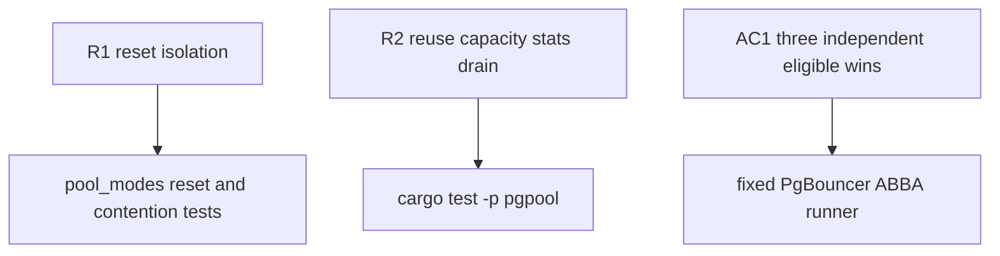

# P0 dense-buffer readiness reactor

## Logic
<!-- type: logic lang: mermaid -->



The reactor is the default transaction engine. `PGPOOL_TRANSACTION_ENGINE=legacy`
is an explicit operational rollback only; failure to start the reactor also
falls back to the existing Tokio handler. Session pooling never enters this
reactor.

The ownership invariant is unchanged: a backend may be assigned only from the
clean-idle queue. A transaction `ReadyForQuery(Idle)` starts `DISCARD ALL`; it
does not make the backend reusable. Only the reset response does. Pipelined
frontend frames remain attached to their client and wait behind that boundary.

Tokens index dense `Vec<Option<T>>` slots directly. Closed tokens are retired
until the current readiness snapshot is fully consumed, then recycled from a
free list; this bounds slot growth without letting stale events target a new
socket. Wait deadlines share one configured duration, so insertion order is
deadline order and a lazy FIFO can discard stale epochs in O(1). Parser buffers
read directly from nonblocking sockets. Validated raw `Bytes` move into a
reusable queue and a bounded `write_vectored` flush runs at the end of the
current readiness batch; WRITABLE interest is retained only on `WouldBlock`.

This P0 preserves pgpool's existing transaction-relay protocol boundary: the
competitive profile and ownership proof use simple-query command cycles.
Cross-lease extended-protocol prepared-statement identity/remapping remains a
separate wire capability under #1287; this reactor does not claim partial
support for it.

## Changes
<!-- type: changes lang: yaml -->

```yaml
coverage_kind: semantic
changes:
  - path: apps/pgpool/src/pool/reactor/state.rs
    action: create
    section: logic
    impl_mode: hand-written
    reason: Own dense client/backend phases, clean-idle and waiter FIFO queues, and reset-before-reuse transitions.
  - path: apps/pgpool/src/pool/reactor/runtime.rs
    action: create
    section: logic
    impl_mode: hand-written
    reason: Own mio readiness, token slots, monotonic deadlines, reusable buffers, vectored output, optimistic flush, startup replay, and drain lifetimes.
  - path: apps/pgpool/src/pool/transaction.rs
    action: update
    section: logic
    impl_mode: hand-written
    reason: Make the reactor the transaction-mode default while retaining an explicit legacy rollback.
  - path: apps/pgpool/src/wire/reader.rs
    action: update
    section: logic
    impl_mode: hand-written
    reason: Read a synchronous nonblocking socket directly into the bounded parser buffer.
  - path: apps/pgpool/src/pool/backend_pool.rs
    action: update
    section: logic
    impl_mode: hand-written
    reason: Publish reactor-owned active and idle counts through the existing pool stats API.
  - path: libs/tcp-server/src/lib.rs
    action: update
    section: logic
    impl_mode: hand-written
    reason: Retain handler-owned readiness resources through connection drain.
  - path: apps/pgpool/tests/pool_modes.rs
    action: update
    section: unit-test
    impl_mode: hand-written
    reason: Preserve backend reuse, contention, saturation, stats, and reset-isolation coverage on the default reactor, and prove failed backend connects release frontend capacity.
  - path: apps/pgpool/tests/pgbouncer_benchmark.rs
    action: update
    section: unit-test
    impl_mode: hand-written
    reason: Pin the host-level serialization rule alongside the immutable counterbalanced profile contract.
  - path: apps/pgpool/benchmarks/pgbouncer-transaction-pooling/README.md
    action: update
    section: e2e-test
    impl_mode: hand-written
    reason: Document that a peer verdict requires the serialized, uncontended runner rather than overlapping host load.
  - path: apps/pgpool/benchmarks/pgbouncer-transaction-pooling/run.sh
    action: update
    section: e2e-test
    impl_mode: hand-written
    reason: Keep the fixed counterbalanced PgBouncer comparison contract while serializing peer runs so competing host workloads cannot invalidate a release verdict.
```

## Unit Test
<!-- type: unit-test lang: mermaid -->


