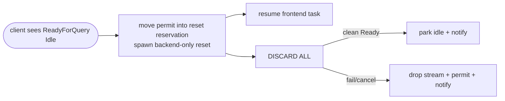
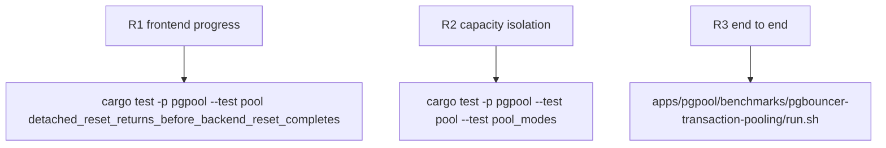

## Logic
<!-- type: logic lang: mermaid -->



### Invariants

- `release(ReturnToIdle)` first removes the lease's permit from `outstanding`; after that point the ordinary lease guard is deliberately a no-op and the reset reservation is the sole owner of that permit.
- Scheduling is non-blocking for the transaction frontend. A reset task owns `(stream, permit)` until it either parks the stream in `idle` after its own `ReadyForQuery` or drops both on any failure.
- `idle` remains the only acquisition source. A resetting stream is never in that collection and therefore cannot be leased, reported idle, or receive client bytes before cleanup succeeds.
- The reset reservation's `Drop` drops its permit and wakes pool waiters. This covers reset read/write failure, timeout, task abort during runtime shutdown, and panic unwinding without a permit leak or a waiter stalled after capacity becomes available.
- On success the reservation transfers its permit exactly once into the idle tuple under `PoolState` mutex, then notifies waiters. On failure the reservation drops it exactly once and notifies.
- Existing client-visible ordering is unchanged: the valid backend response including `ReadyForQuery(Idle)` is forwarded before scheduling reset; malformed suffixes still close after their valid prefix. `DISCARD ALL` still completes before any later owner acquires the stream.

### Error handling

A spawn-owned reset converts every `reset_connection` error/EOF/timeout into stream disposal. The task never synthesizes a client response; its previous frontend has already received the completed transaction response. If runtime shutdown aborts the task, Rust drop order closes the stream and the reset reservation releases capacity plus notification. `Close` remains the existing synchronous disposal behavior for session teardown and terminal transaction legs.
## Changes
<!-- type: changes lang: yaml -->

```yaml
changes:
  - path: apps/pgpool/src/pool/backend_pool.rs
    action: modify
    section: pgpool-detached-reset
    impl_mode: hand-written
  - path: apps/pgpool/src/pool/transaction.rs
    action: modify
    section: pgpool-detached-reset
    impl_mode: hand-written
  - path: apps/pgpool/tests/pool.rs
    action: modify
    section: pgpool-detached-reset
    impl_mode: hand-written
  - path: apps/pgpool/tests/pool_modes.rs
    action: modify
    section: pgpool-detached-reset
    impl_mode: hand-written
```
## Unit Test
<!-- type: unit-test lang: mermaid -->


