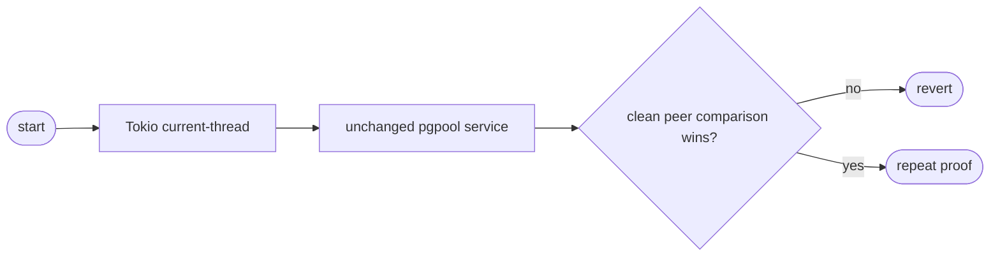
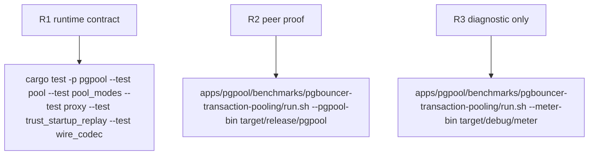

## Logic
<!-- type: logic lang: mermaid -->



### Contract

- The `pgpool` binary starts its existing Tokio service on the `current_thread` scheduler before dispatching the same CLI subcommands.
- Tokio I/O and timer drivers, `tokio::spawn`, signal handling, TCP frontend, and admin plane keep their existing behavior; only the runtime scheduler flavor changes.
- Transaction pooling remains unchanged: frontend admission, startup/replay, backend leasing, relay, reset, and capped physical capacity keep their existing implementations.
- No pool primitive, timeout policy, queue/waiter behavior, socket operation, wire frame ownership, dependency version, or runtime tuning parameter changes.

### Failure contract

- Any failed service behavior or first valid normal-baseline 30-second comparison that loses to PgBouncer reverts the scheduler-flavor change immediately.
- Meter output may diagnose scheduler contention but cannot decide candidate retention.

## Changes
<!-- type: changes lang: yaml -->

```yaml
changes:
  - path: apps/pgpool/src/bin/pgpool.rs
    action: modify
    section: pgpool-current-thread-runtime-locality
    impl_mode: hand-written
    reason: Change only the Tokio scheduler flavor to current-thread while preserving all service and pool behavior.
```

## Unit Test
<!-- type: unit-test lang: mermaid -->


