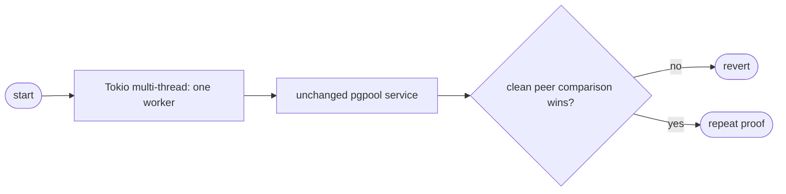
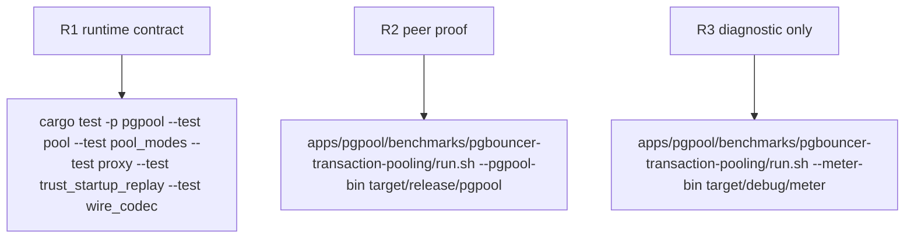

## Logic
<!-- type: logic lang: mermaid -->



### Contract

- The `pgpool` binary starts its existing `multi_thread` Tokio runtime with exactly one worker thread before dispatching its existing CLI subcommands.
- The `Send` task topology, asynchronous I/O and timer drivers, `tokio::spawn`, signal handling, TCP frontend, and admin plane remain unchanged.
- Transaction pooling remains unchanged: frontend admission, startup/replay, backend leasing, relay, reset, and capped physical capacity keep their existing implementations.
- No pool primitive, timeout policy, queue/waiter behavior, socket operation, or wire frame ownership changes.

### Failure contract

- Any failed service behavior or first valid clean 30-second comparison that loses to PgBouncer reverts the runtime-worker change immediately.
- Meter output may diagnose worker lock contention but cannot decide candidate retention.
## Changes
<!-- type: changes lang: yaml -->

```yaml
changes:
  - path: apps/pgpool/src/bin/pgpool.rs
    action: modify
    section: pgpool-one-worker-runtime-locality
    impl_mode: hand-written
    reason: Configure exactly one worker on the existing Tokio multi-thread runtime while leaving all service and pool semantics intact.
```
## Unit Test
<!-- type: unit-test lang: mermaid -->


