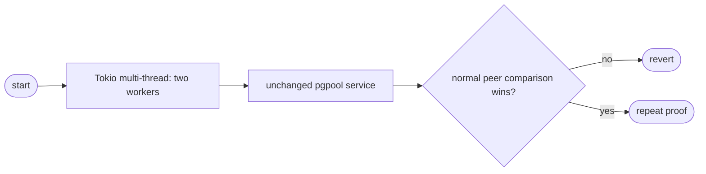

## Logic
<!-- type: logic lang: mermaid -->

### Contract

- The `pgpool` binary starts its existing `multi_thread` Tokio runtime with exactly two worker threads before dispatching its existing CLI subcommands.
- The `Send` task topology, asynchronous I/O and timer drivers, `tokio::spawn`, signal handling, TCP frontend, and admin plane remain unchanged.
- Transaction pooling remains unchanged: frontend admission, startup/replay, backend leasing, relay, reset, and capped physical capacity keep their existing implementations.
- No global queue, event interval, LIFO, blocking pool, dependency, pool primitive, timeout policy, queue/waiter behavior, socket operation, or wire frame ownership changes.

### Failure contract

- Any failed service behavior or first valid normal-baseline 30-second comparison that loses to PgBouncer reverts the worker-count change immediately.
- Meter output may diagnose worker contention but cannot decide candidate retention.
