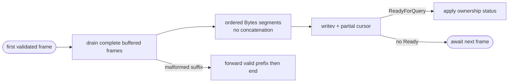
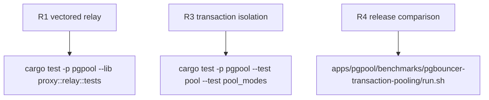

## Logic
<!-- type: logic lang: mermaid -->



## Changes
<!-- type: changes lang: yaml -->

```yaml
changes:
  - path: apps/pgpool/src/proxy/relay.rs
    action: modify
    section: pgpool-vectored-buffered-relay
    impl_mode: hand-written
  - path: apps/pgpool/src/pool/transaction.rs
    action: modify
    section: pgpool-vectored-buffered-relay
    impl_mode: hand-written
  - path: apps/pgpool/tests/pool_modes.rs
    action: modify
    section: pgpool-vectored-buffered-relay
    impl_mode: hand-written
```

## Unit Test
<!-- type: unit-test lang: mermaid -->


