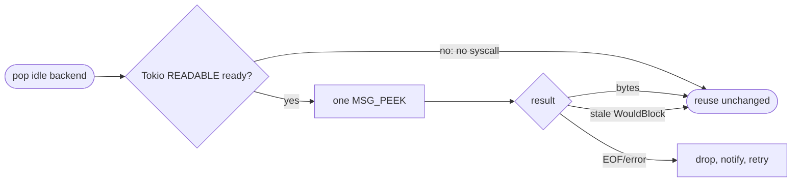

## Logic
<!-- type: logic lang: mermaid -->



### Contract invariants

- The non-ready fast path allocates no timer and invokes no socket syscall; `try_io` returns `WouldBlock` before executing its closure.
- `MSG_PEEK` runs only under Tokio READABLE interest and never consumes protocol bytes. A stale readiness result that yields `WouldBlock` clears Tokio's stale read bit and remains a live socket.
- Zero bytes is EOF; any error other than `WouldBlock` is unsafe for reuse and follows the existing drop-and-retry disposition.
- Stream/permit ownership, reset-before-idle, wakeups, fresh-connect fallback, and acquire deadline stay unchanged.

### Error handling

A `WouldBlock` result can represent either no registered readability or a stale readability bit after the peek syscall. Both mean the descriptor has no observable EOF/error and is returned unchanged. `Ok(0)` and non-`WouldBlock` errors drop the idle tuple before the acquire loop proceeds, preserving the physical cap.

## Changes
<!-- type: changes lang: yaml -->

```yaml
coverage_kind: semantic
changes:
  - path: apps/pgpool/Cargo.toml
    action: modify
    section: pgpool-readiness-gated-idle-liveness
    impl_mode: hand-written
    reason: Declare the safe socket facade used solely inside Tokio's readiness-gated closure.
  - path: apps/pgpool/src/pool/backend_pool.rs
    action: modify
    section: pgpool-readiness-gated-idle-liveness
    impl_mode: hand-written
    reason: Replace timer liveness with Tokio READABLE gating and conditional non-consuming socket peek classification.
  - path: apps/pgpool/tests/pool.rs
    action: modify
    section: pgpool-readiness-gated-idle-liveness
    impl_mode: hand-written
    reason: Cover no-readiness reuse, ready EOF rejection, and preserved queued protocol bytes.
```

## Unit Test

```mermaid
---
id: pgpool-readiness-gated-idle-liveness-verification
requirements:
  nonready_reuse:
    id: R1
    text: "An idle backend with no registered readable state is reused without a timer-backed wait."
    kind: regression
    risk: high
    verify: pool::acquire_reuses_idle_connection_after_liveness_check_passes
  performance_evidence:
    id: AC4
    text: "Meter informs bottleneck diagnosis only; retention requires clean unsampled wins under the fixed PgBouncer benchmark contract."
    kind: e2e
    risk: high
    verify: apps/pgpool/benchmarks/pgbouncer-transaction-pooling/run.sh
  pool_modes_unchanged:
    id: R4
    text: "Pool mode, reset, capacity, and replay contracts remain unchanged around the new liveness gate."
    kind: integration
    risk: high
    verify: cargo test -p pgpool --test pool --test pool_modes --test trust_startup_replay
  readable_bytes_preserved:
    id: R3
    text: "Read-ready queued bytes are observed only with MSG_PEEK and are preserved for the lease holder."
    kind: regression
    risk: high
    verify: pool::acquire_liveness_peek_preserves_queued_backend_bytes
  ready_eof_discard:
    id: R2
    text: "Read-ready peer EOF is detected before a lease is returned and acquisition retries with a fresh backend."
    kind: regression
    risk: high
    verify: pool::acquire_drops_dead_idle_connection_and_retries
---
flowchart TD
    r1[R1 nonready reuse] --> pool_acquire_reuses_idle_connection_after_liveness_check_passes[pool::acquire_reuses_idle_connection_after_liveness_check_passes]
    r2[R2 ready eof discard] --> pool_acquire_drops_dead_idle_connection_and_retries[pool::acquire_drops_dead_idle_connection_and_retries]
    r3[R3 readable bytes preserved] --> pool_acquire_liveness_peek_preserves_queued_backend_bytes[pool::acquire_liveness_peek_preserves_queued_backend_bytes]
    ac4[AC4 performance evidence] --> apps_pgpool_benchmarks_pgbouncer_transaction_pooling_run_sh[apps/pgpool/benchmarks/pgbouncer-transaction-pooling/run.sh]
    r4[R4 pool modes unchanged] --> cargo_test_p_pgpool_test_pool_test_pool_modes_test_trust_startup_replay[cargo test -p pgpool --test pool --test pool_modes --test trust_startup_replay]
```

<!-- type: unit-test lang: mermaid -->


