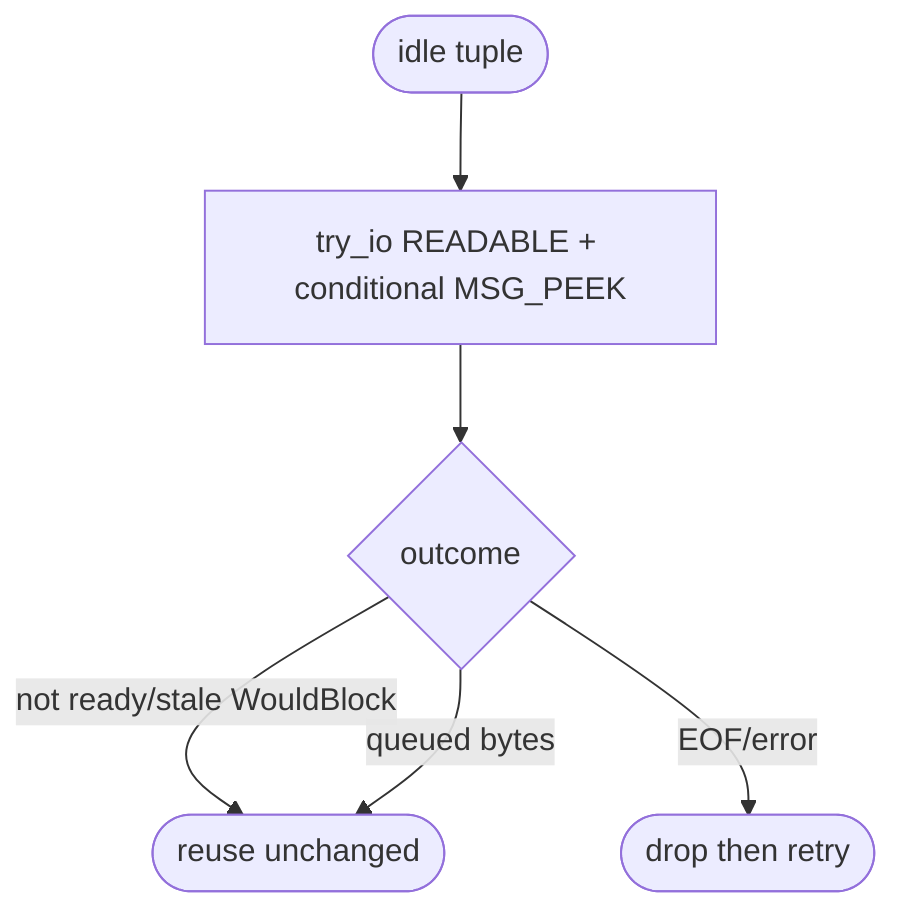

## Logic
<!-- type: logic lang: mermaid -->



### Contract invariants

- `TcpStream::try_io(Interest::READABLE, closure)` is the sole readiness authority. When it returns `WouldBlock` before executing the closure, the stream is live and no syscall ran.
- The closure uses an external socket facade rather than a Tokio stream method, exactly as Tokio requires for `try_io`; it performs only one READABLE operation.
- Closure `WouldBlock` is returned only after a real peek sees stale readiness; Tokio can clear that stale read bit. This still yields a live stream.
- Positive peek results preserve bytes; zero results and non-`WouldBlock` errors discard the tuple.

### Compatibility

This is internal behavior only. It retains the established downstream PostgreSQL wire semantics and all pool API/error shapes. It differs from #1680 by making the common non-readable idle state a runtime-only decision rather than a kernel syscall.
## Changes
<!-- type: changes lang: yaml -->

```yaml
coverage_kind: semantic
changes:
  - path: apps/pgpool/Cargo.toml
    action: modify
    section: pgpool-readiness-gated-idle-liveness-contract
    impl_mode: hand-written
    reason: Declare the direct socket facade used in the Tokio-owned readiness closure.
  - path: apps/pgpool/src/pool/backend_pool.rs
    action: modify
    section: pgpool-readiness-gated-idle-liveness-contract
    impl_mode: hand-written
    reason: Implement exact try_io/MSG_PEEK classifications without changing pool ownership or error paths.
  - path: apps/pgpool/tests/pool.rs
    action: modify
    section: pgpool-readiness-gated-idle-liveness-contract
    impl_mode: hand-written
    reason: Keep byte preservation and EOF handling observable at the pool boundary.
```
## Unit Test

```mermaid
---
id: pgpool-readiness-gated-idle-liveness-contract-verification
requirements:
  integration_contract:
    id: R4
    text: "Existing pool mode, reset, and replay contracts remain passing around the readiness gate."
    kind: integration
    risk: high
    verify: cargo test -p pgpool --test pool --test pool_modes --test trust_startup_replay
  ready_bytes_remain_queued:
    id: R3
    text: "A readable byte remains available after the conditional MSG_PEEK path runs."
    kind: regression
    risk: high
    verify: pool::acquire_liveness_peek_preserves_queued_backend_bytes
  ready_eof_is_dead:
    id: R2
    text: "Read-ready EOF cannot escape as a reusable idle lease."
    kind: regression
    risk: high
    verify: pool::acquire_drops_dead_idle_connection_and_retries
  unready_is_live:
    id: R1
    text: "The common no-readable-byte idle state is leased as live through Tokio's non-ready path."
    kind: regression
    risk: high
    verify: pool::acquire_reuses_idle_connection_after_liveness_check_passes
---
flowchart TD
    r1[R1 unready is live] --> pool_acquire_reuses_idle_connection_after_liveness_check_passes[pool::acquire_reuses_idle_connection_after_liveness_check_passes]
    r2[R2 ready eof is dead] --> pool_acquire_drops_dead_idle_connection_and_retries[pool::acquire_drops_dead_idle_connection_and_retries]
    r3[R3 ready bytes remain queued] --> pool_acquire_liveness_peek_preserves_queued_backend_bytes[pool::acquire_liveness_peek_preserves_queued_backend_bytes]
    r4[R4 integration contract] --> cargo_test_p_pgpool_test_pool_test_pool_modes_test_trust_startup_replay[cargo test -p pgpool --test pool --test pool_modes --test trust_startup_replay]
```

<!-- type: unit-test lang: mermaid -->


