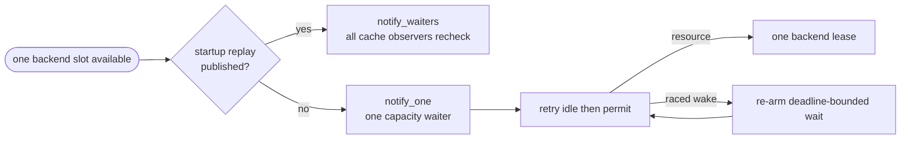

## Logic
<!-- type: logic lang: mermaid -->



### Invariants

- `BackendPool` has two deliberately separate notification intents. `publish_startup_replay` stores an exact shared reply while holding `PoolState`, drops the lock, then calls `notify_waiters`; every other path that makes one physical slot available calls a `notify_one` capacity handoff.
- Capacity handoff occurs only after the released permit is either installed inside one idle tuple or dropped. Therefore the awakened waiter cannot observe a notification before the corresponding resource is visible.
- `acquire_internal`, `acquire_for_startup`, and `acquire_for_replayed_startup` keep their existing deadline and notified-before-check ordering. A one-shot notification can be spurious or won by another waiter, but the loser re-arms its wait without resetting its deadline or claiming a phantom slot.
- Each release, reset failure, close, dead-idle removal, failed fresh connect, or abandoned lease can free at most one permit and emits at most one capacity notification. Consecutive transitions eventually wake distinct pending waiters under Tokio `Notify` FIFO wake discipline.
- Replay cache entries do not consume backend capacity; publishing one can satisfy multiple matching startup identities, so its broadcast is semantically distinct and remains unchanged.
- `DISCARD ALL`, liveness checking, semaphore permit ownership, physical cap, timeout surface, transaction relay, and session state isolation are untouched.

### Error handling

A notified waiter that races and finds neither idle stream nor semaphore permit simply waits again until its original deadline. It never closes another client's stream or reports saturation early. Every I/O, timeout, or liveness failure follows the existing stream disposal path, drops or preserves exactly the same permit as before, and performs the matching one-slot handoff only after capacity is genuinely free. A replay-cache broadcast remains after cache insertion, so it cannot wake a startup admission that has no committed reply to consume.
## Changes
<!-- type: changes lang: yaml -->

```yaml
changes:
  - path: apps/pgpool/src/pool/backend_pool.rs
    action: modify
    section: pgpool-single-capacity-handoff
    impl_mode: hand-written
  - path: apps/pgpool/tests/pool.rs
    action: modify
    section: pgpool-single-capacity-handoff
    impl_mode: hand-written
  - path: apps/pgpool/tests/pool_modes.rs
    action: modify
    section: pgpool-single-capacity-handoff
    impl_mode: hand-written
```
## Unit Test

```mermaid
---
id: pgpool-single-capacity-handoff-verification
requirements:
  benchmark:
    id: AC5
    text: "The immutable 64-client, 16-backend transaction-pooling benchmark has no client errors and is retained only after three valid unsampled release wins over PgBouncer."
    kind: e2e
    risk: high
    verify: apps/pgpool/benchmarks/pgbouncer-transaction-pooling/run.sh
  isolation:
    id: R3
    text: "Pool capacity, DISCARD ALL isolation, transaction reuse, and session mode behavior remain unchanged under concurrent transaction clients."
    kind: regression
    risk: high
    verify: cargo test -p pgpool --test pool --test pool_modes
  replay_broadcast:
    id: R2
    text: "Publishing a replay-safe startup response still wakes all relevant startup admissions so they can re-check the shared reply cache."
    kind: regression
    risk: high
    verify: cargo test -p pgpool --test pool_modes replayed_startup_admits_while_all_backends_are_active
  single_handoff:
    id: R1
    text: "One returned or freed backend capacity slot wakes one waiter, and successive releases eventually admit the remaining saturated waiters without exceeding the pool cap."
    kind: regression
    risk: high
    verify: cargo test -p pgpool --test pool single_capacity_release_wakes_one_waiter
---
flowchart TD
    r1[R1 single handoff] --> cargo_test_p_pgpool_test_pool_single_capacity_release_wakes_one_waiter[cargo test -p pgpool --test pool single_capacity_release_wakes_one_waiter]
    r2[R2 replay broadcast] --> cargo_test_p_pgpool_test_pool_modes_replayed_startup_admits_while_all_backends_are_active[cargo test -p pgpool --test pool_modes replayed_startup_admits_while_all_backends_are_active]
    r3[R3 isolation] --> cargo_test_p_pgpool_test_pool_test_pool_modes[cargo test -p pgpool --test pool --test pool_modes]
    ac5[AC5 benchmark] --> apps_pgpool_benchmarks_pgbouncer_transaction_pooling_run_sh[apps/pgpool/benchmarks/pgbouncer-transaction-pooling/run.sh]
```

<!-- type: unit-test lang: mermaid -->


