## Logic
<!-- type: logic lang: mermaid -->


### Invariants

- A capacity transition exposes exactly one physical backend slot: a reset-clean idle tuple, a permit released after terminal disposal, a failed connect, or a dead-idle drop. Its notifier therefore calls `notify_one`, not `notify_waiters`.
- A notified waiter repeats the existing acquisition order: take a live idle stream first, then try one semaphore permit for a fresh connect. A spurious/raced wake does not claim capacity and re-arms the same deadline-bounded wait.
- Each successive capacity transition emits another one-waiter handoff. No handoff is coupled to a particular client, so a cancelled waiter loses only its own notification; the next release still wakes a remaining waiter and no permit is stranded.
- `publish_startup_replay` remains the sole broadcast path because its shared cache can satisfy multiple distinct startup admissions without consuming a backend slot.
- `DISCARD ALL` still completes before an idle tuple is exposed. Liveness failure, stream shutdown, fresh-connect failure, lease-drop cleanup, and reset failure each free exactly one permit and issue exactly one capacity handoff.
- Semaphore permits and `PoolState` ownership remain unchanged: active and idle physical streams each own exactly one permit; a notified waiter cannot exceed the configured physical backend cap.

### Error handling

All existing timeout and I/O failures remain terminal for their stream and release their permit before notifying one capacity waiter. A waiter that wakes after another task consumed the resource simply re-enters its deadline-bounded wait; it never reports a false saturation error before the original deadline. Replay publication still broadcasts after the entry is committed under the pool mutex, so every awakened startup admission sees either the exact cached reply or safely retries.

## Changes
<!-- type: changes lang: yaml -->

```yaml
changes:
  - path: apps/pgpool/src/pool/backend_pool.rs
    action: modify
    section: pgpool-single-capacity-handoff
    impl_mode: hand-written
  - path: apps/pgpool/tests/pool.rs
    action: modify
    section: pgpool-single-capacity-handoff
    impl_mode: hand-written
  - path: apps/pgpool/tests/pool_modes.rs
    action: modify
    section: pgpool-single-capacity-handoff
    impl_mode: hand-written
```

## Unit Test

```mermaid
---
id: pgpool-single-capacity-handoff-verification
requirements:
  benchmark:
    id: AC5
    text: "The immutable 64-client, 16-backend transaction-pooling benchmark has no client errors and is retained only after three valid unsampled release wins over PgBouncer."
    kind: e2e
    risk: high
    verify: apps/pgpool/benchmarks/pgbouncer-transaction-pooling/run.sh
  isolation:
    id: R3
    text: "Pool capacity, DISCARD ALL isolation, transaction reuse, and session mode behavior remain unchanged under concurrent transaction clients."
    kind: regression
    risk: high
    verify: cargo test -p pgpool --test pool --test pool_modes
  replay_broadcast:
    id: R2
    text: "Publishing a replay-safe startup response still wakes all relevant startup admissions so they can re-check the shared reply cache."
    kind: regression
    risk: high
    verify: cargo test -p pgpool --test pool_modes replayed_startup_admits_while_all_backends_are_active
  single_handoff:
    id: R1
    text: "One returned or freed backend capacity slot wakes one waiter, and successive releases eventually admit the remaining saturated waiters without exceeding the pool cap."
    kind: regression
    risk: high
    verify: cargo test -p pgpool --test pool single_capacity_release_wakes_one_waiter
---
flowchart TD
    r1[R1 single handoff] --> cargo_test_p_pgpool_test_pool_single_capacity_release_wakes_one_waiter[cargo test -p pgpool --test pool single_capacity_release_wakes_one_waiter]
    r2[R2 replay broadcast] --> cargo_test_p_pgpool_test_pool_modes_replayed_startup_admits_while_all_backends_are_active[cargo test -p pgpool --test pool_modes replayed_startup_admits_while_all_backends_are_active]
    r3[R3 isolation] --> cargo_test_p_pgpool_test_pool_test_pool_modes[cargo test -p pgpool --test pool --test pool_modes]
    ac5[AC5 benchmark] --> apps_pgpool_benchmarks_pgbouncer_transaction_pooling_run_sh[apps/pgpool/benchmarks/pgbouncer-transaction-pooling/run.sh]
```

<!-- type: unit-test lang: mermaid -->


