## Logic

```mermaid
---
id: pgpool-bounded-global-reserve-leases
entry: transaction
nodes:
  transaction: { kind: start, label: "Transaction request reaches its endpoint-local BackendPool." }
  idle: { kind: decision, label: "Is a reset-clean normal or already-granted reserve backend idle?" }
  reuse: { kind: process, label: "Lease the exact idle backend without contacting the allocator." }
  enqueue: { kind: process, label: "Queue one live requester FIFO with a monotonic queueWaitTimeout deadline." }
  normal_freed: { kind: decision, label: "Did a normal backend become reset-clean before reservePoolTimeout?" }
  reserve_grant: { kind: decision, label: "Does the asynchronous local cache hold an active unspent reserve grant?" }
  request_batch: { kind: process, label: "Background client batches demand and renewal; no Kubernetes I/O is in relay or acquire loops." }
  admit: { kind: decision, label: "Operator atomically fits base allocations, grants, connecting, active, idle, and draining capacity below usable endpoint capacity?" }
  connect: { kind: process, label: "Spend one active grant before opening a reserve backend and reconcile failed connect exactly once." }
  lease: { kind: process, label: "Relay transaction; ReadyForQuery Idle runs DISCARD ALL before a backend becomes reusable." }
  retain: { kind: process, label: "Retain valid grant capacity through active, idle, and drain states and renew before expiry." }
  release: { kind: process, label: "After reserve idle TTL or drain completion, close the backend and asynchronously release its grant." }
  unavailable: { kind: process, label: "Fail closed for new reserve opens while normal reuse and FIFO waiting continue." }
  saturated: { kind: terminal, label: "queueWaitTimeout expires; return the existing SQLSTATE 53300 saturation error." }
  status: { kind: terminal, label: "Publish base, reserve, queue, grant, denial, expiry, reuse, and open counters." }
edges:
  - { from: transaction, to: idle }
  - { from: idle, to: reuse, label: "clean idle" }
  - { from: reuse, to: lease }
  - { from: idle, to: enqueue, label: "normal pool saturated" }
  - { from: enqueue, to: normal_freed }
  - { from: normal_freed, to: lease, label: "normal backend wakes waiter" }
  - { from: normal_freed, to: reserve_grant, label: "reserve timeout elapsed" }
  - { from: reserve_grant, to: connect, label: "active grant" }
  - { from: reserve_grant, to: request_batch, label: "no active grant" }
  - { from: request_batch, to: admit }
  - { from: admit, to: connect, label: "chunk granted" }
  - { from: admit, to: unavailable, label: "denied or unavailable" }
  - { from: connect, to: lease, label: "connect succeeded" }
  - { from: connect, to: retain, label: "connect or reset failed" }
  - { from: lease, to: retain }
  - { from: retain, to: release, label: "idle TTL or drain complete" }
  - { from: unavailable, to: normal_freed, label: "normal capacity wakes waiter" }
  - { from: unavailable, to: saturated, label: "queue deadline elapsed" }
  - { from: lease, to: status }
  - { from: release, to: status }
  - { from: saturated, to: status }
---
flowchart TD
  transaction([Transaction asks endpoint-local pool]) --> idle{Reset-clean normal or granted reserve idle?}
  idle -->|yes| reuse[Reuse exact idle lease]
  reuse --> lease[Relay then DISCARD ALL before reuse]
  idle -->|no| enqueue[Queue FIFO with monotonic deadline]
  enqueue --> normal_freed{Normal backend freed before reserve timeout?}
  normal_freed -->|yes| lease
  normal_freed -->|timeout| reserve_grant{Active unspent reserve grant cached?}
  reserve_grant -->|yes| connect[Spend grant then connect reserve backend]
  reserve_grant -->|no| request_batch[Batch request or renewal off hot path]
  request_batch --> admit{Operator atomically fits endpoint cap?}
  admit -->|grant| connect
  admit -->|deny or unavailable| unavailable[Fail closed for new reserve opens]
  connect -->|success| lease
  connect -->|failure| retain[Reconcile grant exactly once]
  lease --> retain[Track active idle and drain grant states]
  retain -->|idle TTL or drain done| release[Close/release grant asynchronously]
  unavailable -->|normal wake| normal_freed
  unavailable -->|queue deadline| saturated([SQLSTATE 53300 saturation])
  lease --> status([Publish allocation and queue telemetry])
  release --> status
  saturated --> status
```

<!-- type: logic lang: mermaid -->

The per-endpoint invariant is extended rather than replaced: discovered usable capacity, or the conservative configured ceiling fallback, bounds the sum of static base Pod allocations, unexpired reserve grants, and physical reserve capacity in Connecting, Active, Idle, and Draining states. Cloud SQL and AlloyDB discovery feed the same EndpointCapacity. The operator is the single allocator: it atomically grants chunks, records a generation and expiry token per Pod plus endpoint grant, and treats expired or unreachable allocation state as unavailable for new reserve work.

BackendPool remains local and reuse-first. Any waiter may take a reset-clean normal backend. Only after reservePoolTimeout does it signal bounded demand to a background lease client. The client coalesces requests and renewals; relay, reset, and queue-wake paths only inspect an in-memory lease snapshot. A new reserve TCP connection consumes a cached grant before dialing. Failed connect, failed reset, cancellation, expiry, and drain converge on one idempotent reconciliation key, returning or retaining capacity exactly once.

Fairness is FIFO among live waiters per endpoint. Cancellation and completed waiters are skipped lazily without changing deadline order. Allocator denial, controller unavailability, endpoint failure, and expiry prohibit new reserve connections but leave normal reuse and valid existing grants available. A waiter wakes on normal capacity or returns BackendPoolSaturated with SQLSTATE 53300 at queueWaitTimeout. Idle reserve backends close after the configured TTL; draining Pods retain grants through physical close or safely reconciled expiry.
