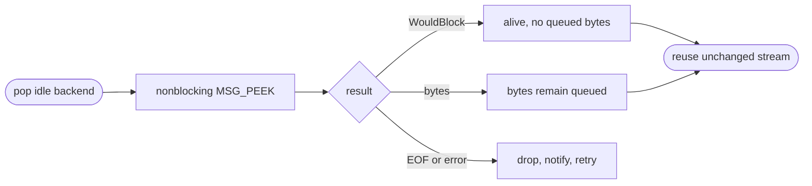

## Logic
<!-- type: logic lang: mermaid -->



### Contract invariants

- The liveness probe runs only while the stream is exclusively owned by the idle tuple; normal relay never races this peek.
- `WouldBlock` is the normal idle state and returns a live lease without scheduling or awaiting Tokio I/O.
- A successful peek is `MSG_PEEK`: it reads no protocol byte, so the next relay read observes the same PostgreSQL frame boundary.
- EOF and every read error retain the existing dead-idle disposition: stream and permit are dropped before the next acquisition attempt.
- This changes neither `DISCARD ALL` before idle admission nor semaphore/permit ownership, capacity wakeups, or acquire deadlines.

### Error handling

A closed peer returns zero bytes and is discarded. A non-`WouldBlock` read error is likewise treated as unsafe for reuse. If no idle tuple remains after a discard, acquisition follows the existing fresh-connect or saturated-capacity path; the new probe creates no timer, wakeup, or alternate scheduling path.

## Changes
<!-- type: changes lang: yaml -->

```yaml
coverage_kind: semantic
changes:
  - path: apps/pgpool/Cargo.toml
    action: modify
    section: pgpool-nonblocking-idle-liveness-peek
    impl_mode: hand-written
    reason: Declare the direct socket abstraction used to issue a safe non-consuming nonblocking peek.
  - path: apps/pgpool/src/pool/backend_pool.rs
    action: modify
    section: pgpool-nonblocking-idle-liveness-peek
    impl_mode: hand-written
    reason: Replace zero-timeout async liveness probing with socket-level MSG_PEEK classification while retaining idle ownership and retry semantics.
  - path: apps/pgpool/tests/pool.rs
    action: modify
    section: pgpool-nonblocking-idle-liveness-peek
    impl_mode: hand-written
    reason: Prove no-byte idle reuse, EOF discard-and-retry, and preservation of readable bytes across the liveness probe.
```
