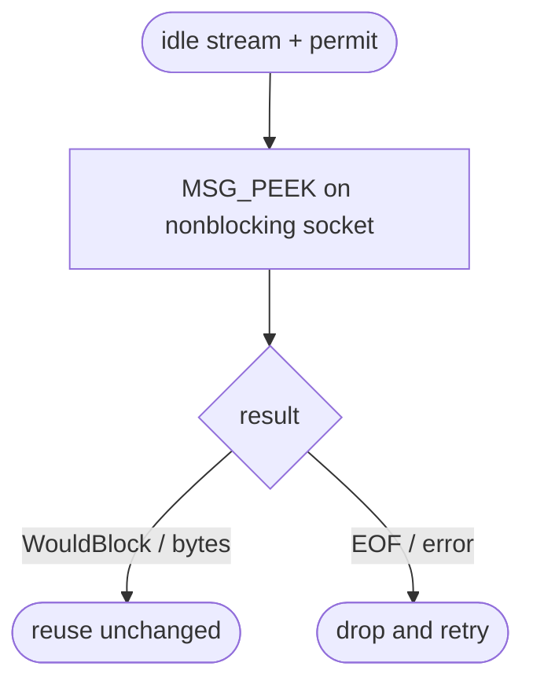

## Logic
<!-- type: logic lang: mermaid -->



### Contract invariants

- The probe is synchronous and creates neither a `tokio::time::Sleep` nor a pending read future.
- `WouldBlock` is success because an idle authenticated backend normally has no readable bytes.
- A positive result is success only because `MSG_PEEK` guarantees those bytes remain for normal frame decoding.
- `Ok(0)` is a peer EOF and every non-`WouldBlock` I/O error is unsafe for reuse.
- The liveness result transfers no ownership: only the existing pool state transition moves the tuple's permit into `outstanding`.

### Compatibility

The implementation uses the safe `socket2::SockRef` facade over the Tokio stream's OS descriptor, so Unix deployment targets keep the descriptor's nonblocking mode. There is no public API or wire-protocol change. The prior zero-timer future-poll no-go is not reused: this contract performs one complete kernel-level readiness/EOF inspection with explicit `WouldBlock` semantics.
## Changes
<!-- type: changes lang: yaml -->

```yaml
coverage_kind: semantic
changes:
  - path: apps/pgpool/Cargo.toml
    action: modify
    section: pgpool-nonblocking-idle-liveness-peek-contract
    impl_mode: hand-written
    reason: Make the safe socket descriptor facade an explicit direct dependency.
  - path: apps/pgpool/src/pool/backend_pool.rs
    action: modify
    section: pgpool-nonblocking-idle-liveness-peek-contract
    impl_mode: hand-written
    reason: Classify `MSG_PEEK` results into live, EOF, and error outcomes without a Tokio timer.
  - path: apps/pgpool/tests/pool.rs
    action: modify
    section: pgpool-nonblocking-idle-liveness-peek-contract
    impl_mode: hand-written
    reason: Lock the byte-preservation and EOF contract at the pool boundary.
```
## Unit Test

```mermaid
---
id: pgpool-nonblocking-idle-liveness-peek-contract-verification
requirements:
  eof_is_dead:
    id: R2
    text: "A zero-length socket peek is classified as peer EOF and cannot be returned as an idle lease."
    kind: regression
    risk: high
    verify: pool::acquire_drops_dead_idle_connection_and_retries
  full_pool_regression:
    id: R4
    text: "Pool-mode integration tests preserve reset, capacity, and session isolation behavior."
    kind: integration
    risk: high
    verify: cargo test -p pgpool --test pool --test pool_modes --test trust_startup_replay
  msg_peek_is_non_consuming:
    id: R3
    text: "A positive socket peek leaves the exact queued byte available to the subsequent lease holder."
    kind: regression
    risk: high
    verify: pool::acquire_liveness_peek_preserves_queued_backend_bytes
  would_block_is_live:
    id: R1
    text: "An idle connection with no readable bytes yields WouldBlock and is leased unchanged without a timer-backed read."
    kind: regression
    risk: high
    verify: pool::acquire_reuses_idle_connection_after_liveness_check_passes
---
flowchart TD
    r1[R1 would block is live] --> pool_acquire_reuses_idle_connection_after_liveness_check_passes[pool::acquire_reuses_idle_connection_after_liveness_check_passes]
    r2[R2 eof is dead] --> pool_acquire_drops_dead_idle_connection_and_retries[pool::acquire_drops_dead_idle_connection_and_retries]
    r3[R3 msg peek is non consuming] --> pool_acquire_liveness_peek_preserves_queued_backend_bytes[pool::acquire_liveness_peek_preserves_queued_backend_bytes]
    r4[R4 full pool regression] --> cargo_test_p_pgpool_test_pool_test_pool_modes_test_trust_startup_replay[cargo test -p pgpool --test pool --test pool_modes --test trust_startup_replay]
```

<!-- type: unit-test lang: mermaid -->


