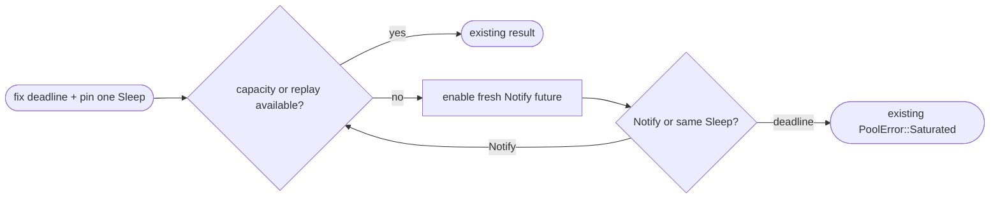

## Logic
<!-- type: logic lang: mermaid -->

### Invariants

- Each invocation fixes one deadline and owns exactly one pinned `Sleep`; Notify wakeups never reset or replace it.
- A fresh enabled `Notify` future retains the current no-missed-wake protocol. A wake only re-enters the existing idle/replay/physical-capacity checks; it grants no slot by itself.
- The deadline race replaces only the current `timeout(remaining, notified)` wrapper. All capacity permits, Notify cardinality, timeout error shape, reset, liveness, and client-visible behavior remain unchanged.
- The timer exists only while saturated acquisition waits; it is not added to the backend relay leg.

### Error handling

If the shared deadline wins, return the existing saturated error. If Notify wins, drop only that one-shot notifier and retry with the same pending Sleep. Connect, bootstrap, reset, liveness, cancellation, and dropped-lease errors preserve their existing paths and permit cleanup.
