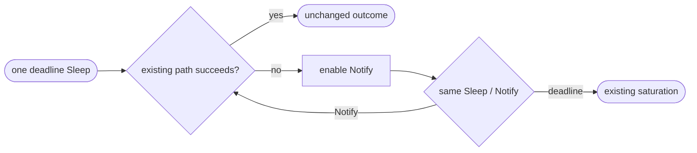

## Logic
<!-- type: logic lang: mermaid -->



### Contract

- Each of the three acquisition functions owns one `Pin<Sleep>` for the fixed deadline. The sleep is created once, is never reset, and is polled only while the existing loop is saturated.
- A wait helper enables a newly-created `Notify` before selecting it against the caller-owned sleep. `Notify` completion preserves the current loop and creates a new notifier, not a new timer.
- The helper returns only `notified` or `deadline_elapsed`; callers retain all pre-existing resource checks and error construction. No helper receives a permit, stream, waiter record, or queue position.
- Cancellation drops the unconsumed timer and notifier without ownership side effects. No idle backend or semaphore permit is transferred by a timer event.

### Failure contract

Deadline completion returns exactly `self.saturated()`. Connect, bootstrap, liveness, reset, and dropped-lease failures continue through the current paths. A coalesced or spurious notification can cause an extra recheck but cannot defer the fixed deadline or admit above physical capacity.
## Changes
<!-- type: changes lang: yaml -->

```yaml
changes:
  - path: apps/pgpool/src/pool/backend_pool.rs
    action: modify
    section: pgpool-reused-acquire-deadline-timer-contract
    impl_mode: hand-written
    reason: Introduce a caller-owned pinned deadline timer and select helper while leaving existing capacity/replay checks and Notify policy intact.
  - path: apps/pgpool/tests/pool.rs
    action: modify
    section: pgpool-reused-acquire-deadline-timer-contract
    impl_mode: hand-written
    reason: Exercise wake/retry before one fixed deadline and saturation after the deadline.
  - path: apps/pgpool/tests/pool_modes.rs
    action: modify
    section: pgpool-reused-acquire-deadline-timer-contract
    impl_mode: hand-written
    reason: Preserve real contended transaction isolation and capacity behavior under the revised wait timing.
```
## Unit Test

```mermaid
---
id: pgpool-reused-acquire-deadline-timer-contract-verification
requirements:
  diagnostic:
    id: R3
    text: "Meter treats retry Sleep reset/drop reduction as diagnosis only; no sampled TPS result decides retention."
    kind: integration
    risk: medium
    verify: apps/pgpool/benchmarks/pgbouncer-transaction-pooling/run.sh --meter-bin target/debug/meter
  fixed_deadline:
    id: R1
    text: "Wakeups before capacity is available recheck with one fixed deadline, and deadline expiry still returns the configured saturation error without extending wait time."
    kind: regression
    risk: high
    verify: pool::saturated_waiter_keeps_deadline_across_spurious_wakeups
  peer_proof:
    id: R4
    text: "Three unchanged clean unsampled release comparisons must match or exceed PgBouncer; the first valid loss reverts the candidate."
    kind: e2e
    risk: high
    verify: apps/pgpool/benchmarks/pgbouncer-transaction-pooling/run.sh --pgpool-bin target/release/pgpool
  transaction_safety:
    id: R2
    text: "Contended transaction clients preserve DISCARD ALL isolation and the physical backend cap while acquisition retries reuse one deadline timer."
    kind: integration
    risk: high
    verify: cargo test -p pgpool --test pool --test pool_modes --test trust_startup_replay
---
flowchart TD
    r1[R1 fixed deadline] --> pool_saturated_waiter_keeps_deadline_across_spurious_wakeups[pool::saturated_waiter_keeps_deadline_across_spurious_wakeups]
    r2[R2 transaction safety] --> cargo_test_p_pgpool_test_pool_test_pool_modes_test_trust_startup_replay[cargo test -p pgpool --test pool --test pool_modes --test trust_startup_replay]
    r3[R3 diagnostic] --> apps_pgpool_benchmarks_pgbouncer_transaction_pooling_run_sh_meter_bin_target_debug_meter[apps/pgpool/benchmarks/pgbouncer-transaction-pooling/run.sh --meter-bin target/debug/meter]
    r4[R4 peer proof] --> apps_pgpool_benchmarks_pgbouncer_transaction_pooling_run_sh_pgpool_bin_target_release_pgpool[apps/pgpool/benchmarks/pgbouncer-transaction-pooling/run.sh --pgpool-bin target/release/pgpool]
```

<!-- type: unit-test lang: mermaid -->


