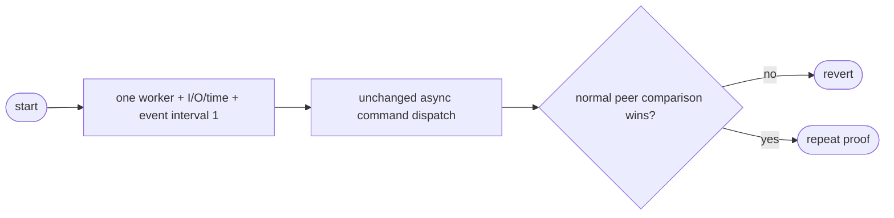

## Logic
<!-- type: logic lang: mermaid -->

### Contract

- A synchronous `main` builds Tokio with `new_multi_thread`, `worker_threads(1)`, `enable_all`, and `event_interval(1)`, then blocks on the extracted `async_main`.
- `async_main` retains the existing CLI parsing and every command arm unchanged. I/O and time drivers remain enabled exactly as the macro supplied them.
- No global queue, LIFO, blocking-pool, dependency, pool, waiter, timeout, socket, wire, or relay setting changes.
- Transaction pooling remains unchanged: frontend admission, startup/replay, backend leasing, relay, reset, and capped physical capacity keep their existing implementations.

### Failure contract

- A bootstrap failure, behavior regression, or first valid normal-baseline 30-second comparison that loses to PgBouncer reverts the runtime bootstrap immediately.
- Meter output may diagnose event-polling effects but cannot decide candidate retention.
