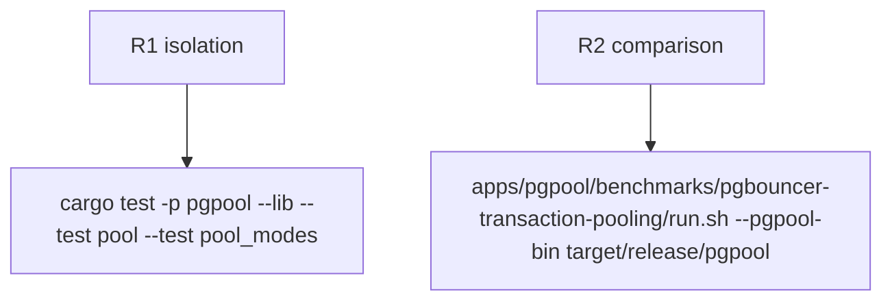

## Logic
<!-- type: logic lang: mermaid -->


## Changes
<!-- type: changes lang: yaml -->

```yaml
changes:
  - path: apps/pgpool/src/bin/pgpool.rs
    action: modify
    section: pgpool-worker-count-tuning
    impl_mode: hand-written
```

## Unit Test
<!-- type: unit-test lang: mermaid -->


