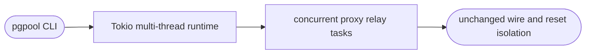

## Logic
<!-- type: logic lang: mermaid -->



## Changes
<!-- type: changes lang: yaml -->

```yaml
changes:
  - path: apps/pgpool/src/bin/pgpool.rs
    action: modify
    section: pgpool-multithread-runtime
    impl_mode: hand-written
```
