# pgpool wire codec — frontend/backend PostgreSQL protocol 3.0 frames

## Logic
<!-- type: logic lang: mermaid -->


## Transaction Status Tracking

```mermaid
---
id: pgpool-wire-codec-tx-status-fsm
initial: idle
nodes:
  idle:
    kind: initial
    label: "Idle: ReadyForQuery status byte 'I' — no transaction block open"
  in_transaction:
    kind: normal
    label: "InTransaction: ReadyForQuery status byte 'T' — an explicit or implicit transaction block is open"
  failed:
    kind: normal
    label: "Failed: ReadyForQuery status byte 'E' — a statement inside the open transaction block errored; only ROLLBACK/COMMIT-abort is accepted until the next ReadyForQuery"
edges:
  - from: idle
    to: in_transaction
    event: "ReadyForQuery('T') observed (BEGIN, or first statement of an implicit multi-statement block)"
  - from: in_transaction
    to: idle
    event: "ReadyForQuery('I') observed (COMMIT or ROLLBACK completed cleanly)"
  - from: in_transaction
    to: failed
    event: "ReadyForQuery('E') observed (a statement inside the transaction block errored)"
  - from: failed
    to: idle
    event: "ReadyForQuery('I') observed (ROLLBACK completed after failure)"
  - from: failed
    to: failed
    event: "ReadyForQuery('E') observed again (a further statement is rejected while still failed)"
---
stateDiagram-v2
    [*] --> idle
    idle --> in_transaction : ReadyForQuery('T')
    in_transaction --> idle : ReadyForQuery('I')
    in_transaction --> failed : ReadyForQuery('E')
    failed --> idle : ReadyForQuery('I')
    failed --> failed : ReadyForQuery('E')
```

<!-- type: state-machine lang: mermaid -->


## Schema
<!-- type: schema lang: yaml -->

```yaml
$schema: "https://json-schema.org/draft/2020-12/schema"
$id: apps-pgpool-wire-codec#schema
title: pgpool Wire Codec Types
description: >
  PostgreSQL protocol 3.0 message model for pgpool's wire codec: frontend and
  backend message types, the raw Frame envelope, the incremental FrameReader's
  typed error taxonomy, and TransactionStatus. Encode/decode operate over
  bytes::BytesMut with no external protocol crate dependency.

definitions:
  FrameTag:
    type: integer
    $id: FrameTag
    description: "Single ASCII tag byte identifying a tagged frontend/backend message (absent only for the untagged StartupMessage/SSLRequest/CancelRequest frames)."

  Frame:
    type: object
    $id: Frame
    x-rust-derive: ["Debug", "Clone", "PartialEq"]
    required: [tag, payload]
    description: "One fully-buffered wire frame as read off the stream, before typed decode: optional tag byte + declared length + raw payload bytes."
    properties:
      tag:
        type: ["integer", "null"]
        description: "Tag byte for tagged frames; null for the untagged StartupMessage/SSLRequest/CancelRequest family."
      payload:
        x-rust-type: "bytes::Bytes"
        description: "Raw payload bytes after the tag+length header, exactly `declared_length - 4` bytes (or `- 4` from the untagged length field)."

  FrontendMessage:
    type: object
    $id: FrontendMessage
    x-rust-derive: ["Debug", "Clone", "PartialEq"]
    x-rust-enum: true
    description: "Client-to-server message variants this slice decodes/encodes."
    oneOf:
      - { $ref: "#/definitions/StartupMessage" }
      - { $ref: "#/definitions/SslRequest" }
      - { $ref: "#/definitions/PasswordMessage" }
      - { $ref: "#/definitions/SaslInitialResponse" }
      - { $ref: "#/definitions/SaslResponse" }
      - { $ref: "#/definitions/Query" }
      - { $ref: "#/definitions/Parse" }
      - { $ref: "#/definitions/Bind" }
      - { $ref: "#/definitions/Describe" }
      - { $ref: "#/definitions/Execute" }
      - { $ref: "#/definitions/Sync" }
      - { $ref: "#/definitions/Terminate" }

  StartupMessage:
    type: object
    $id: StartupMessage
    x-rust-derive: ["Debug", "Clone", "PartialEq"]
    required: [protocol_major, protocol_minor, parameters]
    description: "Untagged startup packet (no leading tag byte): 4-byte length, 4-byte protocol version, then a null-terminated key/value parameter list terminated by an empty string."
    properties:
      protocol_major:
        type: integer
        const: 3
        description: "Protocol major version supported by this slice (3.0)."
      protocol_minor:
        type: integer
        const: 0
      parameters:
        type: object
        additionalProperties: { type: string }
        description: "Startup parameters (user, database, application_name, ...) as ordered key/value pairs."

  SslRequest:
    type: object
    $id: SslRequest
    x-rust-derive: ["Debug", "Clone", "Copy", "PartialEq", "Eq"]
    description: "Untagged 8-byte SSLRequest packet (length=8, request code 80877103); no fields beyond identity."

  PasswordMessage:
    type: object
    $id: PasswordMessage
    x-rust-derive: ["Debug", "Clone", "PartialEq"]
    required: [payload]
    description: "Tag 'p'. Carries either a cleartext/MD5 password string or a raw SASL frame's opaque bytes (SCRAM crypto is out of scope for this slice; bytes are parsed/relayed only)."
    properties:
      payload:
        x-rust-type: "bytes::Bytes"

  SaslInitialResponse:
    type: object
    $id: SaslInitialResponse
    x-rust-derive: ["Debug", "Clone", "PartialEq"]
    required: [mechanism, response]
    description: "Tag 'p' variant carrying SASL mechanism name + initial response bytes (null-terminated mechanism, then i32 length + opaque bytes, -1 length = no response)."
    properties:
      mechanism:
        type: string
      response:
        type: ["string", "null"]
        x-rust-type: "Option<bytes::Bytes>"

  SaslResponse:
    type: object
    $id: SaslResponse
    x-rust-derive: ["Debug", "Clone", "PartialEq"]
    required: [payload]
    description: "Tag 'p' variant carrying a SASL continuation frame's opaque bytes."
    properties:
      payload:
        x-rust-type: "bytes::Bytes"

  Query:
    type: object
    $id: Query
    x-rust-derive: ["Debug", "Clone", "PartialEq"]
    required: [sql]
    description: "Tag 'Q'. Simple query protocol: a single null-terminated SQL string."
    properties:
      sql:
        type: string

  Parse:
    type: object
    $id: Parse
    x-rust-derive: ["Debug", "Clone", "PartialEq"]
    required: [statement_name, sql, param_type_oids]
    description: "Tag 'P'. Extended query: prepare a statement."
    properties:
      statement_name:
        type: string
      sql:
        type: string
      param_type_oids:
        type: array
        items: { type: integer }

  Bind:
    type: object
    $id: Bind
    x-rust-derive: ["Debug", "Clone", "PartialEq"]
    required: [portal_name, statement_name, param_formats, param_values, result_formats]
    description: "Tag 'B'. Extended query: bind a portal to a prepared statement with parameter values."
    properties:
      portal_name:
        type: string
      statement_name:
        type: string
      param_formats:
        type: array
        items: { type: integer }
      param_values:
        type: array
        items:
          x-rust-type: "Option<bytes::Bytes>"
          description: "null = SQL NULL parameter"
      result_formats:
        type: array
        items: { type: integer }

  Describe:
    type: object
    $id: Describe
    x-rust-derive: ["Debug", "Clone", "PartialEq", "Eq"]
    required: [target_kind, name]
    description: "Tag 'D'. Extended query: describe a statement or portal."
    properties:
      target_kind:
        type: string
        enum: ["statement", "portal"]
      name:
        type: string

  Execute:
    type: object
    $id: Execute
    x-rust-derive: ["Debug", "Clone", "PartialEq", "Eq"]
    required: [portal_name, max_rows]
    description: "Tag 'E'. Extended query: execute a bound portal."
    properties:
      portal_name:
        type: string
      max_rows:
        type: integer
        description: "0 = no limit."

  Sync:
    type: object
    $id: Sync
    x-rust-derive: ["Debug", "Clone", "Copy", "PartialEq", "Eq"]
    description: "Tag 'S'. Extended query: sync, closing the current extended-query message stream."

  Terminate:
    type: object
    $id: Terminate
    x-rust-derive: ["Debug", "Clone", "Copy", "PartialEq", "Eq"]
    description: "Tag 'X'. Graceful client-initiated close."

  BackendMessage:
    type: object
    $id: BackendMessage
    x-rust-derive: ["Debug", "Clone", "PartialEq"]
    x-rust-enum: true
    description: "Server-to-client message variants this slice decodes/encodes."
    oneOf:
      - { $ref: "#/definitions/AuthenticationOk" }
      - { $ref: "#/definitions/AuthenticationCleartextPassword" }
      - { $ref: "#/definitions/AuthenticationMd5Password" }
      - { $ref: "#/definitions/AuthenticationSasl" }
      - { $ref: "#/definitions/AuthenticationSaslContinue" }
      - { $ref: "#/definitions/AuthenticationSaslFinal" }
      - { $ref: "#/definitions/ParameterStatus" }
      - { $ref: "#/definitions/BackendKeyData" }
      - { $ref: "#/definitions/ReadyForQuery" }
      - { $ref: "#/definitions/RowDescription" }
      - { $ref: "#/definitions/DataRow" }
      - { $ref: "#/definitions/CommandComplete" }
      - { $ref: "#/definitions/ErrorResponse" }
      - { $ref: "#/definitions/NoticeResponse" }

  AuthenticationOk:
    type: object
    $id: AuthenticationOk
    x-rust-derive: ["Debug", "Clone", "Copy", "PartialEq", "Eq"]
    description: "Tag 'R', auth type code 0: authentication succeeded."

  AuthenticationCleartextPassword:
    type: object
    $id: AuthenticationCleartextPassword
    x-rust-derive: ["Debug", "Clone", "Copy", "PartialEq", "Eq"]
    description: "Tag 'R', auth type code 3: client must send a cleartext PasswordMessage."

  AuthenticationMd5Password:
    type: object
    $id: AuthenticationMd5Password
    x-rust-derive: ["Debug", "Clone", "PartialEq", "Eq"]
    required: [salt]
    description: "Tag 'R', auth type code 5: client must send an MD5-hashed PasswordMessage using this 4-byte salt."
    properties:
      salt:
        type: array
        items: { type: integer }
        minItems: 4
        maxItems: 4

  AuthenticationSasl:
    type: object
    $id: AuthenticationSasl
    x-rust-derive: ["Debug", "Clone", "PartialEq", "Eq"]
    required: [mechanisms]
    description: "Tag 'R', auth type code 10: server offers a list of SASL mechanism names, null-terminated list terminated by an empty string."
    properties:
      mechanisms:
        type: array
        items: { type: string }

  AuthenticationSaslContinue:
    type: object
    $id: AuthenticationSaslContinue
    x-rust-derive: ["Debug", "Clone", "PartialEq"]
    required: [payload]
    description: "Tag 'R', auth type code 11: opaque SASL continuation bytes (server-first-message)."
    properties:
      payload:
        x-rust-type: "bytes::Bytes"

  AuthenticationSaslFinal:
    type: object
    $id: AuthenticationSaslFinal
    x-rust-derive: ["Debug", "Clone", "PartialEq"]
    required: [payload]
    description: "Tag 'R', auth type code 12: opaque SASL final bytes (server-final-message)."
    properties:
      payload:
        x-rust-type: "bytes::Bytes"

  ParameterStatus:
    type: object
    $id: ParameterStatus
    x-rust-derive: ["Debug", "Clone", "PartialEq", "Eq"]
    required: [name, value]
    description: "Tag 'S'. Runtime parameter report (server_version, client_encoding, ...)."
    properties:
      name:
        type: string
      value:
        type: string

  BackendKeyData:
    type: object
    $id: BackendKeyData
    x-rust-derive: ["Debug", "Clone", "Copy", "PartialEq", "Eq"]
    required: [process_id, secret_key]
    description: "Tag 'K'. Cancellation key data for this backend connection."
    properties:
      process_id:
        type: integer
      secret_key:
        type: integer

  ReadyForQuery:
    type: object
    $id: ReadyForQuery
    x-rust-derive: ["Debug", "Clone", "Copy", "PartialEq", "Eq"]
    required: [status]
    description: "Tag 'Z'. Marks the backend ready for a new query cycle; status drives TransactionStatus tracking."
    properties:
      status:
        $ref: "#/definitions/TransactionStatus"

  TransactionStatus:
    type: string
    $id: TransactionStatus
    x-rust-derive: ["Debug", "Clone", "Copy", "PartialEq", "Eq"]
    enum: ["idle", "in_transaction", "failed"]
    description: "Decoded from the ReadyForQuery status byte: 'I' -> idle, 'T' -> in_transaction, 'E' -> failed. See the Transaction Status Tracking state-machine."

  RowDescription:
    type: object
    $id: RowDescription
    x-rust-derive: ["Debug", "Clone", "PartialEq"]
    required: [fields]
    description: "Tag 'T'. Column metadata for a result set."
    properties:
      fields:
        type: array
        items: { $ref: "#/definitions/FieldDescription" }

  FieldDescription:
    type: object
    $id: FieldDescription
    x-rust-derive: ["Debug", "Clone", "PartialEq", "Eq"]
    required: [name, table_oid, column_attr, type_oid, type_size, type_modifier, format]
    properties:
      name: { type: string }
      table_oid: { type: integer }
      column_attr: { type: integer }
      type_oid: { type: integer }
      type_size: { type: integer }
      type_modifier: { type: integer }
      format: { type: integer }

  DataRow:
    type: object
    $id: DataRow
    x-rust-derive: ["Debug", "Clone", "PartialEq"]
    required: [columns]
    description: "Tag 'D'. One result row; each column is either raw bytes or SQL NULL."
    properties:
      columns:
        type: array
        items:
          x-rust-type: "Option<bytes::Bytes>"

  CommandComplete:
    type: object
    $id: CommandComplete
    x-rust-derive: ["Debug", "Clone", "PartialEq", "Eq"]
    required: [tag]
    description: "Tag 'C'. Command completion tag string (e.g. \"SELECT 3\")."
    properties:
      tag:
        type: string

  ErrorResponse:
    type: object
    $id: ErrorResponse
    x-rust-derive: ["Debug", "Clone", "PartialEq", "Eq"]
    required: [fields]
    description: "Tag 'E'. Backend error; a set of typed one-byte-code fields terminated by a null byte."
    properties:
      fields:
        type: object
        additionalProperties: { type: string }
        description: "Field code ('S' severity, 'C' sqlstate, 'M' message, ...) to value."

  NoticeResponse:
    type: object
    $id: NoticeResponse
    x-rust-derive: ["Debug", "Clone", "PartialEq", "Eq"]
    required: [fields]
    description: "Tag 'N'. Same field structure as ErrorResponse, non-fatal."
    properties:
      fields:
        type: object
        additionalProperties: { type: string }

  FrameError:
    type: object
    $id: FrameError
    x-rust-derive: ["Debug", "Clone", "PartialEq", "Eq", "thiserror::Error"]
    x-rust-enum: true
    description: "Typed decode/read error taxonomy; the codec never panics on malformed or oversized input."
    oneOf:
      - type: object
        required: [Oversized]
        properties:
          Oversized:
            type: object
            required: [declared, max]
            properties:
              declared: { type: integer }
              max: { type: integer }
        description: "Declared frame length exceeds the configured bound."
      - type: object
        required: [Malformed]
        properties:
          Malformed:
            type: object
            required: [tag, reason]
            properties:
              tag: { type: ["integer", "null"] }
              reason: { type: string }
        description: "Frame parsed under the declared length but a field was structurally invalid (bad UTF-8, truncated array, unknown enum discriminant, ...)."
      - type: object
        required: [UnknownTag]
        properties:
          UnknownTag:
            type: object
            required: [tag]
            properties:
              tag: { type: integer }
        description: "Tag byte does not match any known frontend/backend message in this slice's scope."
      - type: object
        required: [Io]
        properties:
          Io:
            type: string
        description: "Underlying stream I/O error surfaced from the reader."
```
## Config
<!-- type: config lang: yaml -->

```yaml
(fill)
```

## Unit Test
<!-- type: unit-test lang: mermaid -->


