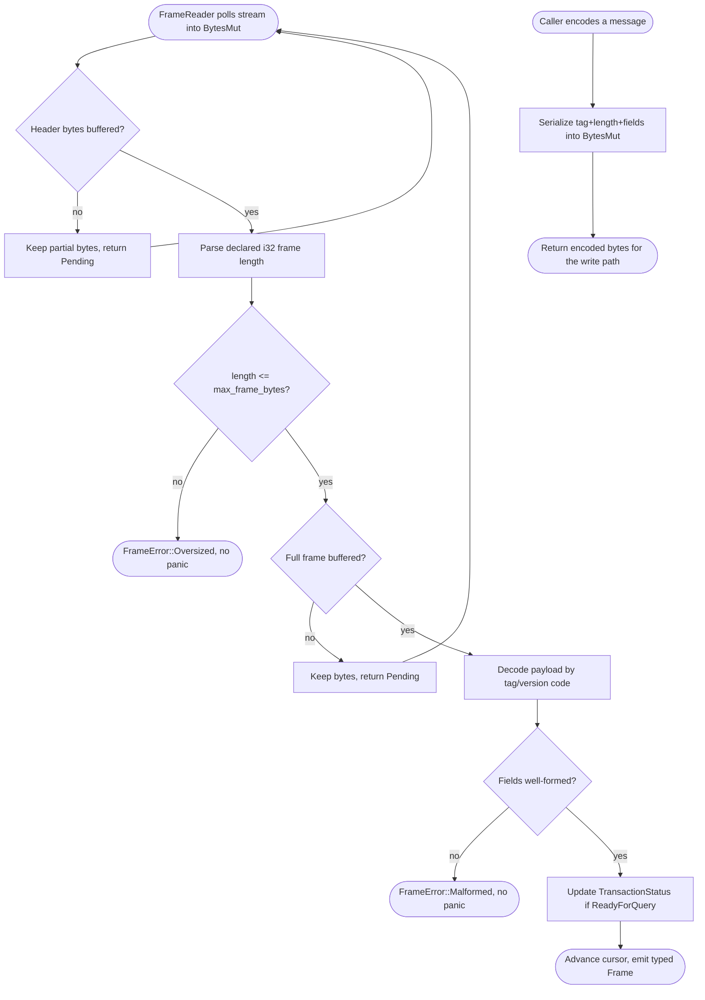
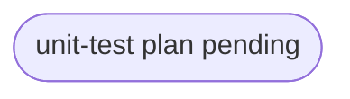

# pgpool wire codec — frontend/backend PostgreSQL protocol 3.0 frames

## Logic
<!-- type: logic lang: mermaid -->


## Transaction Status Tracking

```mermaid
---
id: pgpool-wire-codec-tx-status-fsm
initial: idle
nodes:
  idle:
    kind: initial
    label: "Idle: ReadyForQuery status byte 'I' — no transaction block open"
  in_transaction:
    kind: normal
    label: "InTransaction: ReadyForQuery status byte 'T' — an explicit or implicit transaction block is open"
  failed:
    kind: normal
    label: "Failed: ReadyForQuery status byte 'E' — a statement inside the open transaction block errored; only ROLLBACK/COMMIT-abort is accepted until the next ReadyForQuery"
edges:
  - from: idle
    to: in_transaction
    event: "ReadyForQuery('T') observed (BEGIN, or first statement of an implicit multi-statement block)"
  - from: in_transaction
    to: idle
    event: "ReadyForQuery('I') observed (COMMIT or ROLLBACK completed cleanly)"
  - from: in_transaction
    to: failed
    event: "ReadyForQuery('E') observed (a statement inside the transaction block errored)"
  - from: failed
    to: idle
    event: "ReadyForQuery('I') observed (ROLLBACK completed after failure)"
  - from: failed
    to: failed
    event: "ReadyForQuery('E') observed again (a further statement is rejected while still failed)"
---
stateDiagram-v2
    [*] --> idle
    idle --> in_transaction : ReadyForQuery('T')
    in_transaction --> idle : ReadyForQuery('I')
    in_transaction --> failed : ReadyForQuery('E')
    failed --> idle : ReadyForQuery('I')
    failed --> failed : ReadyForQuery('E')
```

<!-- type: state-machine lang: mermaid -->


## Schema
<!-- type: schema lang: yaml -->

```yaml
(fill)
```

## Config
<!-- type: config lang: yaml -->

```yaml
(fill)
```

## Unit Test
<!-- type: unit-test lang: mermaid -->


