## Logic
<!-- type: logic lang: mermaid -->

```mermaid
---
id: pgpool-pgbouncer-transaction-pooling-contract
entry: run_sh
nodes:
  run_sh:
    kind: start
    label: apps/pgpool/benchmarks/pgbouncer-transaction-pooling/run.sh is the sole P0 entrypoint. It accepts --dry-run, --help, and an optional explicit --pgpool-bin path; normal mode defaults to target/release/pgpool so performance evidence never silently measures a debug binary.
  profile_constants:
    kind: process
    label: The runner owns one named profile: pgbench TPC-B scale 1, protocol simple, 64 clients, 4 jobs, 30 seconds, transaction pooling, and 16 backend server connections. These values are emitted verbatim by --dry-run and used unchanged for BOTH targets.
  fresh_postgres:
    kind: process
    label: Normal mode creates a mktemp cluster with initdb --auth=trust, starts it with pg_ctl on loopback, creates database pgpool_bench, then runs pgbench --initialize --scale=1 directly against that backend before either proxy starts.
  pgbouncer_target:
    kind: process
    label: Render a temporary pgbouncer.ini with auth_type=trust, pool_mode=transaction, default_pool_size=16, server_reset_query=DISCARD ALL, and the temporary backend address; start foreground PgBouncer on one loopback port.
  pgpool_target:
    kind: process
    label: Start pgpool serve on a second loopback port against the same backend with --max-backend-connections=16. RuntimePlan defaults to transaction mode; this P0 runner does not add another product configuration surface.
  pgbench_targets:
    kind: process
    label: Invoke pgbench --protocol=simple --client=64 --jobs=4 --time=30 --no-vacuum sequentially once per target and retain each raw report in the temporary directory.
  report_json:
    kind: process
    label: Extract each report's tps and latency average values and print pgpool.pgbouncer-baseline.v1 JSON with both measurements, pgpool/pgbouncer ratios, and an observed winner/tie. A measurement failure is nonzero; a PgBouncer win is valid baseline evidence, not a harness failure.
  trap_cleanup:
    kind: terminal
    label: An EXIT/INT/TERM trap stops pgpool, PgBouncer, and pg_ctl and removes the temporary directory.
edges:
  - from: run_sh
    to: profile_constants
  - from: profile_constants
    to: fresh_postgres
    label: normal mode
  - from: profile_constants
    to: report_json
    label: --dry-run emits profile-only JSON
  - from: fresh_postgres
    to: pgbouncer_target
  - from: pgbouncer_target
    to: pgpool_target
  - from: pgpool_target
    to: pgbench_targets
  - from: pgbench_targets
    to: report_json
  - from: report_json
    to: trap_cleanup
---
flowchart TD
    run_sh([run.sh]) --> profile_constants[Fixed simple-query transaction profile]
    profile_constants -->|--dry-run| report_json[Emit pgpool.pgbouncer-baseline.v1 profile/comparison JSON]
    profile_constants -->|normal| fresh_postgres[initdb + pg_ctl temporary trust-auth PostgreSQL]
    fresh_postgres --> pgbouncer_target[Start PgBouncer: transaction, cap 16, DISCARD ALL]
    pgbouncer_target --> pgpool_target[Start pgpool: default transaction mode, cap 16]
    pgpool_target --> pgbench_targets[Sequential pgbench -M simple measurements]
    pgbench_targets --> report_json
    report_json --> trap_cleanup([Trap: stop all processes and remove temp directory])
```

### Artifact ownership

- `apps/pgpool/benchmarks/pgbouncer-transaction-pooling/run.sh` is the hand-written real-service runner. It owns only benchmark process orchestration, profile output, pgbench report parsing, and cleanup; it must not contain pooler behaviour.
- `apps/pgpool/benchmarks/pgbouncer-transaction-pooling/README.md` owns prerequisite/install commands, fairness constraints, profile explanation, and the explicit statement that P0 is advisory baseline evidence rather than a production ratchet.
- `apps/pgpool/tests/pgbouncer_benchmark.rs` owns hermetic profile/syntax verification and the opt-in real-tool smoke. It never changes host configuration, fetches packages, or launches a live benchmark unless `PGPOOL_RUN_PGBOUNCER_BENCH=1` is explicitly set.

### Fairness invariants

1. Both targets point at exactly one freshly initialized PostgreSQL backend and one seeded `pgpool_bench` database.
2. Both use PostgreSQL simple-query protocol only; extended-query comparison is explicitly deferred until the pgpool wire contract supports it.
3. Both use transaction pooling and a cap of 16 physical backend connections. PgBouncer's reset query is `DISCARD ALL`, matching pgpool's existing return-to-idle reset invariant.
4. The same pgbench workload, client count, worker count, duration, database user, and cleartext loopback network path are used for each target. Measurements run sequentially to avoid shared-backend contention.
5. The benchmark reports results but does not enforce an arbitrary ratio. A later competitor-performance gate may turn a demonstrated win into a host-scoped ratchet.

### Out of scope

Provider-managed poolers, Kubernetes/operator scaling, TLS/SCRAM, multiple databases/users, session pooling, pgbench extended/prepared modes, CPU/RSS attribution, and modifying `rig`/`arena` are all out of scope for this P0 baseline.
## Unit Test

```mermaid
---
id: pgpool-pgbouncer-transaction-pooling-baseline-verification
requirements:
  ac1_live_baseline_emits_both_target_metrics_when_enabled:
    id: AC1
    text: "When PGPOOL_RUN_PGBOUNCER_BENCH=1 and the documented real-tool prerequisites are present, the runner provisions a temporary PostgreSQL backend and emits one parseable comparison JSON document containing nonzero TPS and average-latency values for both PgBouncer and pgpool plus their ratios; otherwise the integration test skips with an actionable prerequisite message."
    kind: integration
    risk: high
    verify: pgbouncer_benchmark::live_transaction_pooling_baseline_emits_comparable_metrics_when_enabled
  r1_dry_run_declares_a_protocol_compatible_equal_capacity_profile:
    id: R1
    text: "The benchmark runner's --dry-run JSON fixes transaction pooling, PostgreSQL simple-query protocol, and the identical backend connection cap/client count/job count/duration for pgpool and PgBouncer before either target is measured."
    kind: functional
    risk: high
    verify: pgbouncer_benchmark::dry_run_profile_declares_equal_transaction_pooling_inputs
  r2_runner_remains_a_parseable_hermetic_entrypoint:
    id: R2
    text: "The shipped benchmark runner passes bash syntax validation and its --dry-run mode exits successfully without requiring PgBouncer, PostgreSQL, open ports, or a compiled pgpool binary."
    kind: regression
    risk: medium
    verify: pgbouncer_benchmark::runner_is_syntax_valid_and_dry_run_is_hermetic
---
flowchart TD
    ac1[AC1 ac1 live baseline emits both target metrics when enabled] --> pgbouncer_benchmark_live_transaction_pooling_baseline_emits_comparable_metrics_when_enabled[pgbouncer_benchmark::live_transaction_pooling_baseline_emits_comparable_metrics_when_enabled]
    r1[R1 r1 dry run declares a protocol compatible equal capacity profile] --> pgbouncer_benchmark_dry_run_profile_declares_equal_transaction_pooling_inputs[pgbouncer_benchmark::dry_run_profile_declares_equal_transaction_pooling_inputs]
    r2[R2 r2 runner remains a parseable hermetic entrypoint] --> pgbouncer_benchmark_runner_is_syntax_valid_and_dry_run_is_hermetic[pgbouncer_benchmark::runner_is_syntax_valid_and_dry_run_is_hermetic]
```

<!-- type: unit-test lang: mermaid -->


