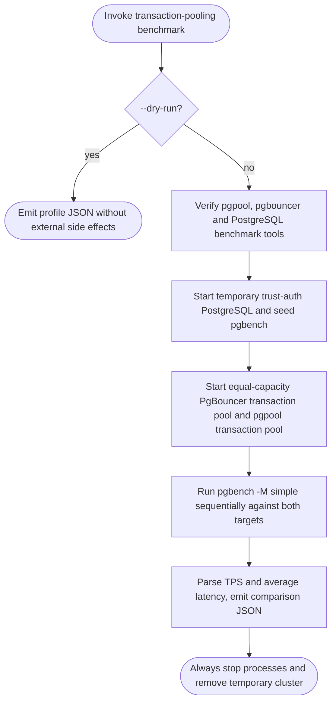

## Logic
<!-- type: logic lang: mermaid -->

This is applicable as a P0 competitor-performance baseline. It proves the first necessary condition for a PgBouncer win: a repeatable, protocol-compatible, equal-capacity measurement. It deliberately does not mutate the pooler data plane, introduce a performance ratchet, claim a win before observing one, test TLS/auth variants, or benchmark the currently unsupported extended-query protocol. The harness lives under `apps/pgpool/benchmarks/pgbouncer-transaction-pooling/`; its hermetic `--dry-run` profile is covered by a normal Cargo integration test, while the real benchmark uses actual PgBouncer and PostgreSQL processes and is manually invoked or later run under Vat. A later shared `rig` simple-query transport may replace the pgbench driver without changing this profile's fairness rules.

## Unit Test

```mermaid
---
id: pgpool-pgbouncer-transaction-pooling-baseline-verification
requirements:
  ac1_live_baseline_emits_both_target_metrics_when_enabled:
    id: AC1
    text: "When PGPOOL_RUN_PGBOUNCER_BENCH=1 and the documented real-tool prerequisites are present, the runner provisions a temporary PostgreSQL backend and emits one parseable comparison JSON document containing nonzero TPS and average-latency values for both PgBouncer and pgpool plus their ratios; otherwise the integration test skips with an actionable prerequisite message."
    kind: integration
    risk: high
    verify: pgbouncer_benchmark::live_transaction_pooling_baseline_emits_comparable_metrics_when_enabled
  r1_dry_run_declares_a_protocol_compatible_equal_capacity_profile:
    id: R1
    text: "The benchmark runner's --dry-run JSON fixes transaction pooling, PostgreSQL simple-query protocol, and the identical backend connection cap/client count/job count/duration for pgpool and PgBouncer before either target is measured."
    kind: functional
    risk: high
    verify: pgbouncer_benchmark::dry_run_profile_declares_equal_transaction_pooling_inputs
  r2_runner_remains_a_parseable_hermetic_entrypoint:
    id: R2
    text: "The shipped benchmark runner passes bash syntax validation and its --dry-run mode exits successfully without requiring PgBouncer, PostgreSQL, open ports, or a compiled pgpool binary."
    kind: regression
    risk: medium
    verify: pgbouncer_benchmark::runner_is_syntax_valid_and_dry_run_is_hermetic
---
flowchart TD
    ac1[AC1 ac1 live baseline emits both target metrics when enabled] --> pgbouncer_benchmark_live_transaction_pooling_baseline_emits_comparable_metrics_when_enabled[pgbouncer_benchmark::live_transaction_pooling_baseline_emits_comparable_metrics_when_enabled]
    r1[R1 r1 dry run declares a protocol compatible equal capacity profile] --> pgbouncer_benchmark_dry_run_profile_declares_equal_transaction_pooling_inputs[pgbouncer_benchmark::dry_run_profile_declares_equal_transaction_pooling_inputs]
    r2[R2 r2 runner remains a parseable hermetic entrypoint] --> pgbouncer_benchmark_runner_is_syntax_valid_and_dry_run_is_hermetic[pgbouncer_benchmark::runner_is_syntax_valid_and_dry_run_is_hermetic]
```

<!-- type: unit-test lang: mermaid -->

