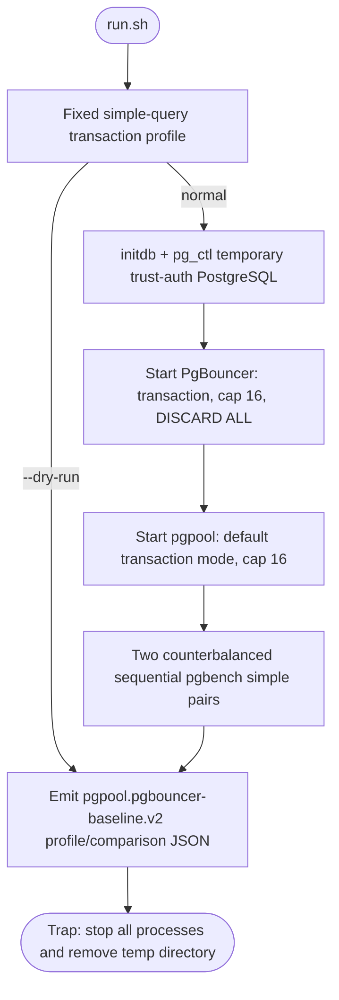

## Logic
<!-- type: logic lang: mermaid -->



### Artifact ownership

- `apps/pgpool/benchmarks/pgbouncer-transaction-pooling/run.sh` is the hand-written real-service runner. It owns only benchmark process orchestration, profile output, pgbench report parsing, and cleanup; it must not contain pooler behaviour.
- `apps/pgpool/benchmarks/pgbouncer-transaction-pooling/README.md` owns prerequisite/install commands, fairness constraints, profile explanation, and the explicit statement that P0 is advisory baseline evidence rather than a production ratchet.
- `apps/pgpool/tests/pgbouncer_benchmark.rs` owns hermetic profile/syntax verification and the opt-in real-tool smoke. It never changes host configuration, fetches packages, or launches a live benchmark unless `PGPOOL_RUN_PGBOUNCER_BENCH=1` is explicitly set.

### Fairness invariants

1. Both targets point at exactly one freshly initialized PostgreSQL backend and one seeded `pgpool_bench` database.
2. Both use PostgreSQL simple-query protocol only; extended-query comparison is explicitly deferred until the pgpool wire contract supports it.
3. Both use transaction pooling and a cap of 16 physical backend connections. PgBouncer's reset query is `DISCARD ALL`, matching pgpool's existing return-to-idle reset invariant.
4. Both poolers finish startup before either measured leg. The same pgbench workload, client count, worker count, duration, database user, and cleartext loopback network path are used for each target.
5. Two sequential pairs avoid shared-backend contention while counterbalancing position: PgBouncer-first then pgpool-first. Every target therefore has one first-position and one second-position sample.
6. The runner reports each raw sample, pair winner, unanimous direction, and ratio stability. A pgpool win requires both pairs to favor pgpool and to differ by no more than 20%; mixed directions or an unstable pgpool direction are invalid. Two clean PgBouncer-favoring pairs reject a candidate even when their loss magnitude varies. A later competitor-performance gate may turn demonstrated stable wins into a host-scoped ratchet.

### Out of scope

Provider-managed poolers, Kubernetes/operator scaling, TLS/SCRAM, multiple databases/users, session pooling, pgbench extended/prepared modes, CPU/RSS attribution, and modifying `rig`/`arena` are all out of scope for this P0 baseline.
## Unit Test

```mermaid
---
id: pgpool-pgbouncer-transaction-pooling-baseline-verification
requirements:
  ac1_real_runner_emits_nonzero_comparable_measurements:
    id: AC1
    text: "With `PGPOOL_RUN_PGBOUNCER_BENCH=1`, all documented local tools present, and an explicit pgpool binary, the real runner produces one parseable comparison JSON document with two opposite-order samples, positive target TPS/average-latency values, ratio fields, and an explicit comparison-validity boolean. Without the opt-in variable, the integration test skips with an actionable command rather than changing the host or consuming benchmark time."
    kind: integration
    risk: high
    verify: pgbouncer_benchmark::live_transaction_pooling_baseline_emits_comparable_metrics_when_enabled
  r1_dry_run_profile_is_exact_and_target_symmetric:
    id: R1
    text: "`bash benchmarks/pgbouncer-transaction-pooling/run.sh --dry-run` emits parseable pgpool.pgbouncer-baseline.v2 JSON declaring `protocol: simple`, `pool_mode: transaction`, a backend cap of 16, 64 clients, 4 jobs, 30 seconds per leg, two opposite-order paired trials, a 20% paired-ratio stability bound, and identical target settings for pgpool and PgBouncer."
    kind: functional
    risk: high
    verify: pgbouncer_benchmark::dry_run_profile_declares_equal_transaction_pooling_inputs
  r2_runner_is_hermetic_until_explicitly_enabled:
    id: R2
    text: "The benchmark runner passes `bash -n`, and its --dry-run path neither probes commands nor creates a temporary cluster, binds ports, starts processes, or requires a pgpool binary."
    kind: regression
    risk: medium
    verify: pgbouncer_benchmark::runner_is_syntax_valid_and_dry_run_is_hermetic
  r3_counterbalanced_order_and_verdict_rules_are_documented_and_enforced:
    id: R3
    text: "The ordinary runner starts both targets before measurement, records PgBouncer-first and pgpool-first samples, and documents pair winner, unanimous direction, and the stricter pgpool-win eligibility rule."
    kind: regression
    risk: high
    verify: pgbouncer_benchmark::ordinary_peer_profile_counterbalances_order_and_documents_peer_verdict_rules
---
flowchart TD
    ac1[AC1 ac1 real runner emits nonzero comparable measurements] --> pgbouncer_benchmark_live_transaction_pooling_baseline_emits_comparable_metrics_when_enabled[pgbouncer_benchmark::live_transaction_pooling_baseline_emits_comparable_metrics_when_enabled]
    r1[R1 r1 dry run profile is exact and target symmetric] --> pgbouncer_benchmark_dry_run_profile_declares_equal_transaction_pooling_inputs[pgbouncer_benchmark::dry_run_profile_declares_equal_transaction_pooling_inputs]
    r2[R2 r2 runner is hermetic until explicitly enabled] --> pgbouncer_benchmark_runner_is_syntax_valid_and_dry_run_is_hermetic[pgbouncer_benchmark::runner_is_syntax_valid_and_dry_run_is_hermetic]
    r3[R3 r3 counterbalanced order and verdict rules are documented and enforced] --> pgbouncer_benchmark_ordinary_peer_profile_counterbalances_order_and_documents_peer_verdict_rules[pgbouncer_benchmark::ordinary_peer_profile_counterbalances_order_and_documents_peer_verdict_rules]
```

<!-- type: unit-test lang: mermaid -->



## Changes
<!-- type: changes lang: yaml -->

```yaml
coverage_kind: semantic
changes:
  - path: apps/pgpool/benchmarks/pgbouncer-transaction-pooling/run.sh
    action: create
    section: logic
    impl_mode: hand-written
    reason: Run an identical simple-protocol pgbench workload through PgBouncer and pgpool.
  - path: apps/pgpool/benchmarks/pgbouncer-transaction-pooling/README.md
    action: create
    section: logic
    impl_mode: hand-written
    reason: Document the reproducible P0 benchmark profile and its prerequisites.
  - path: apps/pgpool/tests/pgbouncer_benchmark.rs
    action: create
    section: unit-test
    impl_mode: hand-written
    reason: Verify the hermetic benchmark profile and provide an opt-in live smoke test.
```
