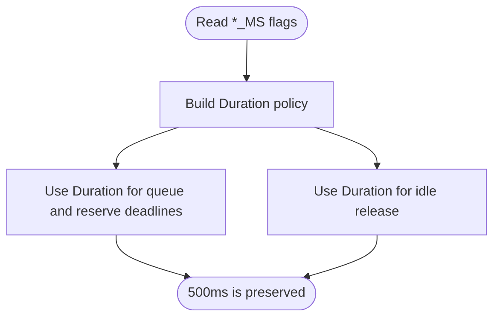

## Logic
<!-- type: logic lang: mermaid -->

The runtime policy owns timeout units as `Duration`. CLI milliseconds convert exactly with `Duration::from_millis`; no runtime code divides them by 1,000. Lease TTL remains seconds because it is persisted in the control-plane lease contract. The reserve client retains deterministic tests by accepting elapsed `Duration` for local timeout checks while converting only the lease-expiry clock to seconds at the Kubernetes boundary.
