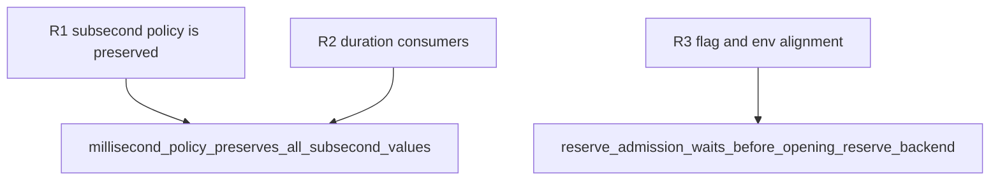

## Logic
<!-- type: logic lang: mermaid -->


The runtime policy owns timeout units as `Duration`. CLI milliseconds convert exactly with `Duration::from_millis`; no runtime code divides them by 1,000. Lease TTL remains seconds because it is persisted in the control-plane lease contract. The reserve client retains deterministic tests by accepting elapsed `Duration` for local timeout checks while converting only the lease-expiry clock to seconds at the Kubernetes boundary.
## Changes
<!-- type: changes lang: yaml -->

```yaml
coverage_kind: semantic
changes:
  - path: apps/pgpool/src/pool/reserve.rs
    action: modify
    section: logic
    impl_mode: hand-written
    anchor: ReserveLeasePolicy
    reason: Represent reserve, queue, and idle timeouts as Duration and preserve sub-second elapsed time during local idle release.
  - path: apps/pgpool/src/pool/backend_pool.rs
    action: modify
    section: logic
    impl_mode: hand-written
    anchor: acquire_internal
    reason: Use the Duration reserve policy directly for normal queue and reserve admission deadlines.
  - path: apps/pgpool/src/pool/reactor/runtime.rs
    action: modify
    section: logic
    impl_mode: hand-written
    anchor: queue_wait_timeout
    reason: Use the Duration queue policy directly in reactor wait deadlines.
  - path: apps/pgpool/src/pool/transaction.rs
    action: modify
    section: logic
    impl_mode: hand-written
    anchor: new
    reason: Log reserve policy with millisecond values matching the configuration surface.
  - path: apps/pgpool/src/bin/pgpool.rs
    action: modify
    section: logic
    impl_mode: hand-written
    anchor: serve
    reason: Convert all three PGPOOL_RESERVE or queue millisecond flags without floor division.
  - path: apps/pgpool/tests/pool.rs
    action: modify
    section: unit-test
    impl_mode: hand-written
    anchor: reserve_admission_waits_before_opening_reserve_backend
    reason: Update explicit policy fixtures to Duration values.
```
## Unit Test
<!-- type: unit-test lang: mermaid -->


