## Logic

```mermaid
---
id: pgpool-managed-discovery-tls-required-proof
entry: docker_postgres
nodes:
  docker_postgres: { kind: start, label: "Start a disposable PostgreSQL container with a self-signed localhost certificate and hostssl-only HBA." }
  plaintext: { kind: process, label: "Attempt sslmode=disable and require rejection." }
  ca: { kind: process, label: "Copy the server certificate as the configured CA PEM." }
  discovery: { kind: process, label: "Run CloudSql discovery through the Rustls connector." }
  facts: { kind: terminal, label: "Receive runtime connection facts over a verified TLS handshake." }
edges:
  - { from: docker_postgres, to: plaintext }
  - { from: plaintext, to: ca }
  - { from: ca, to: discovery }
  - { from: discovery, to: facts }
---
flowchart LR
    docker_postgres([TLS-required PostgreSQL]) --> plaintext[Reject plaintext]
    plaintext --> ca[Pass server CA to test]
    ca --> discovery[CloudSql Rustls discovery]
    discovery --> facts([Runtime facts returned])
```

<!-- type: logic lang: mermaid -->

The Docker proof creates a one-use localhost certificate, forces `hostssl` authentication, and cleans up after the test. The Rust integration test only runs its TLS assertion when the script supplies endpoint and CA environment values; without them ordinary developer test runs remain hermetic.
