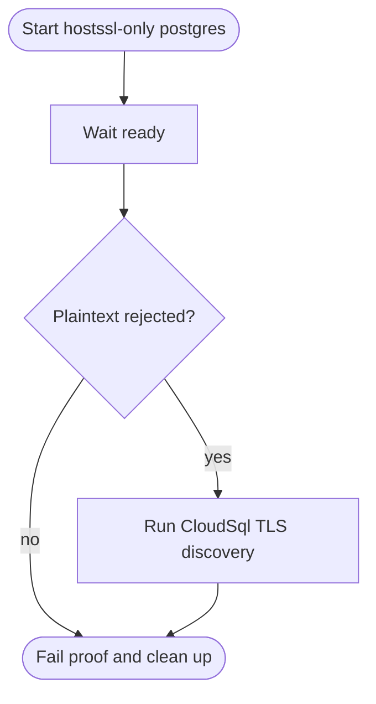
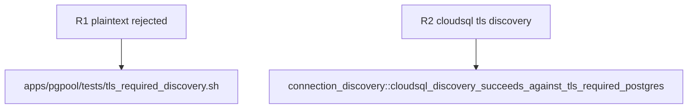

## Logic
<!-- type: logic lang: mermaid -->



The server certificate is self-signed for `localhost`, then copied out as the exact configured CA used by `RemoteEndpoint::tls_ca_pem`. The test endpoint uses `EndpointProvider::CloudSql`, ensuring the path selects `MakeRustlsConnect`; a successful runtime facts query proves TLS negotiation, certificate trust, PostgreSQL authentication, and query decoding together.
## Changes
<!-- type: changes lang: yaml -->

```yaml
coverage_kind: semantic
changes:
  - path: apps/pgpool/tests/connection_discovery.rs
    action: modify
    section: unit-test
    impl_mode: hand-written
    anchor: cloudsql_discovery_succeeds_against_tls_required_postgres
    reason: Exercise configured-CA Rustls discovery against the endpoint supplied by the TLS-required container proof.
  - path: apps/pgpool/tests/tls_required_discovery.sh
    action: create
    section: unit-test
    impl_mode: hand-written
    reason: Start and clean up a disposable hostssl-only PostgreSQL 15 container and run the targeted Rust test.
```

## Unit Test
<!-- type: unit-test lang: mermaid -->


