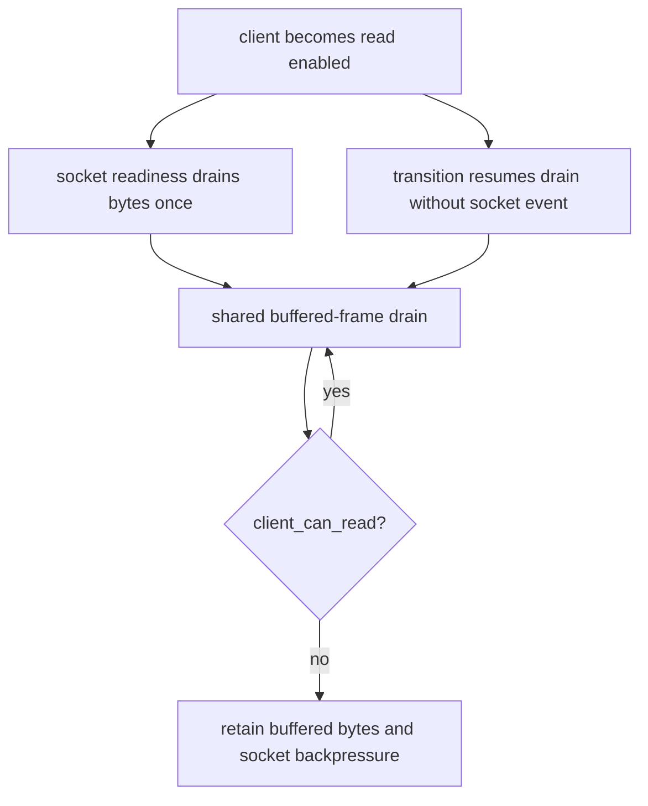

```mermaid
---
id: reactor-buffered-frame-resume-contract-verification
requirements:
  backpressure_preserved:
    id: R2
    text: "A pipelined next query remains out of the active backend until ReadyForQuery and reset complete, preserving the existing waiting/pending backpressure boundary."
    kind: regression
    risk: high
    verify: cargo test -p pgpool --test trust_startup_replay backend_first_relay_keeps_pipelined_query_out_of_resetting_backend
  saturated_pipeline_completes:
    id: R1
    text: "A reactor client that writes two and three simple-query frames in one segment while the sole backend is busy receives every response without sending additional bytes."
    kind: regression
    risk: high
    verify: cargo test -p pgpool --test trust_startup_replay reactor_saturated_pipelined_queries_resume_without_new_socket_read
  startup_pipeline_completes:
    id: R1
    text: "A StartupMessage and its first simple query written in one segment complete after handshake without an extra client write."
    kind: functional
    risk: high
    verify: cargo test -p pgpool --test trust_startup_replay reactor_pipelined_startup_and_first_query_complete
---
flowchart TD
    r1[R1 saturated pipeline completes] --> cargo_test_p_pgpool_test_trust_startup_replay_reactor_saturated_pipelined_queries_resume_without_new_socket_read[cargo test -p pgpool --test trust_startup_replay reactor_saturated_pipelined_queries_resume_without_new_socket_read]
    r1[R1 startup pipeline completes] --> cargo_test_p_pgpool_test_trust_startup_replay_reactor_pipelined_startup_and_first_query_complete[cargo test -p pgpool --test trust_startup_replay reactor_pipelined_startup_and_first_query_complete]
    r2[R2 backpressure preserved] --> cargo_test_p_pgpool_test_trust_startup_replay_backend_first_relay_keeps_pipelined_query_out_of_resetting_backend[cargo test -p pgpool --test trust_startup_replay backend_first_relay_keeps_pipelined_query_out_of_resetting_backend]
```

## Logic
<!-- type: logic lang: mermaid -->


## Changes
<!-- type: changes lang: yaml -->

```yaml
changes:
  - path: apps/pgpool/src/pool/reactor/runtime.rs
    action: modify
    section: logic
    impl_mode: hand-written
    anchor: read_client
  - path: apps/pgpool/tests/trust_startup_replay.rs
    action: modify
    section: unit-test
    impl_mode: hand-written
    anchor: backend_first_relay_keeps_pipelined_query_out_of_resetting_backend
```
## Unit Test
<!-- type: unit-test lang: mermaid -->



## Changes
<!-- type: changes lang: yaml -->

```yaml
changes:
  - path: apps/pgpool/src/pool/reactor/runtime.rs
    action: modify
    section: logic
    impl_mode: hand-written
    anchor: read_client
  - path: apps/pgpool/tests/trust_startup_replay.rs
    action: modify
    section: unit-test
    impl_mode: hand-written
    anchor: backend_first_relay_keeps_pipelined_query_out_of_resetting_backend
```

## Unit Test
<!-- type: unit-test lang: mermaid -->


