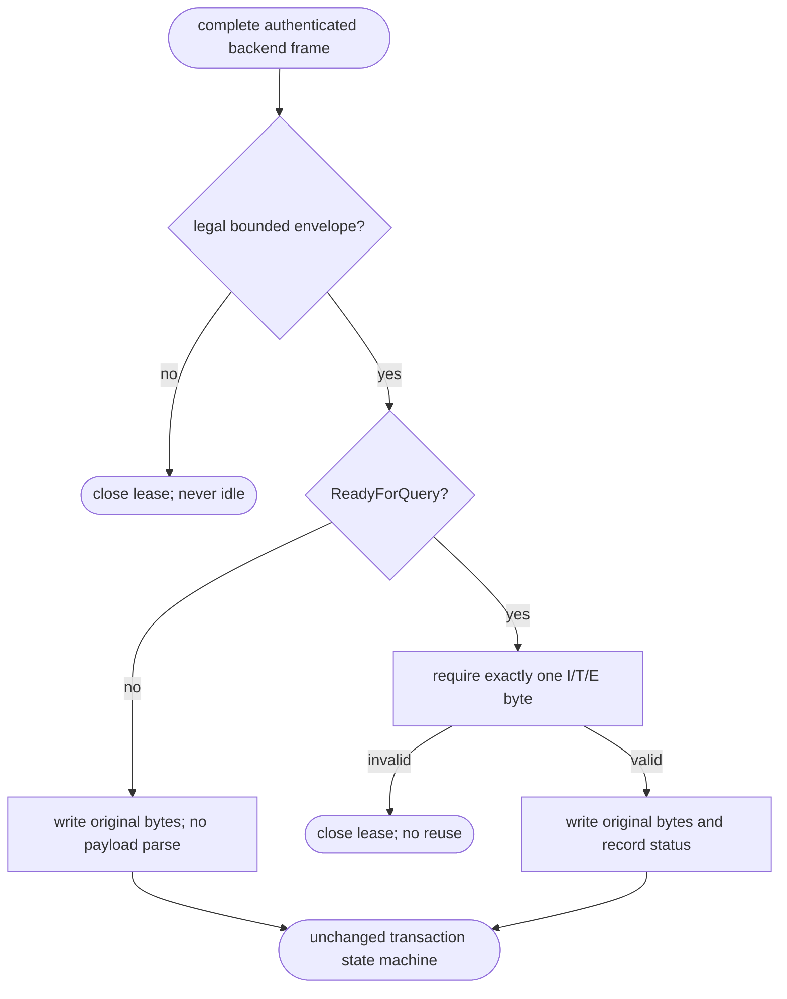

## Logic
<!-- type: logic lang: mermaid -->



### Compatibility boundary

- Opaque forwarding is limited to backend frames after the established startup/authentication path. It does not alter frontend validation or any typed-codec caller.
- Framing is not opaque: `take_frame` still rejects short, negative, and oversized envelopes before a byte is written.
- Payload opacity is not state opacity: only a fully valid `ReadyForQuery` records transaction status. All other tag/payload combinations are non-control data for this path.
- The existing transaction handler still forwards in order, stages pipelined frontend frames, closes on EOF/frame errors, and sends `DISCARD ALL` before a successful Idle lease is reintroduced.
## Changes
<!-- type: changes lang: yaml -->

```yaml
coverage_kind: semantic
changes:
  - path: apps/pgpool/src/wire/reader.rs
    action: modify
    section: pgpool-opaque-backend-transaction-relay
    impl_mode: hand-written
    reason: Make only the established backend transaction relay opaque after its bounded envelope is accepted, while preserving strict ReadyForQuery status validation.
  - path: apps/pgpool/tests/wire_codec.rs
    action: modify
    section: pgpool-opaque-backend-transaction-relay
    impl_mode: hand-written
    reason: Pin opaque bounded result forwarding, malformed ReadyForQuery rejection, and unchanged raw-byte ownership evidence.
```
## Unit Test

```mermaid
---
id: pgpool-opaque-backend-transaction-relay-verification
requirements:
  opaque_non_control:
    id: R1
    text: "A complete bounded non-ReadyForQuery backend frame preserves its exact bytes and never requires a structurally valid result payload to be relayed."
    kind: regression
    risk: high
    verify: wire_codec::transaction_relay_forwards_bounded_non_control_backend_frame_without_payload_validation
  peer_comparison:
    id: R4
    text: "The unchanged 64-client, 16-backend, simple-protocol comparison runs cleanly; a first valid loss reverts production code and preserves evidence."
    kind: integration
    risk: high
    verify: apps/pgpool/benchmarks/pgbouncer-transaction-pooling/run.sh --pgpool-bin target/release/pgpool
  pool_isolation:
    id: R3
    text: "Existing transaction ownership, reset-before-reuse, and pipelined-query isolation remain intact."
    kind: integration
    risk: high
    verify: cargo test -p pgpool --test wire_codec --test pool --test pool_modes
  ready_control_boundary:
    id: R2
    text: "ReadyForQuery remains the only relay control frame: invalid payload length or status rejects before transaction state or reuse can change."
    kind: regression
    risk: high
    verify: wire_codec::transaction_relay_rejects_malformed_ready_for_query
---
flowchart TD
    r1[R1 opaque non control] --> wire_codec_transaction_relay_forwards_bounded_non_control_backend_frame_without_payload_validation[wire_codec::transaction_relay_forwards_bounded_non_control_backend_frame_without_payload_validation]
    r2[R2 ready control boundary] --> wire_codec_transaction_relay_rejects_malformed_ready_for_query[wire_codec::transaction_relay_rejects_malformed_ready_for_query]
    r3[R3 pool isolation] --> cargo_test_p_pgpool_test_wire_codec_test_pool_test_pool_modes[cargo test -p pgpool --test wire_codec --test pool --test pool_modes]
    r4[R4 peer comparison] --> apps_pgpool_benchmarks_pgbouncer_transaction_pooling_run_sh_pgpool_bin_target_release_pgpool[apps/pgpool/benchmarks/pgbouncer-transaction-pooling/run.sh --pgpool-bin target/release/pgpool]
```

<!-- type: unit-test lang: mermaid -->


