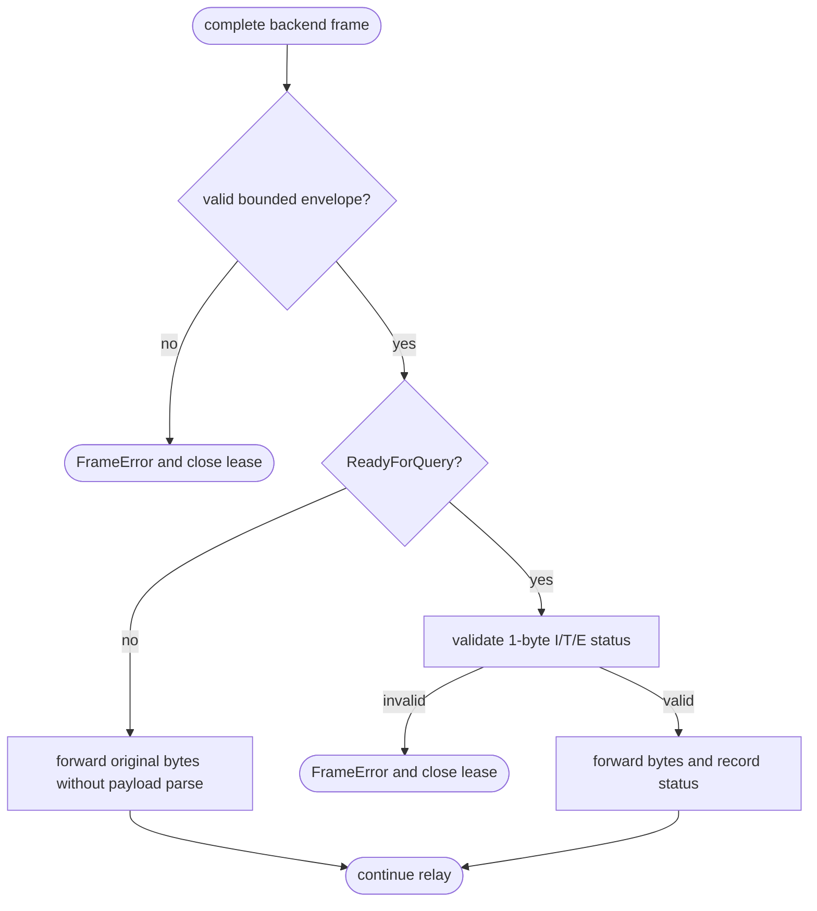

## Logic
<!-- type: logic lang: mermaid -->

### Contract invariants

- This path begins only after the normal startup/authentication relay has established the backend connection. Startup, authentication, reset, session-mode, and typed codec callers retain their existing full decoder.
- `take_frame` remains the sole envelope authority: every frame has a tagged PostgreSQL envelope, a length of at least four, and a configured maximum before any byte is exposed to the frontend.
- `ReadyForQuery` is the sole backend control frame for transaction ownership. Its payload must be exactly one valid status byte before `TransactionStatus` changes or the idle/reset path can run.
- Any other bounded backend frame is opaque to the transaction relay. Its payload cannot select a lease state, bypass `DISCARD ALL`, or cause a connection to re-enter the idle pool.
- Frontend validation, pipelined-query staging, client-visible frame order, and the existing error/EOF close path do not change.
