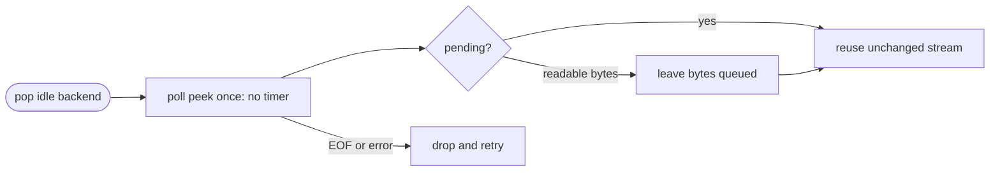
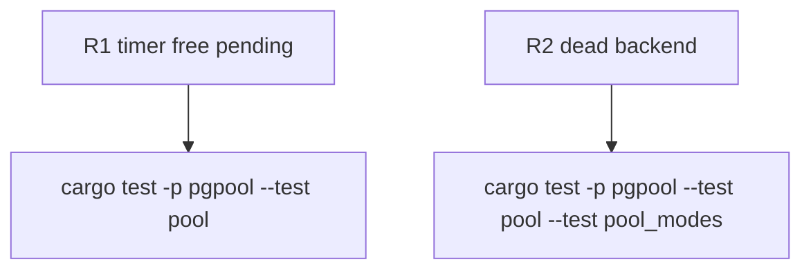

## Logic
<!-- type: logic lang: mermaid -->


## Changes
<!-- type: changes lang: yaml -->

```yaml
changes:
  - path: apps/pgpool/src/pool/backend_pool.rs
    action: modify
    section: pgpool-immediate-idle-liveness-probe
    impl_mode: hand-written
  - path: apps/pgpool/tests/pool.rs
    action: modify
    section: pgpool-immediate-idle-liveness-probe
    impl_mode: hand-written
```
## Unit Test
<!-- type: unit-test lang: mermaid -->


