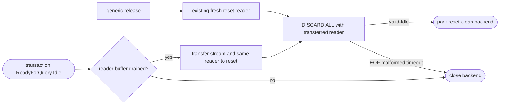

## Logic
<!-- type: logic lang: mermaid -->



## Changes
<!-- type: changes lang: yaml -->

```yaml
changes:
  - path: apps/pgpool/src/pool/backend_pool.rs
    action: modify
    section: pgpool-reset-reader-reuse
    impl_mode: hand-written
    reason: Accept an optional drained transaction reader for reset validation while preserving the generic fresh-reader release path.
  - path: apps/pgpool/src/pool/transaction.rs
    action: modify
    section: pgpool-reset-reader-reuse
    impl_mode: hand-written
    reason: Transfer the established transaction backend reader only at the verified Idle lease boundary.
  - path: apps/pgpool/src/wire/reader.rs
    action: modify
    section: pgpool-reset-reader-reuse
    impl_mode: hand-written
    reason: Expose the bounded drained-buffer fact needed to reject unsafe reader reuse without weakening frame validation.
  - path: apps/pgpool/tests/pool.rs
    action: modify
    section: pgpool-reset-reader-reuse
    impl_mode: hand-written
    reason: Exercise generic reset fallback and malformed reset close behavior when no transaction reader is supplied.
  - path: apps/pgpool/tests/pool_modes.rs
    action: modify
    section: pgpool-reset-reader-reuse
    impl_mode: hand-written
    reason: Verify a contended real transaction remains reset-isolated and backend-cap bounded through the reused-reader path.
  - path: apps/pgpool/tests/wire_codec.rs
    action: modify
    section: pgpool-reset-reader-reuse
    impl_mode: hand-written
    reason: Pin the drained reader precondition and preserve strict ReadyForQuery state validation.
```

## Unit Test

```mermaid
---
id: pgpool-reset-reader-reuse-verification
requirements:
  drained_reader_only:
    id: R1
    text: "Only a transaction reader that has reached ReadyForQuery Idle with no residual buffered bytes may be transferred into reset validation."
    kind: regression
    risk: high
    verify: wire_codec::transaction_reset_reader_reuse_requires_drained_idle_reader
  generic_fallback:
    id: R2
    text: "Generic BackendPool release retains its fresh-reader reset path and still closes on malformed or failed reset response."
    kind: regression
    risk: high
    verify: pool::release_return_to_idle_closes_connection_when_reset_fails
  peer_gate:
    id: R4
    text: "The unchanged competitor benchmark remains the sole success gate; meter is diagnostic only and a first valid loss reverts production code."
    kind: integration
    risk: high
    verify: apps/pgpool/benchmarks/pgbouncer-transaction-pooling/run.sh --pgpool-bin target/release/pgpool
  transaction_isolation:
    id: R3
    text: "A contended next transaction observes DISCARD ALL isolation and the configured one-backend capacity bound after reader reuse."
    kind: integration
    risk: high
    verify: pool_modes::transaction_mode_reused_reset_reader_preserves_isolation_and_capacity
---
flowchart TD
    r1[R1 drained reader only] --> wire_codec_transaction_reset_reader_reuse_requires_drained_idle_reader[wire_codec::transaction_reset_reader_reuse_requires_drained_idle_reader]
    r2[R2 generic fallback] --> pool_release_return_to_idle_closes_connection_when_reset_fails[pool::release_return_to_idle_closes_connection_when_reset_fails]
    r3[R3 transaction isolation] --> pool_modes_transaction_mode_reused_reset_reader_preserves_isolation_and_capacity[pool_modes::transaction_mode_reused_reset_reader_preserves_isolation_and_capacity]
    r4[R4 peer gate] --> apps_pgpool_benchmarks_pgbouncer_transaction_pooling_run_sh_pgpool_bin_target_release_pgpool[apps/pgpool/benchmarks/pgbouncer-transaction-pooling/run.sh --pgpool-bin target/release/pgpool]
```

<!-- type: unit-test lang: mermaid -->


