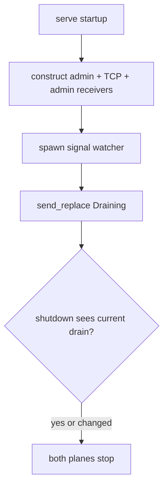
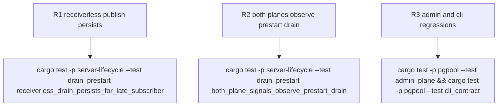

## Logic
<!-- type: logic lang: mermaid -->



## Changes
<!-- type: changes lang: yaml -->

```yaml
changes:
  - path: libs/server-lifecycle/src/drain.rs
    action: modify
    section: logic
    impl_mode: hand-written
    anchor: start_drain
  - path: apps/pgpool/src/bin/pgpool.rs
    action: modify
    section: logic
    impl_mode: hand-written
    anchor: serve
  - path: apps/pgpool/src/admin/state.rs
    action: modify
    section: logic
    impl_mode: hand-written
    anchor: AdminState
  - path: apps/pgpool/src/admin/wiring.rs
    action: modify
    section: logic
    impl_mode: hand-written
    anchor: shutdown_future_resolving_calls_start_drain_on_the_shared_controller
  - path: libs/server-lifecycle/tests/drain_prestart.rs
    action: create
    section: unit-test
    impl_mode: hand-written
```

## Unit Test
<!-- type: unit-test lang: mermaid -->


