# pgpool served admin plane — drain-aware readiness

## Logic

```mermaid
---
id: pgpool-admin-plane-logic-flow
entry: serve_entry
nodes:
  serve_entry:
    kind: start
    label: "pgpool serve builds RuntimePlan, constructs ONE shared server_core::DrainController, and binds both the TCP frontend listener and the admin HTTP listener on RuntimePlan.admin_bind"
  share_drain:
    kind: process
    label: "Clone the shared DrainController into TcpServerConfig.drain (replacing the fresh DrainController::new() TcpServerConfig::new() builds by default) and into AdminState, so the data plane, the admin plane, and readiness all read/write the same watch channel (R2, scope: drain coordination)"
  spawn_signal_task:
    kind: process
    label: "Spawn a background task awaiting server_core::signal::wait_shutdown_signal(); when SIGTERM/SIGINT resolves it, the task calls drain.start_drain() on the shared controller (R2)"
  build_admin_router:
    kind: process
    label: "Build the admin axum Router directly against AdminState (shared DrainController clone + Vec<NamedPool>, each pairing a pool name/mode with its ConnectionBudget and BackendPool clone): /healthz, /readyz, /metrics, /openapi.json, /docs, GET /pools, GET /pools/{pool}/stats, POST /drain (R1, R3) - hand-rolled rather than libs/service-http's standard_probe_routes because that helper's openapi arg type is fn() -> utoipa::openapi::OpenApi, while apps/pgpool/src/spec.rs's single-source-of-truth OpenAPI document is a serde_json::Value the offline `pgpool spec --format openapi` CLI already serializes directly; routing /openapi.json through a typed utoipa round-trip would risk breaking the byte-for-byte parity R4/AC3 requires, so /openapi.json instead returns Json(pgpool::spec::openapi()) - the exact same Value"
  run_both_planes:
    kind: process
    label: "tokio::join! the TCP frontend (tcp_server::serve, existing PoolHandler dispatch, unchanged from WI #1289) and the admin plane (http_server::serve_h2c_with_options) concurrently; each is given its OWN one-shot shutdown future that awaits drain.signal().changed()"
  request_kind:
    kind: decision
    label: "Which admin request arrives while both planes are running?"
  healthz_req:
    kind: terminal
    label: "GET /healthz: always 200 'ok' - liveness only, never reflects drain state (R1)"
  readyz_req:
    kind: process
    label: "GET /readyz: reads drain.is_draining() off the shared controller"
  readyz_result:
    kind: decision
    label: "drain.is_draining()?"
  readyz_ready:
    kind: terminal
    label: "false: 200 'ok'"
  readyz_draining:
    kind: terminal
    label: "true: 503 'draining' (R2)"
  metrics_req:
    kind: terminal
    label: "GET /metrics: renders Prometheus text-format gauges (pgpool_frontend_active, pgpool_backend_active, pgpool_backend_idle, each labeled pool=<name>) from every AdminState.pools entry's ConnectionBudget::active() and BackendPool::stats() (AC4)"
  openapi_req:
    kind: terminal
    label: "GET /openapi.json: returns Json(pgpool::spec::openapi()) - the identical serde_json::Value apps/pgpool/src/spec.rs already builds for `pgpool spec --format openapi` (R4)"
  docs_req:
    kind: terminal
    label: "GET /docs: static Swagger UI HTML page that loads /openapi.json, mirroring libs/service-http's docs_swagger convention"
  pools_req:
    kind: terminal
    label: "GET /pools: 200 Json(PoolList{pools: [...]}) - one PoolStats entry per AdminState.pools member, matching spec.rs's PoolList/PoolStats schema (R3)"
  pool_stats_req:
    kind: decision
    label: "GET /pools/{pool}/stats: does {pool} match a name in AdminState.pools?"
  pool_stats_found:
    kind: terminal
    label: "found: 200 Json(PoolStats{name, mode, frontend_active, backend_active, backend_idle}) (R3, AC4)"
  pool_stats_missing:
    kind: terminal
    label: "not found: 404, body names the unknown pool"
  drain_post:
    kind: process
    label: "POST /drain: calls the SAME shared DrainController::start_drain() the SIGTERM path uses - one drain trigger, two sources"
  drain_effect:
    kind: terminal
    label: "The shared watch channel flips to Draining: /readyz starts returning 503, and the TCP frontend's own shutdown future (also awaiting drain.signal().changed()) resolves so its accept loop stops admitting new frontend connections, while already-established sessions/transactions keep relaying until they end or TcpServerConfig.drain_timeout elapses (R2, AC2); the handler returns 200 Json(DrainState{draining:true})"
  both_drained:
    kind: process
    label: "Both tokio::join! futures resolve once their in-flight work ends or their own configured drain_timeout/admin_h2c.drain_timeout elapses"
  process_exit:
    kind: terminal
    label: "serve() returns Ok(()); the process exits cleanly with no forcibly-dropped in-flight session or admin request (AC2)"
edges:
  - from: serve_entry
    to: share_drain
    label: "RuntimePlan built, DrainController constructed"
  - from: share_drain
    to: spawn_signal_task
  - from: spawn_signal_task
    to: build_admin_router
  - from: build_admin_router
    to: run_both_planes
  - from: run_both_planes
    to: request_kind
    label: "both planes accepting connections"
  - from: request_kind
    to: healthz_req
    label: "GET /healthz"
  - from: request_kind
    to: readyz_req
    label: "GET /readyz"
  - from: readyz_req
    to: readyz_result
  - from: readyz_result
    to: readyz_ready
    label: "not draining"
  - from: readyz_result
    to: readyz_draining
    label: "draining"
  - from: request_kind
    to: metrics_req
    label: "GET /metrics"
  - from: request_kind
    to: openapi_req
    label: "GET /openapi.json"
  - from: request_kind
    to: docs_req
    label: "GET /docs"
  - from: request_kind
    to: pools_req
    label: "GET /pools"
  - from: request_kind
    to: pool_stats_req
    label: "GET /pools/{pool}/stats"
  - from: pool_stats_req
    to: pool_stats_found
    label: "name matches"
  - from: pool_stats_req
    to: pool_stats_missing
    label: "no match"
  - from: request_kind
    to: drain_post
    label: "POST /drain"
  - from: drain_post
    to: drain_effect
  - from: spawn_signal_task
    to: drain_effect
    label: "SIGTERM/SIGINT observed instead - same drain_effect via the shared controller"
  - from: drain_effect
    to: both_drained
  - from: both_drained
    to: process_exit
---
flowchart TD
    serve_entry([pgpool serve: build RuntimePlan, construct shared DrainController, bind TCP+admin listeners]) --> share_drain[Share DrainController: TcpServerConfig.drain + AdminState]
    share_drain --> spawn_signal_task[Spawn task: wait_shutdown_signal -> drain.start_drain]
    spawn_signal_task --> build_admin_router[Build admin axum Router against AdminState]
    build_admin_router --> run_both_planes[tokio::join!: tcp_server::serve + http_server::serve_h2c_with_options, each shutdown = drain.signal changed]
    run_both_planes --> request_kind{Which admin request arrives?}
    request_kind -->|GET /healthz| healthz_req([200 ok, always])
    request_kind -->|GET /readyz| readyz_req[Read drain.is_draining]
    readyz_req --> readyz_result{is_draining?}
    readyz_result -->|false| readyz_ready([200 ok])
    readyz_result -->|true| readyz_draining([503 draining])
    request_kind -->|GET /metrics| metrics_req([Render Prometheus gauges per pool])
    request_kind -->|GET /openapi.json| openapi_req([Json of pgpool::spec::openapi Value])
    request_kind -->|GET /docs| docs_req([Swagger UI HTML loading /openapi.json])
    request_kind -->|GET /pools| pools_req([Json PoolList from every AdminState pool])
    request_kind -->|GET /pools/pool/stats| pool_stats_req{pool name matches?}
    pool_stats_req -->|yes| pool_stats_found([200 Json PoolStats])
    pool_stats_req -->|no| pool_stats_missing([404])
    request_kind -->|POST /drain| drain_post[Call shared DrainController.start_drain]
    drain_post --> drain_effect[readyz flips 503, TCP accept loop stops admitting, in-flight sessions keep relaying]
    spawn_signal_task -.->|SIGTERM/SIGINT instead| drain_effect
    drain_effect --> both_drained[Both join! futures resolve within their drain_timeout]
    both_drained --> process_exit([serve returns Ok, process exits cleanly])
```

<!-- type: logic lang: mermaid -->



## State Machine

```mermaid
---
id: pgpool-admin-plane-readiness-fsm
initial: ready
nodes:
  ready:
    kind: initial
    label: "Admin plane reports ready: /readyz returns 200 'ok'. TCP frontend accept loop admits new frontend connections; admin router serves all routes normally."
  draining:
    kind: normal
    label: "Shared DrainController flipped to Draining by either SIGTERM/SIGINT or POST /drain (R2). /readyz now returns 503 'draining'. TCP frontend accept loop stops admitting new connections; already-established sessions/transactions keep relaying to completion. Admin plane keeps serving /healthz, /metrics, /openapi.json, /docs, /pools, /pools/{pool}/stats, and POST /drain (idempotent) throughout."
  exited:
    kind: terminal
    label: "Both the TCP frontend's tokio::join! future and the admin http_server::serve_h2c_with_options future have resolved (in-flight work ended, or drain_timeout/admin_h2c.drain_timeout elapsed) and serve() returns Ok(()) (AC2)."
edges:
  - from: ready
    to: draining
    label: "SIGTERM/SIGINT observed by the signal task, or POST /drain received by the admin router - both call the same shared DrainController::start_drain() (R2)"
  - from: draining
    to: draining
    label: "Redundant POST /drain while already draining: start_drain() is idempotent, watch channel stays Draining, still returns 200 Json(DrainState{draining:true})"
  - from: draining
    to: exited
    label: "In-flight sessions/transactions finish (or drain_timeout elapses) and both planes' shutdown futures resolve (AC2)"
---
stateDiagram-v2
    [*] --> ready
    ready --> draining: SIGTERM/SIGINT or POST /drain calls DrainController.start_drain
    draining --> draining: redundant POST /drain (idempotent)
    draining --> exited: in-flight work drains or drain_timeout elapses
    exited --> [*]
```

<!-- type: state-machine lang: mermaid -->



## Schema
<!-- type: schema lang: yaml -->

```yaml
$schema: "https://json-schema.org/draft/2020-12/schema"
$id: apps-pgpool-admin-plane#schema
title: pgpool Admin Plane Types
description: >
  Types for the served admin HTTP plane in `apps/pgpool/src/admin/`: the
  shared router state (one shared DrainController clone plus the named pool
  registry), the named-pool wrapper the admin plane adds on top of WI #1289's
  `pool::BackendPool`/`pool::BackendPoolStats` (which carry no name/mode
  fields), and the wire-shape response bodies for `/pools`,
  `/pools/{pool}/stats`, and `POST /drain`. `PoolList`/`PoolStats` reuse the
  exact field shape `apps/pgpool/src/spec.rs`'s offline `schemas()` already
  declares (R4/AC3 byte-for-byte parity with `pgpool spec --format openapi`);
  this section does not redefine `apps::pgpool::pool::{PoolConfig,
  BackendPoolStats}`, `server_core::{DrainController, DrainState as
  CoreDrainState}`, or `server_core::ConnectionBudget` — it composes them.

definitions:
  NamedPool:
    type: object
    $id: NamedPool
    x-rust-derive: ["Clone"]
    required: [name, mode, budget, pool]
    description: "Pairs one WI #1289 BackendPool (Arc-backed, cheap to clone) with the pool name and PoolMode the admin plane needs to answer /pools and /pools/{pool}/stats, since pool::types::PoolStats/BackendPoolStats carry no name/mode fields themselves (R3). Constructed once in `serve()` from RuntimePlan.pool_name (Config section) + RuntimePlan.pool_mode and stored in AdminState.pools."
    properties:
      name:
        type: string
        description: "Operator-facing pool identifier; matches the {pool} path segment in GET /pools/{pool}/stats. Defaults to \"default\" (see Config section) since pgpool currently runs exactly one pool per process."
      mode:
        x-rust-type: "crate::pool::PoolMode"
        description: "Session or Transaction — the fixed-for-the-process mode already selected by RuntimePlan.pool_mode; surfaced read-only in PoolStats.mode."
      budget:
        x-rust-type: "server_core::ConnectionBudget"
        description: "The SAME ConnectionBudget instance the frontend accept path checks (RuntimePlan::frontend_budget); AdminState reads budget.active() for PoolStats.frontend_active and the pgpool_frontend_active metric gauge, never constructing a second budget (single source of truth)."
      pool:
        x-rust-type: "crate::pool::BackendPool"
        description: "Arc-backed clone of the live BackendPool this pool name serves; AdminState calls pool.stats() (WI #1289) for backend_active/backend_idle on every /pools, /pools/{pool}/stats, and /metrics request — never a cached snapshot."

  AdminState:
    type: object
    $id: AdminState
    x-rust-derive: ["Clone"]
    required: [drain, pools]
    description: "axum shared state for the admin Router (via axum::extract::State), constructed once in `serve()` alongside the TCP frontend's TcpServerConfig so both planes hold clones of the identical DrainController (R2). Cheap to clone per-request since DrainController, ConnectionBudget, and BackendPool are all Arc/watch-channel backed internally."
    properties:
      drain:
        x-rust-type: "server_core::DrainController"
        description: "The one shared drain controller; /readyz reads drain.is_draining(), POST /drain calls drain.start_drain(), and the same clone is handed to TcpServerConfig.drain for the frontend accept loop and to the signal-handling task (R2)."
      pools:
        type: array
        items: { $ref: "#/definitions/NamedPool" }
        description: "Every pool this pgpool process serves (currently always exactly one entry, named per Config's pool_name, since RuntimePlan is single-pool-per-process); GET /pools iterates this, GET /pools/{pool}/stats looks up by name (R3)."

  PoolStats:
    type: object
    $id: PoolStats
    x-rust-derive: ["Debug", "Clone", "serde::Serialize"]
    required: [name, mode, frontend_active, backend_active, backend_idle]
    description: "Response body for GET /pools/{pool}/stats and each entry of PoolList.pools; field names/shape are IDENTICAL to the `PoolStats` schema `apps/pgpool/src/spec.rs`'s offline `schemas()` already declares, so the served body and `pgpool spec --format openapi`'s component schema stay byte-for-byte in sync (R4, AC3). Derived per-request from one NamedPool: name/mode copied directly, frontend_active from budget.active(), backend_active/backend_idle from pool.stats() (WI #1289 pool::BackendPoolStats)."
    properties:
      name:
        type: string
      mode:
        type: string
        enum: ["session", "transaction"]
      frontend_active:
        type: integer
        minimum: 0
        description: "server_core::ConnectionBudget::active() for this pool's frontend budget (AC4 metric source)."
      backend_active:
        type: integer
        minimum: 0
        description: "pool::BackendPoolStats.backend_active from BackendPool::stats() (WI #1289) (AC4 metric source)."
      backend_idle:
        type: integer
        minimum: 0
        description: "pool::BackendPoolStats.backend_idle from BackendPool::stats() (WI #1289) (AC4 metric source)."

  PoolList:
    type: object
    $id: PoolList
    x-rust-derive: ["Debug", "Clone", "serde::Serialize"]
    required: [pools]
    description: "Response body for GET /pools; matches apps/pgpool/src/spec.rs's offline PoolList schema field-for-field (R4, AC3)."
    properties:
      pools:
        type: array
        items: { $ref: "#/definitions/PoolStats" }

  DrainResponse:
    type: object
    $id: DrainResponse
    x-rust-derive: ["Debug", "Clone", "serde::Serialize"]
    required: [draining]
    description: "Response body for POST /drain, matching apps/pgpool/src/spec.rs's offline DrainState schema (single required boolean field, R4/AC3); returned after calling AdminState.drain.start_drain() (idempotent — repeated POSTs return the same {draining: true} body, see State Machine section)."
    properties:
      draining:
        type: boolean
        description: "Always true in the response body (POST /drain only ever transitions toward draining; there is no un-drain verb) and reflects AdminState.drain.is_draining() immediately after the call."

  ReadyzResponse:
    type: object
    $id: ReadyzResponse
    x-rust-derive: ["Debug", "Clone", "serde::Serialize"]
    required: [status]
    description: "Plain-text-equivalent body for GET /readyz (status field mirrors the libs/service-http probe-route convention of a short status string); HTTP status code (200 vs 503) is the primary readiness signal consumers rely on, this body is a human-diagnostic supplement (R2)."
    properties:
      status:
        type: string
        enum: ["ok", "draining"]

  AdminMetricsLine:
    type: object
    $id: AdminMetricsLine
    x-rust-derive: ["Debug", "Clone"]
    required: [metric, pool, value]
    description: "Internal (non-serialized-as-JSON) shape the /metrics handler folds every AdminState.pools entry into before rendering Prometheus text-format output; not part of the served JSON contract, only documents the pgpool_frontend_active / pgpool_backend_active / pgpool_backend_idle gauge rows (AC4). Rendered as `<metric>{pool=\"<pool>\"} <value>` per Prometheus text exposition format 0.0.4."
    properties:
      metric:
        type: string
        enum: ["pgpool_frontend_active", "pgpool_backend_active", "pgpool_backend_idle"]
      pool:
        type: string
      value:
        type: integer
        minimum: 0
```
