# pgpool session-mode proxy — serve entrypoint, auth passthrough, drain

## Logic

```mermaid
---
id: pgpool-session-proxy-logic-flow
entry: cli_serve_entry
nodes:
  cli_serve_entry:
    kind: start
    label: "`pgpool serve` builds TcpServerConfig from RuntimePlan (bind, TcpSocketOptions, drain_timeout) with NO tcp-server-level ConnectionBudget wired in — admission moves into SessionHandler so a rejection can still write a wire frame — then calls tcp_server::bind + tcp_server::serve(listener, config, SessionHandler, server_core::signal::wait_shutdown_signal())"
  tcp_accept:
    kind: process
    label: "tcp-server's serve_arc accepts a raw TCP connection and invokes SessionHandler::handle(stream, ConnectionContext) for every accepted socket"
  admission_check:
    kind: decision
    label: "SessionHandler's own ConnectionBudget::try_acquire() (RuntimePlan::frontend_budget) succeeds for this connection (R1)?"
  reject_saturated:
    kind: terminal
    label: "Saturated: encode BackendMessage::ErrorResponse (SQLSTATE 53300 too_many_connections) and write it directly to the client stream, then close the socket without touching the backend or any other session (AC3)"
  connect_backend:
    kind: process
    label: "Admitted, permit held for the session lifetime: TCP-connect to the configured backend endpoint (PGPOOL_BACKEND_ADDR/--backend-addr host:port, bounded by PGPOOL_BACKEND_CONNECT_TIMEOUT_MS/--backend-connect-timeout-ms) (R3)"
  backend_connect_ok:
    kind: decision
    label: "Backend TCP connect succeeded within the connect timeout?"
  reject_backend_unreachable:
    kind: terminal
    label: "Unreachable/timed out: encode BackendMessage::ErrorResponse (SQLSTATE 08006 connection_failure) to the client, release the ConnectionBudget permit, close the client socket"
  relay_startup:
    kind: process
    label: "Frame-aware startup relay: a frontend-role FrameReader fed from the client stream decodes the client's untagged StartupMessage (or SSLRequest, rejected — TLS is out of scope), which is re-encoded and forwarded byte-identically to the backend stream (R2)"
  relay_auth:
    kind: process
    label: "Auth passthrough loop: alternately decode backend-role BackendMessage frames from the backend stream and frontend-role FrontendMessage frames from the client stream, re-encoding and forwarding every Authentication*/PasswordMessage/SaslInitialResponse/SaslResponse frame verbatim in both directions; pgpool treats password/SASL payload bytes as opaque relay data only and never persists them (R2, AC2)"
  auth_result:
    kind: decision
    label: "Backend emits AuthenticationOk before any ErrorResponse?"
  relay_error_from_backend:
    kind: terminal
    label: "Backend emits ErrorResponse during startup/auth (bad credentials, SCRAM failure, ...): forward it to the client verbatim, release the permit, close both sides (no retry, no credential caching)"
  relay_ready:
    kind: process
    label: "Forward remaining backend startup messages (ParameterStatus*, BackendKeyData, ReadyForQuery) to the client; the backend-role FrameReader's transaction_status() records the initial TransactionStatus"
  bidi_relay:
    kind: process
    label: "Bidirectional relay: two concurrent tasks each decode WireMessage frames from one leg (frontend FrameReader on client->backend, backend FrameReader on backend->client) and re-encode+forward them to the other leg, until a frontend Terminate message, clean EOF, or a FrameError ends that leg (R2)"
  relay_end:
    kind: decision
    label: "Which condition ended the bidirectional relay?"
  client_terminate:
    kind: terminal
    label: "Client sent Terminate (or closed cleanly): forward Terminate to the backend if not already sent, close the backend connection, release the ConnectionBudget permit — a clean session end"
  backend_closed_or_error:
    kind: terminal
    label: "Backend closed the connection, or a leg hit FrameError (malformed/oversized frame): close the client socket, release the permit; a FrameError never forwards the offending bytes, it only ends that leg"
  drain_interaction:
    kind: process
    label: "Concurrently, DrainSignal (from ConnectionContext.drain) flips to Draining when the process receives SIGTERM/SIGINT: tcp-server's accept loop stops taking new connections immediately, while this session's bidi_relay keeps running unaffected until the client/backend end it or tcp_server's TcpServerConfig.drain_timeout elapses, at which point the task is abandoned (R4, AC4)"
edges:
  - from: cli_serve_entry
    to: tcp_accept
    label: "listener bound, serve loop running"
  - from: tcp_accept
    to: admission_check
    label: "connection accepted"
  - from: admission_check
    to: reject_saturated
    label: "budget exhausted"
  - from: admission_check
    to: connect_backend
    label: "permit acquired"
  - from: connect_backend
    to: backend_connect_ok
    label: "connect attempted"
  - from: backend_connect_ok
    to: reject_backend_unreachable
    label: "connect failed/timed out"
  - from: backend_connect_ok
    to: relay_startup
    label: "backend socket established"
  - from: relay_startup
    to: relay_auth
    label: "StartupMessage forwarded"
  - from: relay_auth
    to: auth_result
    label: "backend responds"
  - from: auth_result
    to: relay_error_from_backend
    label: "ErrorResponse (auth failed)"
  - from: auth_result
    to: relay_ready
    label: "AuthenticationOk"
  - from: relay_ready
    to: bidi_relay
    label: "ReadyForQuery forwarded to client"
  - from: bidi_relay
    to: relay_end
    label: "a leg ends"
  - from: relay_end
    to: client_terminate
    label: "Terminate or clean client EOF"
  - from: relay_end
    to: backend_closed_or_error
    label: "backend EOF or FrameError"
  - from: connect_backend
    to: drain_interaction
    label: "session task holds a DrainSignal for its whole lifetime"
---
flowchart TD
    cli_serve_entry([pgpool serve builds TcpServerConfig + SessionHandler, calls tcp_server::serve]) --> tcp_accept[serve_arc accepts a connection, calls SessionHandler::handle]
    tcp_accept --> admission_check{ConnectionBudget::try_acquire succeeds?}
    admission_check -->|budget exhausted| reject_saturated([Write ErrorResponse 53300, close socket])
    admission_check -->|permit acquired| connect_backend[TCP-connect to configured backend endpoint]
    connect_backend --> backend_connect_ok{Backend connect ok within timeout?}
    backend_connect_ok -->|failed/timed out| reject_backend_unreachable([Write ErrorResponse 08006, release permit, close])
    backend_connect_ok -->|established| relay_startup[Relay StartupMessage frame-aware]
    relay_startup --> relay_auth[Auth passthrough loop: relay Authentication*/Password/SASL frames]
    relay_auth --> auth_result{Backend emits AuthenticationOk?}
    auth_result -->|ErrorResponse| relay_error_from_backend([Forward ErrorResponse, release permit, close both sides])
    auth_result -->|AuthenticationOk| relay_ready[Forward ParameterStatus/BackendKeyData/ReadyForQuery]
    relay_ready --> bidi_relay[Bidirectional relay until Terminate/EOF/FrameError]
    bidi_relay --> relay_end{Which side ended the session?}
    relay_end -->|Terminate/clean client EOF| client_terminate([Forward Terminate, close backend, release permit])
    relay_end -->|backend EOF/FrameError| backend_closed_or_error([Close client socket, release permit])
    connect_backend -.-> drain_interaction[DrainSignal: accept loop stops on drain, in-flight relay keeps running until drain_timeout]
```

<!-- type: logic lang: mermaid -->


## Session State Machine

```mermaid
---
id: pgpool-session-proxy-session-fsm
initial: admitting
nodes:
  admitting:
    kind: initial
    label: "Admitting: SessionHandler::handle just received the accepted socket and is calling ConnectionBudget::try_acquire() (R1)"
  rejected_saturated:
    kind: terminal
    label: "RejectedSaturated: budget exhausted — a BackendMessage::ErrorResponse (53300 too_many_connections) is written to the client, then the socket is closed; no other session is affected (AC3)"
  connecting_backend:
    kind: normal
    label: "ConnectingBackend: permit held; dialing the configured backend endpoint within the connect timeout (R3)"
  rejected_backend_unreachable:
    kind: terminal
    label: "RejectedBackendUnreachable: backend TCP connect failed or timed out — an ErrorResponse (08006 connection_failure) is written to the client, the permit is released, the socket is closed"
  auth_relay:
    kind: normal
    label: "AuthRelay: StartupMessage forwarded; alternately relaying Authentication*/PasswordMessage/SaslInitialResponse/SaslResponse frames verbatim between client and backend (R2, AC2)"
  rejected_auth_failed:
    kind: terminal
    label: "RejectedAuthFailed: backend sent ErrorResponse during startup/auth (bad credentials, failed SCRAM exchange) — forwarded to the client verbatim, permit released, both sockets closed"
  established:
    kind: normal
    label: "Established: AuthenticationOk + ReadyForQuery forwarded; bidirectional frame relay is live in both directions until Terminate/EOF/FrameError (R2). The backend-role FrameReader's TransactionStatus (idle/in_transaction/failed, see the wire codec TD's Transaction Status Tracking FSM) is observable here for the next slice's pooling decisions but does not gate session-mode behavior"
  draining:
    kind: normal
    label: "Draining: the process received SIGTERM/SIGINT (DrainSignal flipped to Draining); tcp-server's accept loop has stopped admitting new connections, but this session's bidirectional relay keeps running unaffected, bounded by TcpServerConfig.drain_timeout (R4, AC4)"
  closed:
    kind: terminal
    label: "Closed: permit released, both sockets closed — either a clean end (client Terminate, or backend/client EOF), a FrameError on either leg, or the drain_timeout elapsing while still Established/Draining (task abandoned)"
edges:
  - from: admitting
    to: rejected_saturated
    event: "ConnectionBudget::try_acquire() returns Err(ConnectionLimitExceeded)"
  - from: admitting
    to: connecting_backend
    event: "permit acquired"
  - from: connecting_backend
    to: rejected_backend_unreachable
    event: "TCP connect fails or exceeds the configured backend connect timeout"
  - from: connecting_backend
    to: auth_relay
    event: "backend TCP socket established"
  - from: auth_relay
    to: rejected_auth_failed
    event: "backend BackendMessage::ErrorResponse observed before AuthenticationOk"
  - from: auth_relay
    to: established
    event: "backend AuthenticationOk followed by ReadyForQuery forwarded to the client"
  - from: established
    to: draining
    event: "DrainSignal::changed() resolves to DrainState::Draining (SIGTERM/SIGINT)"
  - from: established
    to: closed
    event: "client Terminate, clean EOF on either leg, or FrameError on either leg"
  - from: draining
    to: closed
    event: "session ends normally before drain_timeout elapses (same terminal events as Established), or drain_timeout elapses and the relay task is abandoned"
---
stateDiagram-v2
    [*] --> admitting
    admitting --> rejected_saturated : budget exhausted
    admitting --> connecting_backend : permit acquired
    connecting_backend --> rejected_backend_unreachable : connect failed/timed out
    connecting_backend --> auth_relay : backend socket established
    auth_relay --> rejected_auth_failed : backend ErrorResponse
    auth_relay --> established : AuthenticationOk + ReadyForQuery
    established --> draining : SIGTERM/SIGINT (DrainSignal)
    established --> closed : Terminate / EOF / FrameError
    draining --> closed : session ends or drain_timeout elapses
    rejected_saturated --> [*]
    rejected_backend_unreachable --> [*]
    rejected_auth_failed --> [*]
    closed --> [*]
```

<!-- type: state-machine lang: mermaid -->


## Schema
<!-- type: schema lang: yaml -->

```yaml
$schema: "https://json-schema.org/draft/2020-12/schema"
$id: apps-pgpool-session-proxy#schema
title: pgpool Session Proxy Types
description: >
  Configuration and outcome types for the `apps/pgpool/src/proxy/` session-mode
  (1:1) proxy: the backend endpoint seam, the per-session config bundle
  (budget/timeouts/wire codec), the rejection-reason -> wire ErrorResponse
  mapping, and the session outcome taxonomy tests assert on. Reuses
  `crate::wire::{WireCodecConfig, FrameReader, FrontendMessage,
  BackendMessage, FrameError}` from the wire codec TD rather than redefining
  frame types.

definitions:
  BackendEndpointConfig:
    type: object
    $id: BackendEndpointConfig
    x-rust-derive: ["Debug", "Clone", "PartialEq", "Eq"]
    required: [host, port]
    description: "TCP host/port of the single configured Postgres backend this session-mode proxy dials per client (R3); sourced from PGPOOL_BACKEND_ADDR/--backend-addr. Credentials are never part of this config — auth is relayed frame-for-frame from the client, never generated or stored by pgpool (AC2). This seam is later formalized by the backend-adapter-seam epic #1283."
    properties:
      host:
        type: string
      port:
        type: integer

  SessionProxyConfig:
    type: object
    $id: SessionProxyConfig
    x-rust-derive: ["Debug", "Clone"]
    required: [backend, frontend_budget, backend_connect_timeout, drain_timeout, wire]
    description: "Everything a SessionHandler needs to admit and relay one client session; constructed once from RuntimePlan + CLI/env backend config and shared (cheaply cloneable) across every accepted connection."
    properties:
      backend:
        $ref: "#/definitions/BackendEndpointConfig"
      frontend_budget:
        x-rust-type: "server_core::ConnectionBudget"
        description: "Same budget RuntimePlan::frontend_budget() constructs; admission is checked here (inside SessionHandler::handle), not via tcp_server::TcpServerConfig.connection_budget, so a rejection can still write a wire-level ErrorResponse before the socket closes (R1, AC3)."
      backend_connect_timeout:
        x-rust-type: "std::time::Duration"
        description: "Bounds the backend TCP connect attempt (R3); exceeding it produces RejectionReason::BackendUnreachable."
      drain_timeout:
        x-rust-type: "std::time::Duration"
        description: "Mirrors tcp_server::TcpServerConfig.drain_timeout (itself from RuntimePlan.admin_drain_timeout-equivalent for the frontend listener) so the bounded-drain proof in AC4 has one source of truth."
      wire:
        x-rust-type: "crate::wire::WireCodecConfig"
        description: "Frame bounds/limits for the frontend-role and backend-role FrameReader instances this session constructs."

  RejectionReason:
    type: string
    $id: RejectionReason
    x-rust-derive: ["Debug", "Clone", "Copy", "PartialEq", "Eq"]
    x-rust-enum: true
    enum: ["frontend_budget_exhausted", "backend_unreachable", "backend_auth_failed"]
    description: "Drives the wire-level BackendMessage::ErrorResponse the client sees before the socket closes: frontend_budget_exhausted -> SQLSTATE 53300 too_many_connections (AC3); backend_unreachable -> SQLSTATE 08006 connection_failure; backend_auth_failed -> the backend's own ErrorResponse is forwarded verbatim instead of a synthesized one."

  SessionOutcome:
    type: string
    $id: SessionOutcome
    x-rust-derive: ["Debug", "Clone", "Copy", "PartialEq", "Eq"]
    x-rust-enum: true
    enum:
      - "rejected_saturated"
      - "rejected_backend_unreachable"
      - "rejected_auth_failed"
      - "established_closed_clean"
      - "established_closed_error"
      - "drain_abandoned"
    description: "Terminal classification of one session, mirroring the Session State Machine's terminal states; SessionHandler::handle returns/records this so unit tests assert on a typed outcome instead of parsing logs (maps 1:1 onto rejected_saturated/rejected_backend_unreachable/rejected_auth_failed/closed(*) in the Session State Machine section)."

  ProxyError:
    type: object
    $id: ProxyError
    x-rust-derive: ["Debug", "thiserror::Error"]
    x-rust-enum: true
    description: "Internal error taxonomy surfaced from a session task; every variant is handled by writing the appropriate wire frame (or none, if the client already disconnected) and releasing the ConnectionBudget permit — a session task never panics."
    oneOf:
      - type: object
        required: [Rejection]
        properties:
          Rejection:
            type: object
            required: [reason]
            properties:
              reason: { $ref: "#/definitions/RejectionReason" }
        description: "Admission or backend-connect rejection (see RejectionReason)."
      - type: object
        required: [Wire]
        properties:
          Wire:
            x-rust-type: "crate::wire::FrameError"
        description: "A frontend or backend leg produced a FrameError (oversized/malformed/unknown-tag frame); that leg's relay ends without forwarding the offending bytes."
      - type: object
        required: [Io]
        properties:
          Io:
            type: string
        description: "Underlying client or backend socket I/O error (reset, broken pipe, ...)."
```
## Config
<!-- type: config lang: yaml -->

```yaml
# SessionProxyConfig — backend endpoint, admission, and timeout defaults for
# `pgpool serve`'s session-mode (1:1) proxy. No pooling/transaction-mode or
# TLS config lives here (out of scope for this slice). frontend_budget and
# the frontend bind/socket options continue to come from RuntimePlan
# (max_frontend_connections / frontend_bind / frontend_socket, see
# apps/pgpool/src/lib.rs); this section adds only the backend-endpoint and
# session-proxy-specific seam RuntimePlan does not yet own.

# Backend endpoint (R3) — single configured Postgres backend this session-mode
# proxy dials per client; env var takes precedence, CLI flag overrides env.
backend_host:
  env: PGPOOL_BACKEND_HOST
  flag: --backend-host
  default: "127.0.0.1"
  description: "Host of the single configured Postgres backend."
backend_port:
  env: PGPOOL_BACKEND_PORT
  flag: --backend-port
  default: 5432
  description: "Port of the single configured Postgres backend."

# Backend connect timeout (R3 / AC3 rejected_backend_unreachable path).
backend_connect_timeout_ms:
  env: PGPOOL_BACKEND_CONNECT_TIMEOUT_MS
  flag: --backend-connect-timeout-ms
  default: 5000        # 5s; exceeding this produces RejectionReason::BackendUnreachable / SQLSTATE 08006

# Frontend listener bind (R1) — reuses RuntimePlan::frontend_bind/frontend_socket
# defaults (any:6432, TcpSocketOptions::default()); `pgpool serve` does not
# introduce a second bind config, only surfaces the existing ones as CLI flags.
frontend_bind_override:
  env: PGPOOL_FRONTEND_BIND
  flag: --bind
  default: null        # null = use RuntimePlan::frontend_bind (0.0.0.0:6432) unchanged

# Drain timeout (R4 / AC4) — bounds how long an in-flight session may keep
# running after SIGTERM/SIGINT before the drain loop abandons it; shared by
# tcp_server::TcpServerConfig.drain_timeout and SessionProxyConfig.drain_timeout
# so there is one source of truth for the bounded-drain proof.
drain_timeout_ms:
  env: PGPOOL_DRAIN_TIMEOUT_MS
  flag: --drain-timeout-ms
  default: 30000        # 30s; matches server-core's shutdown_with_drain style bounded-wait convention

# Frontend admission budget (R1 / AC3) — reused from RuntimePlan, not
# reconfigured here; listed for traceability only.
max_frontend_connections:
  source: "RuntimePlan::max_frontend_connections"
  default: 10000        # ConnectionBudget::new(10_000); checked inside SessionHandler::handle, not via tcp_server::TcpServerConfig.connection_budget (see Schema: SessionProxyConfig.frontend_budget)
```
## Unit Test
<!-- type: unit-test lang: mermaid -->

```mermaid
---
id: (fill: spec-id)-verification
requirements:
  example_requirement:
    id: R1
    text: "(fill: requirement text)"
    kind: functional
    risk: medium
    verify: (fill: concrete verification target, e.g. a test name)
---
flowchart TD
    r1[R1 example requirement] --> fill_concrete_verification_target_e_g_a_test_name[(fill: concrete verification target, e.g. a test name)]
```
